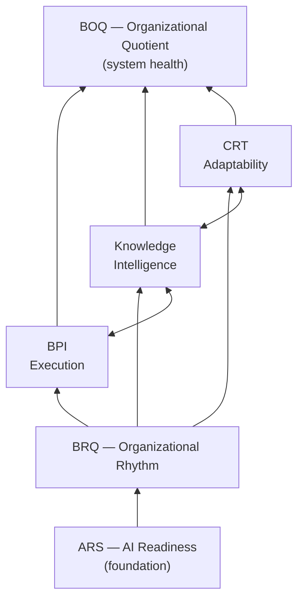

# BOQ — the BRAMHI Organizational Quotient framework

## Purpose

Define the measurement universe above AIR. The game Nexus runs (six pages, NOF objectives) needs a scoreboard that grows with it: it **starts** with the AI readiness score and grows into **BOQ — the BRAMHI Organizational Quotient (0–100)**, the highest-level score an organization can achieve. This doc captures the framework as it stands; it is **explicitly evolving** — the binding part is the *structure* (traceability + pluggability), not the current formulas.

## TL;DR

- **Four layers, one measurement rule**: Market → Capabilities → Replication Drivers → Signals. **Layer 3 (Signals) is the only place we directly measure; everything above is calculated.** Every score must trace back to a signal — that traceability is what makes the framework credible when a CEO asks "where did this number come from?"
- **AIRscore is the diagnostic lens applied across the stack**, not a layer in it: it discovers signals → driver scores → capability scores → the score family → BOQ.
- **The score family**: ARS (AI readiness, the foundation) · BRQ (rhythm) · BPI (execution) · Knowledge Intelligence · CRT (adaptability) · KRP (AI-native tool readiness) → **BOQ** (system health/balance).
- **The signature visual is the Bridge**: ARS enables BRQ; BRQ enables the engine (BPI ↔ Knowledge ↔ CRT — the compounding loop); BOQ measures the whole bridge.
- **Modularity is the requirement, not a preference**: each score is a pluggable calculator over the signal store (same lego discipline as assessment blocks), because the definitions will change as real engagements teach us.

## The 4-layer stack

| Layer | Name | Core question | What we measure | Output |
|---|---|---|---|---|
| **L0** | Market | What does the external world value? | Demand, competitive position, AI disruption risk, industry velocity | Market Relevance Score |
| **L1** | Capabilities | What can the org repeatedly do? | Acquire · Build · Deliver · Support · Learn · Govern | Capability Scores |
| **L2** | Replication Drivers | Why can/can't each capability scale? | Knowledge · Process · Capacity · Coordination | Driver Scores |
| **L3** | **Signals** | Where do we catch evidence? | Documentation coverage, SOP coverage, decision latency, meeting effectiveness, onboarding time, AI adoption, automation coverage, rework rate, dependency delays, knowledge-retrieval time | **Raw signal data — the only direct measurement** |

A capability = Knowledge + Process + Capacity + Coordination. Example flow: *documentation coverage 75% (L3 signal) → Knowledge driver rises (L2) → Deliver capability more replicable (L1) → CRT falls → BOQ rises.*

## The score family

| Score | Measures | One-line question |
|---|---|---|
| **ARS / AIRscore** | AI readiness — the foundation + the diagnostic engine | Is the org even ready to use AI? (Low ARS → nothing above matters) |
| **BRQ** | Organizational rhythm — meetings, decisions, alignment, accountability | Are people moving *together* (not just working hard)? |
| **BPI** | Productivity/execution — intent → execution friction | How efficiently does a founder's intent become customer value? |
| **Knowledge Intelligence** | Organizational memory | Does learning compound, or does the org re-solve the same problem quarterly? |
| **CRT** | Capability Replication Time — adaptability | How fast can the org scale a capability / absorb change? |
| **KRP** | AI-native tool readiness | Can AI-native systems support the same capability better than current tools? |
| **BOQ** | The whole system, 0–100 | How effectively does the org convert intelligence into market value? |

BOQ measures **balance**, not maxima: high BPI + low BRQ = burnout; high Knowledge + low CRT = bureaucracy; high ARS + low BPI = demos without outcomes.

## The Bridge — signature visual

*The middle row is the engine: execution creates knowledge, knowledge enables adaptability, adaptability improves execution — the compounding loop most companies never enter (Work → Forget → Repeat vs Work → Learn → Adapt → Work Better).*

## The maturity journey — AIR at entry, BOQ as North Star

Companies progress through score maturity the same way they progress through the pipeline — and **Nexus is the delivery engine for the entire ladder**:

| Client stage | Score state | What Nexus does |
|---|---|---|
| **Prospect** (client added) | — | **Adding a client auto-initiates the AIR assessment** — no manual send; the assessment module owns delivery from the moment of Add Client |
| **Assessing** | ARS established | Two-week sprint instruments collect L3 signals; BRAMHI Baseline written |
| **Engaged** | ARS + progress/outcome data | Roadmap runs as NOF objectives; normal Nexus usage starts accruing signals passively (telemetry IS measurement) |
| **Handed over / Builder mode** | Sub-scores light up | The assessment module sends **cadenced re-assessments and pulses automatically** (recurring/pulse instruments); BRQ, BPI, Knowledge, CRT come online as data accrues |
| **North Star state** (end stage) | **BOQ** | The company adopts **BOQ as its company North Star metric**, tracked year over year — the transformation's end state and the durable relationship |

The objective lifecycle (Identified → Handed off → Sustained) is the same shape one level down: the *company* lifecycle ends with BOQ Sustained as their own KPI.

## The pitch (why this is the business)

A 50-person firm runs HubSpot + Asana + Notion + Slack + Confluence ($40–80k/yr) and Monday still sounds like "what's the status / who owns this / didn't we solve this last month?" Each tool solves **one box** of the bridge. No system manages the whole diagram. Nexus's ambition is not to replace those tools — it is to be **the operating system that continuously improves every box**, with BOQ as the measure of organizational consciousness. The framework is the actual product; the software is the implementation layer.

## What's settled vs evolving

| Settled (binding now) | Evolving (expected to change) |
|---|---|
| The 4-layer structure and the **L3-only-measured** rule | Exact signal sets per driver |
| Traceability: every score decomposes to signals on demand | Weights, formulas, thresholds, score ranges |
| AIRscore as the diagnostic lens; AIR engagement = the signal-collection vehicle (the two-week sprint's instruments ARE L3 collectors) | Which sub-scores ship when (ARS first; others sequenced post-beta) |
| Scores are **pluggable calculators** over a signal store | The signature visual's final form (Bridge favored; Tree/Diamond candidates) |

## Implications for the other cards

| Implication | Where it lands |
|---|---|
| AIR's instruments are L3 signal collectors; the BRAMHI Baseline is a signal snapshot | AI_CONSULTING_PLAYBOOK (already aligned) |
| Score calculators are lego blocks: pure functions over the signal store, registered like assessment providers — never hardcoded into pages | TECH_STRATEGY (assessment/knowledge seam; engine design N4) |
| Game telemetry (decision latency, rework, meeting load) accrues from normal Nexus usage — the product *is* a signal collector | TECH_STRATEGY domain events; knowledge module |
| Score tiles on pages render whatever calculators are installed (like assessment score columns) | PRODUCT_STRATEGY analytics doctrine |

## Open questions

Tracked via revisit triggers (deliberately not clarifications — the founder finalizes these as engagements teach us): signal sets, weights/formulas, sub-score sequencing, signature visual.
