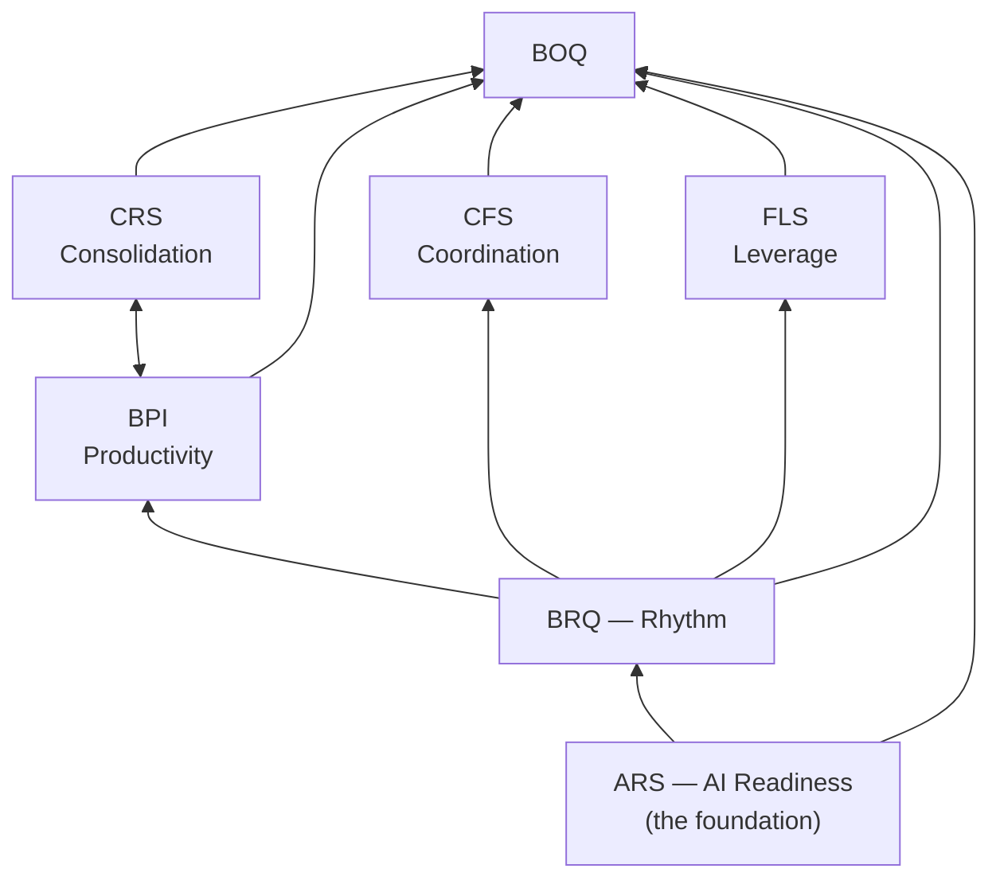

# BOQ — the core model

> One number, 0–100, that a software company can plan against: **how well does this
> company operate?** Six drivers feed it; every driver decomposes to observable signals;
> every probability the system ever states starts honest and earns its confidence.
> This document is the aggregation and epistemics layer; each driver's own anatomy lives
> in its child document (the driver index, §8).

## 1 · What BOQ is, plainly

The Business Operating Quotient is the company-level composite of six driver scores. It
measures the **operating engine** — readiness, productivity, coordination, rhythm,
leverage, consolidation — and deliberately *not* market direction (the steering): a
company can run a flawless engine and build the wrong product, and we say so
(constitution §9). It is a **quotient** in the honest sense: every score in the system
is a position-ratio against the frontier's anchors (Article 10) — the composite inherits
the name the way IQ kept its name after its arithmetic changed.

**Referent** (C-016.2): BOQ attaches to the **company**. Signals are collected per
program (work happens there); BPI, CFS, and BRQ aggregate across programs; ARS, FLS, and
CRS are inherently company-wide. Program-scoped views are **program gauges** —
diagnostics, never called a BOQ.

## 2 · The shape: signals → drivers → BOQ

| Layer | What it is | Rule |
|---|---|---|
| **Signals** | Observable facts: dollars per shipped change, decision latency, milestone adherence, tool overlap… | The *only* directly measured layer (Article 1). Stored immutable — the replay file |
| **Drivers** | Six summaries of the signals: ARS · BPI · CFS · BRQ · FLS · CRS | Calculated, never measured; each is a pluggable calculator over the signal store |
| **BOQ** | The composite | Calculated from the six; traceable to signals on demand |

This collapses the older 4-layer stack (Market → Capabilities → Replication Drivers →
Signals, from the superseded BOQ_FRAMEWORK): the Market layer is now the **reserved
seat** (§9), the capability/driver layers fold into the six drivers, and L3 *is* the
signal store. The two presentation stacks survive as **views**: the *disclosure* view
(BOQ → drivers → signals → evidence; progressive reveal for executives) and the
*measurement* view (signals upward; the engineer's read). Two visuals, two jobs: the
**Organizational Map** (rhythm × efficiency, four quadrants — the executive deliverable)
and the **Bridge** (the causal explainer, §6).

## 3 · The mathematics

**Normalization (Article 10).** Every signal converts to 0–100 by tier placement between
its anchor pack's published anchors (newbie → top 0.1%). Raw values are retained and
displayed as evidence.

**The composite:**

```
BOQ = (ARS × BPI′ × CFS × BRQ × FLS × CRS)^(1/6)        each driver clamped to [1, 100]
```

- **Geometric mean**: one weak driver drags the whole number; fixing the weakest driver
  always helps more than polishing the strongest. Worked example: five drivers at 80,
  one at 20 → (80⁵ × 20)^(1/6) ≈ **63.5**, not the arithmetic 70. BOQ measures balance.
- **The clamp** (Article 11): a zero cannot annihilate the quotient; the drag stays
  brutal by design.
- **BPI′**: BPI's raw index (SaaS-baseline 100; can exceed 100) is converted to 0–100
  tier placement before entering the composite; the raw index always displays alongside.
- **The gradient is the advice**: BOQ is the position, the weakest driver is the
  direction of steepest ascent — company-altitude NBM falls out of the arithmetic,
  *read through the Bridge's causal edges* (§6; C-015.7).

**Provenance inheritance**: BOQ carries the *weakest* provenance among its drivers. Any
driver Proxy → BOQ displays Proxy. Fully-Measured BOQ is exactly the Evolve state's
achievement.

## 4 · The bands

Every 0–100 score in the system, including BOQ, reads on one shared scale:

| Band | Range | Plain meaning |
|---|---|---|
| **Reactive** | 0–30 | firefighting; no system to improve yet |
| **Operational** | 31–50 | things run, but on heroics and memory |
| **Structured** | 51–70 | repeatable process; learning starts to stick |
| **AI-Ready** | 71–85 | the foundation can absorb AI leverage |
| **AI-Native** | 86–100 | the operating loop *is* the company |

## 5 · Anchor packs and the restatement rule (C-016.7)

Anchors live in **versioned packs** — one per segment, dated editions (annual, plus
out-of-cycle on material frontier shifts). Rules:

1. Every displayed score names its pack (Article 6: number + band + provenance + pack +
   evidence).
2. Trend views always **restate**: history recomputes from stored signals under the
   *current* pack. Never two rulers compared silently.
3. Pack changes are ratified in `_agent/DECISIONS.md`.
4. **The cohort floor** (candidate rule, 03_NEXUS_GAME F10): below a real measured
   cohort in a segment, scores show anchor placement (labeled research-grade) and
   self-trend only — never a percentile against a cohort that doesn't exist.

Current pack: **`saas-product v2026.1`** — sources: DORA, DX Core 4, published industry
research, the Karvia measured case (n=1, labeled). Every driver doc cites this pack and
labels each anchor's source. The proprietary distribution replaces the borrowed one as
engagements accumulate — every engagement is an anchor-collection event.

## 6 · The Bridge — the causal view



The Bridge is why the gradient alone can mislead (C-015.7): drivers are **coupled** —
readiness enables rhythm; rhythm enables the engine. A weak BPI whose cause is upstream
BRQ wants a rhythm intervention, not a productivity one. NBM v1 therefore reads the
weakest driver *through* these edges: **which driver** to attack is computed arithmetic
(Nexus); **which move** within it is prediction (iBrain) — Article 13's seam, exactly.

The Bridge's edge weights are themselves theory-layer: v1 ships the consultant's causal
prior (this diagram); the cohort's outcome records test and recalibrate it (§7).

## 7 · The epistemic engine — how the system knows what it knows

The founding principle, stated by the founder (2026-06-11): *with no evidence, the
probability of any action's favorable outcome is fifty-fifty — and everything improves
cyclically from feedback.* Formalized as **the prior ladder** plus **the learning wheel**:

### 7.1 The prior ladder

Every probability the system states sits on one of three rungs, and says which:

| Rung | When | Confidence label | Example |
|---|---|---|---|
| **Measured** | live evidence exists for *this* company | High — posterior from telemetry/outcomes | "this team's milestone slippage under load" |
| **Informed prior** | research, anchors, playbook heuristics, or cohort patterns apply | Low/Medium — prior-based, labeled | "rhythm-first works for Chaotic-quadrant companies" (the staircase's theory layer is itself an informed prior — NBM v0) |
| **The fifty-fifty floor** | genuinely nothing known | Floor — stated plainly | a brand-new person × a never-seen task type |

**Confidence is earned upward, never asserted.** The floor is the humility guarantee:
the system never claims knowledge it doesn't have — but it also never *feigns ignorance*
of what BRAMHI demonstrably knows (the informed rung is most of day one; pretending
otherwise would discard the moat).

### 7.2 The two faces of humility (Article 13, quantified)

| Side of the seam | Its "I don't know" | Rule |
|---|---|---|
| **Nexus — measurement** | *"insufficient signal"* | Scores never start at fifty or any default. Below floors (volume, recency, size), no number renders. A score is either computed from real signals or absent (Articles 3–4) |
| **iBrain — prediction** | *fifty-fifty, low confidence* | Predictions start at the prior and update from outcomes. Every NBM displays recommendation + confidence + why (Article 13) |

Same humility, two notations — the duality design law applied to epistemics itself.

### 7.3 The learning wheel

```
  base model (priors)  →  recommendation (with confidence)  →  action taken
        ▲                                                          │
        │                                                          ▼
  recalibration  ◀──  the tuple recorded: (state, move, outcome record)
```

The wheel turns on **outcome records** (NOF: every objective closes with one; every
task×person allocation resolves observably). The tuples *(company state → move
recommended → move taken → ΔBOQ / outcome)* are simultaneously the learning data and
the moat — no competitor has a closed loop from advice to measured consequence. Each
driver doc names which outcomes feed its recalibration; each carries an append-only
**calibration log** so the model's evolution is itself auditable (calibrate-never-invent
applies to the model, not just the scores).

**Worked micro-example (the founder's own)**: a marketing task needs an outward,
reactive doer. With no profile data: 50–50. The Profile's match-grade tags (assessment-
fed) shift the odds — structure-driven, introverted, deep-focus tags shift this pairing
*down* (a detrimental allocation, flagged before it happens); the task completes badly
or well, the outcome records, and that *class* of pairing learns. A thousand allocations
later the match model is real — grown, not designed.

## 8 · The driver index

| Driver | Doc | One question | Staircase brick | Becomes Measured |
|---|---|---|---|---|
| **ARS** | [ARS.md](ARS.md) | Ready to use AI seriously? | Measure (raised head-on) | proxy by design; re-benchmarked each cycle |
| **BPI** | [BPI.md](BPI.md) | Intent → shipped product, efficiently? | Transform | Transform (velocity) → Evolve (quality) |
| **CFS** | [CFS.md](CFS.md) | What does alignment cost? | Transform | Align onward |
| **BRQ** | [BRQ.md](BRQ.md) | Cadence or heroics? | Align (raised head-on) | Evolve |
| **FLS** | [FLS.md](FLS.md) | One person, or a company? | Transform | Align onward |
| **CRS** | [CRS.md](CRS.md) | Stack ready to consolidate? | Transform | Measure (proxy) → Transform (observed migrations) |

Each child doc follows one template: identity · how it fits · signals · instruments ·
floors (volume, recency, size) · anchors (pack-cited, source-labeled) · provenance path ·
**base model v1** · **the learning loop** · a teleported worked scenario · gaming
exposure · known misfits · the calibration log.

## 9 · Reserved seats (C-016.3)

Registered candidates — **not** v1 drivers; entry requires constitutional amendment
(Article 12) backed by engagement evidence:

| Seat | What it would measure | Why reserved, not seated |
|---|---|---|
| **Market/customer signal** | The steering: market relevance, customer-signal reception, product-direction fitness | BOQ honestly measures the engine; the right half of the holistic story needs its own instruments before it deserves a number (constitution §9 scope limit) |
| **Culture Score** | Founder's candidate (notes p.4): the human climate the engine runs in | Territory overlaps BRQ/FLS; needs real-engagement evidence to earn distinctness |

## 10 · The absorption record (from BOQ_FRAMEWORK.md, per C-016.1)

Reflection record (IM-11): the superseded BOQ_FRAMEWORK's score family maps as —
**Knowledge Intelligence** → BPI's Knowledge pillar (weight 0.25) · **CRT** → a signal
feeding CRS · **KRP** → renamed CRS (C-011) · the **4-layer stack** → §2's three-layer
shape with the Market layer as a reserved seat · the **Bridge** → kept (§6) · the
**maturity journey** → superseded by the constitution's ladder (C-014) · *"BRAMHI
Organizational Quotient"* → **Business Operating Quotient** everywhere. What improved:
one document per score with floors/anchors/learning loops (the framework had none);
what was dropped: the L0 Market Relevance Score as a v1 claim (honesty, C-016.3).

## 11 · Settled vs evolving

| Settled (binding) | Evolving (calibration log territory) |
|---|---|
| The three-layer shape; signals as the only measured layer | Exact signal sets per driver |
| The six-driver family; geometric mean + clamp; company referent | Driver weights, calibration constants (trade secret) |
| Bands; tier placement; anchor packs + restatement; cohort floor | Band boundaries after real cohorts; pack editions |
| The prior ladder + the two faces of humility + the learning wheel | The Bridge's edge weights; every base model v1 |
| Calculators as pluggable lego over the signal store | Which sub-scores ship when (ARS first; engine four post-beta) |
