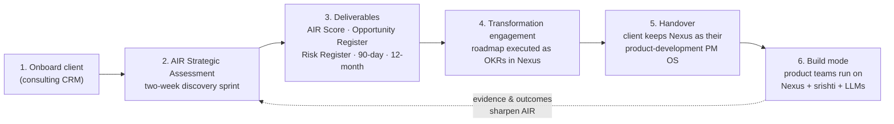
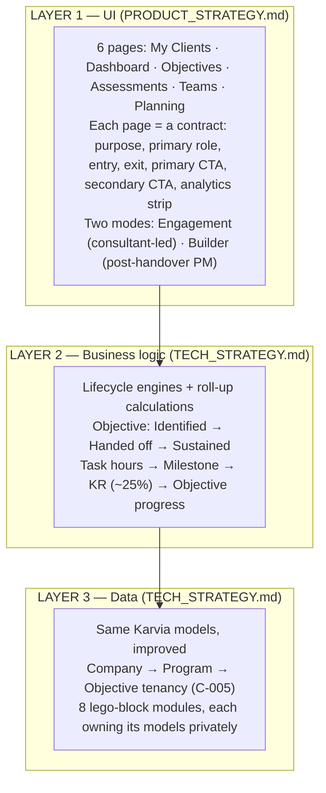

# Nexus North Star — the 90-step thesis

## Purpose

This is the single entry point for building Nexus. It states the play, the philosophy, the constraint, and the three-layer model, and it hands off to four downstream documents — business, product, technical, execution — that together act as a **pack of cards**: each session draws the next card with minimal human intervention. If a future session is unsure what to do, it starts here.

## TL;DR

- **The play**: BRAMHI becomes a world-class **AI transformation consulting** practice, and **Nexus is the instrument that delivers it** — from AIR assessment through roadmap through execution — and then **the product that gets handed over**: the client's product teams keep Nexus as their project-management OS, with srishti as the document/intelligence add-on.
- **The thesis**: Karvia went from idea to working beta in ~290 sessions. Nexus arrives at a better product in **≤ 90 sessions**, because we have the complete journey in hindsight, ratified architecture decisions, and an autonomous agent loop with a quality bar.
- **The method**: three layers (UI, business logic, data); every capability a **lego block** with a published contract. The assessment block is the flagship proof: **AIR ships v1; any future assessment plugs in without touching the rest**. SSI is not carried into Nexus — it remains a Karvia reference only.
- **The pack of cards**: four documents — [AI_CONSULTING_PLAYBOOK.md](0-BUSINESS/AI_CONSULTING_PLAYBOOK.md) (the service), [PRODUCT_STRATEGY.md](1-PRODUCT/PRODUCT_STRATEGY.md) (the tool), [TECH_STRATEGY.md](2-TECHNICAL/TECH_STRATEGY.md) (the architecture), [EXECUTION_PLAYBOOK.md](3-DELIVERY/EXECUTION_PLAYBOOK.md) (the ≤90-session plan).
- **The bar**: every session is measured against `2-TECHNICAL/IMPROVEMENT_PLAN.md`. Nexus is not a copy of Karvia — it is the codebase Karvia should have been.

---

## The play: consulting is the wedge, Nexus is the engine

Nexus remains a **Transformation OS** at the architecture level (C-001) — but the go-to-market is sharpened (C-006): **AI transformation consulting for product-development companies is the beachhead.** The motion, end to end:

*The flywheel. Every engagement makes the assessment smarter and the product stickier.*

Why this compounds:

- **The assessment is the acquisition engine, not the business.** A ~$25k AIR Strategic Assessment converts into quick-wins and transformation-partner phases worth ~5× the assessment fee. (Tiers, funnel, and collateral: the consulting playbook.)
- **The handover is the moat.** Other consultancies leave a PDF. We leave the operating system the client's product teams run on — and srishti as the document/model-care layer connected to LLMs for intelligence. The engagement ends; the subscription begins.
- **Nexus dogfoods itself.** We use Nexus to manage every consulting engagement and to build Nexus. Every papercut we feel is a customer papercut.
- **The end-state ambition**: Nexus is the single tool every AI product builder uses to coordinate building any application — project management and team coordination in Nexus, documents and model care in srishti, intelligence from LLMs.

## The philosophy: fewer steps from idea to product

Karvia is a real, working product. Its journey is fully recorded: ~290 sessions of strategy, coding, testing, hotfixing, and re-strategizing live in `_source/karvia_claude/SESSION_LOG.md` and the sprint archives. That record is an asset no greenfield project has.

The question Nexus answers — and the philosophy behind the wider Srishti process work — is:

> **How many steps does it take to go from idea to a launched product, when you already know the whole journey?**

Karvia's 290 steps included every dead end: engines that never deployed, dual-write migrations left open, hardcoded question banks, strategy docs that drifted. Nexus deletes the dead ends and keeps the destinations. One session = one step. The budget is **90 steps**, and each step must either be a strategy card, a contract card, or a code card — never a "figure out what we're doing" card, because the pack of cards already answers that.

What makes ≤90 credible rather than aspirational:

| Karvia spent sessions on | Nexus instead has |
|---|---|
| Discovering the domain model by building it | The proven chain, sharpened into **NOF**: Objective → KR → Milestone → Task — dynamic, outcome-measured (`1-PRODUCT/NOF.md`, C-008) |
| Architecture experiments (10 engines, 8 dead) | Ratified decisions: consolidate (C-003), TypeScript strict (C-004), Program entity (C-005) |
| Lifting + untangling legacy assessment code | SSI dropped (C-006); AIR built clean and data-driven inside the assessment block |
| Re-deriving context every session | `_agent/` loop state + this pack of cards |
| Strategy docs drifting from code | Docs-as-code gates (AP-10) |
| Manual quality judgment | CI quality gates per PR (IM-5) |

## What Nexus is

Nexus is a **Transformation OS**: a multi-tenant platform where a consultant (or an org directly) runs a transformation program end to end — assess readiness, govern the program, set OKRs, drive weekly execution, capture institutional knowledge, measure outcomes. **AI transformation, scored by AIR, is the launch vertical**; the architecture makes every future vertical a new assessment implementation plus a playbook on the same blocks.

At the experience level, Nexus **is Karvia 2.0**: the same six pages, the same click flow, the same backend models — re-skinned with a **new minimalistic design language** (founder's design docs, incoming — see PRODUCT_STRATEGY § design). A Karvia user should recognize the flow instantly; a Karvia developer should not recognize the codebase.

## The three-layer model

Every decision in the pack of cards lives in exactly one layer:

*The three layers. UI strategy is owned by the product card; business logic and data are owned by the tech card.*

The **lego rule** binds all three layers: every capability (CRM, assessment, objectives, key results, weekly goals, tasks, governance, knowledge) is a black box with a published TypeScript contract. You ask the objectives module for an objective and it answers — you never reach into its schemas. The flagship case: **the assessment block**. AIR — its five dimensions, its two-week sprint instruments, its scoring, its deliverable generators — lives entirely inside `assessment/impls/air/`. Installing a different assessment tomorrow adds a folder; it changes nothing else. That swap-in-hours property is the acceptance test of the whole architecture.

## The pack of cards

Four documents, each owning one concern, none overlapping:

| Card | Document | Owns | Drawn when |
|---|---|---|---|
| **Business** | [0-BUSINESS/AI_CONSULTING_PLAYBOOK.md](0-BUSINESS/AI_CONSULTING_PLAYBOOK.md) | The AIR framework, two-week sprint, deliverables, pricing, funnel, collateral | Any session touching the consulting service or what AIR must produce |
| **Product** | [1-PRODUCT/PRODUCT_STRATEGY.md](1-PRODUCT/PRODUCT_STRATEGY.md) | The 6 page contracts, two operating modes, first-value journey, design language | Any session touching what a user sees or does |
| **Tech** | [2-TECHNICAL/TECH_STRATEGY.md](2-TECHNICAL/TECH_STRATEGY.md) | The 3-layer architecture, 8 module contracts, pluggable assessment, handover, srishti boundary | Any session touching code structure, models, or APIs |
| **Execution** | [3-DELIVERY/EXECUTION_PLAYBOOK.md](3-DELIVERY/EXECUTION_PLAYBOOK.md) | The ≤90-session plan, session types, folder + command hierarchy, measurement | Every session — it names the next card |

Supporting (already exist, not duplicated here):

- `2-TECHNICAL/SYSTEM_ARCHITECTURE.md` — what Karvia *is* (the as-is map)
- `2-TECHNICAL/IMPROVEMENT_PLAN.md` — the quality bar (10 anti-patterns, 10 improvements, per-PR gates)
- `_agent/DECISIONS.md` — every ratified architectural choice, dated

## Doc hierarchy

| Tier | Folder | Purpose | Key docs |
|---|---|---|---|
| T0 | `NEXUS_STRATEGY/` root + `0-BUSINESS/` | This doc; the consulting service, GTM, business model | `00_NORTH_STAR.md`, `AI_CONSULTING_PLAYBOOK.md` |
| T1 | `1-PRODUCT/` | Product strategy, capabilities, journeys, design | `PRODUCT_STRATEGY.md` |
| T2 | `2-TECHNICAL/` | Architecture, contracts, data models | `TECH_STRATEGY.md`, `SYSTEM_ARCHITECTURE.md`, `IMPROVEMENT_PLAN.md` |
| T3 | `3-DELIVERY/` | Execution plan, QA, releases | `EXECUTION_PLAYBOOK.md` |
| T4 | `4-CUSTOMER/` | Interviews, feedback, evidence | (Night 1, N1-P3-03) |

## Command hierarchy

The agent loop is the delivery engine. Commands (defined in `.claude/commands/`):

| Command | Role in the 90 steps |
|---|---|
| `/init` | Interactive session start — load this pack |
| `/sprint-load` | Turn a night's sprint file into tick-sized BACKLOG entries |
| `/nexus-tick` | One autonomous step: pick task → branch → work → PR → journal → exit |
| `/audit` | Read-only drift check: docs vs code vs BACKLOG |
| `/close` | Interactive session end — journal, commit, push |

Every step — human-driven or cron-fired — journals to `_agent/JOURNAL.md`. The journal is the session counter: **the count of journal entries is the step count**, measured against the 90 budget in the execution playbook.

## How we know it worked

By launch, all of these hold:

1. **≤ 90 journaled sessions** from this document's date to a deployed, usable Nexus beta.
2. Every dimension in `IMPROVEMENT_PLAN.md` § "How we'll know it worked" beats the Karvia baseline.
3. **A new assessment vertical ships in hours** (a new impl folder of the assessment contract, nothing else touched), proving the lego claim.
4. **A real AIR engagement runs end to end in Nexus** — onboarding, two-week sprint evidence capture, scoring, deliverables, roadmap-as-OKRs, handover — with no step falling back to spreadsheets or slide decks.
5. A handed-over client's product team keeps using Nexus as their PM tool after the engagement ends.

## Open questions

None blocking. The design language is a declared dependency (founder's design docs, incoming) tracked in `PRODUCT_STRATEGY.md`; anything ambiguous goes to `_agent/clarifications.md` per the standing rule.
