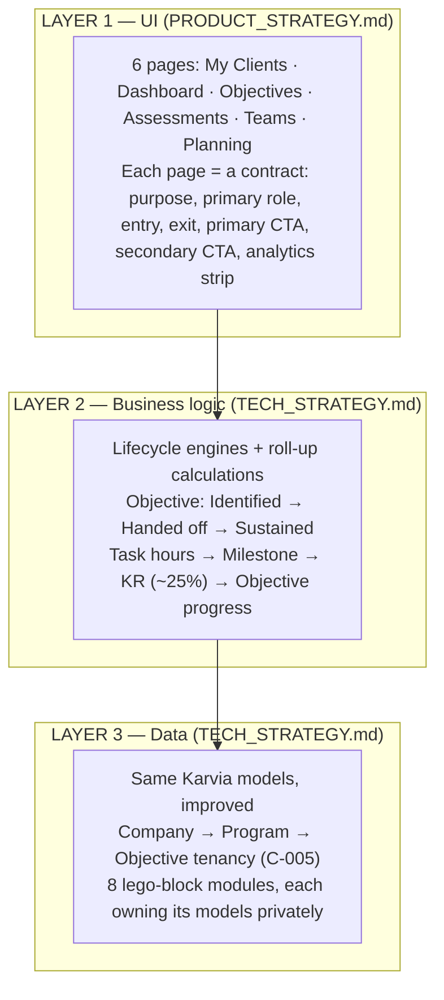

# Nexus North Star — the 90-step thesis

**Status**: Active
**Last Updated**: 2026-06-09
**Owner**: Founder + agent (interactive session 2026-06-09)
**Tier**: T0
**Depends on**: `_agent/DECISIONS.md`, `.claude/CLAUDE.md`, `_source/KARVIA_STRATEGY/00_MASTER_STRATEGY.md`, `_source/karvia_claude/SESSION_LOG.md`

---

## Purpose

This is the single entry point for rebuilding Karvia as Nexus. It states the philosophy, the constraint, and the three-layer model, and it hands off to exactly three downstream documents — product, technical, execution — that together act as a **pack of cards**: each session draws the next card with minimal human intervention. If a future session is unsure what to do, it starts here.

## TL;DR

- **The thesis**: Karvia went from idea to working beta in ~290 sessions. Nexus arrives at a better product in **≤ 90 sessions**, because we now have the complete journey in hindsight, ratified architecture decisions, and an autonomous agent loop with a quality bar.
- **The product**: Nexus is a **Transformation OS** — Karvia 2.0, same proven flow and models, repositioned for any transformation vertical with AI Readiness launching first.
- **The method**: treat the product as **three layers** (UI, business logic, data) and every capability as a **lego block** with a published contract. Swap any block (e.g., SSI → another assessment) without touching the rest.
- **The pack of cards**: three documents guide everything — [PRODUCT_STRATEGY.md](1-PRODUCT/PRODUCT_STRATEGY.md) (what each page is for), [TECH_STRATEGY.md](2-TECHNICAL/TECH_STRATEGY.md) (how the layers compose), [EXECUTION_PLAYBOOK.md](3-DELIVERY/EXECUTION_PLAYBOOK.md) (the ≤90-session plan).
- **The bar**: every session is measured against `2-TECHNICAL/IMPROVEMENT_PLAN.md`. Nexus is not a copy of Karvia — it is the codebase Karvia should have been.

---

## The philosophy: fewer steps from idea to product

Karvia is a real, working product. Its journey is fully recorded: ~290 sessions of strategy, coding, testing, hotfixing, and re-strategizing live in `_source/karvia_claude/SESSION_LOG.md` and the sprint archives. That record is an asset no greenfield project has.

The question Nexus answers — and the philosophy behind the wider Srishti process work — is:

> **How many steps does it take to go from idea to a launched product, when you already know the whole journey?**

Karvia's 290 steps included every dead end: engines that never deployed, dual-write migrations left open, hardcoded question banks, strategy docs that drifted. Nexus deletes the dead ends and keeps the destinations. One session = one step. The budget is **90 steps**, and each step must either be a strategy card, a contract card, or a code card — never a "figure out what we're doing" card, because the pack of cards already answers that.

What makes ≤90 credible rather than aspirational:

| Karvia spent sessions on | Nexus instead has |
|---|---|
| Discovering the domain model by building it | The proven hierarchy: Objective → Key Result → Weekly Goal/Milestone → Task, untouched (`DECISIONS.md`, IMPROVEMENT_PLAN parking lot) |
| Architecture experiments (10 engines, 8 dead) | Ratified decisions: consolidate (C-003), TypeScript strict (C-004), Program entity (C-005) |
| Re-deriving context every session | `_agent/` loop state + this pack of cards |
| Strategy docs drifting from code | Docs-as-code gates (AP-10) |
| Manual quality judgment | CI quality gates per PR (IM-5) |

## What Nexus is

Nexus is a **Transformation OS**: a multi-tenant platform where any organization — directly, or through a consultant — runs a transformation program end to end: assess readiness, govern the program, set OKRs, drive weekly execution, capture institutional knowledge, measure outcomes. **AI Readiness is the launch vertical**; the architecture makes every future vertical a new assessment implementation plus a playbook on the same blocks. (Full positioning: `.claude/CLAUDE.md`; ratified as C-001.)

At the experience level, Nexus **is Karvia 2.0**: the same six pages, the same click flow, the same backend models. What changes is the UI quality, the business-logic clarity, and the modularity underneath. A Karvia user should recognize Nexus instantly; a Karvia developer should not recognize the codebase.

## The three-layer model

Every decision in the pack of cards lives in exactly one layer:

*The three layers. UI strategy is owned by the product card; business logic and data are owned by the tech card.*

The **lego rule** binds all three layers: every capability (CRM, assessment, objectives, key results, weekly goals, tasks, governance, knowledge) is a black box with a published TypeScript contract. You ask the objectives module for an objective and it answers — you never reach into its schemas. Swapping the assessment block from SSI to AI Readiness (or MBTI, or PTH) changes nothing outside the assessment block; the My Clients tile simply shows another score column.

## The pack of cards

Three documents, each owning one concern, none overlapping:

| Card | Document | Owns | Drawn when |
|---|---|---|---|
| **Product** | [1-PRODUCT/PRODUCT_STRATEGY.md](1-PRODUCT/PRODUCT_STRATEGY.md) | The 6 page contracts, roles, first-value journey, objective lifecycle stages, analytics doctrine | Any session touching what a user sees or does |
| **Tech** | [2-TECHNICAL/TECH_STRATEGY.md](2-TECHNICAL/TECH_STRATEGY.md) | The 3-layer architecture, 8 module contracts, pluggable assessment, calculation engine | Any session touching code structure, models, or APIs |
| **Execution** | [3-DELIVERY/EXECUTION_PLAYBOOK.md](3-DELIVERY/EXECUTION_PLAYBOOK.md) | The ≤90-session plan, session types, folder + command hierarchy, measurement | Every session — it names the next card |

Supporting (already exist, not duplicated here):

- `2-TECHNICAL/SYSTEM_ARCHITECTURE.md` — what Karvia *is* (the as-is map)
- `2-TECHNICAL/IMPROVEMENT_PLAN.md` — the quality bar (10 anti-patterns, 10 improvements, per-PR gates)
- `_agent/DECISIONS.md` — every ratified architectural choice, dated

## Doc hierarchy

| Tier | Folder | Purpose | Key docs |
|---|---|---|---|
| T0 | `NEXUS_STRATEGY/` root + `0-BUSINESS/` | This doc; positioning, GTM, business model | `00_NORTH_STAR.md` |
| T1 | `1-PRODUCT/` | Product strategy, capabilities, journeys | `PRODUCT_STRATEGY.md` |
| T2 | `2-TECHNICAL/` | Architecture, contracts, data models | `TECH_STRATEGY.md`, `SYSTEM_ARCHITECTURE.md`, `IMPROVEMENT_PLAN.md` |
| T3 | `3-DELIVERY/` | Execution plan, QA, releases | `EXECUTION_PLAYBOOK.md` |
| T4 | `4-CUSTOMER/` | Interviews, feedback, evidence | (Night 1, N1-P3-03) |

## Command hierarchy

The agent loop is the delivery engine. Commands (defined in `.claude/commands/`):

| Command | Role in the 90 steps |
|---|---|
| `/init` | Interactive session start — load this pack |
| `/sprint-load` | Turn a night's sprint file into tick-sized BACKLOG entries |
| `/nexus-tick` | One autonomous step: pick task → branch → work → PR → journal → exit |
| `/audit` | Read-only drift check: docs vs code vs BACKLOG |
| `/close` | Interactive session end — journal, commit, push |

Every step — human-driven or cron-fired — journals to `_agent/JOURNAL.md`. The journal is the session counter: **the count of journal entries is the step count**, measured against the 90 budget in the execution playbook.

## How we know it worked

By launch, all of these hold:

1. **≤ 90 journaled sessions** from this document's date to a deployed, usable Nexus beta.
2. Every dimension in `IMPROVEMENT_PLAN.md` § "How we'll know it worked" beats the Karvia baseline.
3. A new assessment vertical ships in **hours** (new impl of the assessment contract), proving the lego claim.
4. A Karvia user, shown Nexus, says "this is Karvia but better" — same flow, sharper pages, clearer value.

## Open questions

None blocking. Product-level refinements (exact analytics tile sets per page, dashboard primary CTA wording) are owned by `PRODUCT_STRATEGY.md` and resolved there; anything ambiguous goes to `_agent/clarifications.md` per the standing rule.
