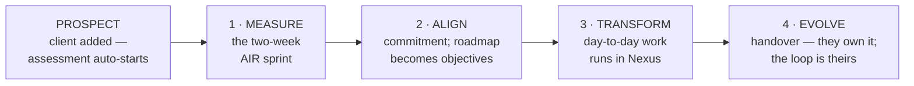

# The Nexus Constitution

> **NEXUS by BRAMHI** — *Measure. Align. Transform. Evolve.*

## Preamble — what this document is

This is the constitutional document for Nexus. It states, in plain language, what Nexus is, why it exists, how an organization travels through it, and how everything is measured. Every other document — business, product, technical, delivery — implements what this one states. Where any document disagrees with this one, this one wins and the other gets revised.

It is written to be read without prior context, by anyone — an engineer, an investor, a client CEO, a new team member. Every term of art is defined in the glossary (Appendix A). If you finish this document with an unanswered question, that is a defect in the document: file it.

It can be amended — reality will teach us things — but only deliberately: an amendment requires founder ratification and a dated entry in the decision log (Article 12).

---

## 1 · The thesis — why Nexus exists

Software companies built their development processes for a world where humans typed all the code. That world is ending. In the AI world, the scarce skill is no longer writing software — it is **operating an AI-powered development engine well**: knowing whether your AI spending produces real product, and whether what ships actually works.

Most companies cannot answer either question. The measurable gap between an average team and a top-operating team — on the *same* AI tools — is worth roughly **$1.4M–$2.5M per year for every ten engineers** (Appendix C). That money is lost silently: wasted AI spend, foregone velocity, and quality failures nobody attributes correctly.

BRAMHI's proof is itself: **Karvia**, a full SaaS product, was built end-to-end in ten months by an AI-native process that was *measured the entire way* — 96% of every AI dollar became shipped product, at $2.37 per production change, with 97.7% of work building on prior work (Appendix C). That process — and the measurement system that proves it works — is the product.

**Nexus is the operating system that installs this way of working in other software companies.** Not a report that says "be better." A system the company runs on, with gauges that show — honestly, continuously — whether it is working.

One sentence: *Nexus progressively instruments an organization until its own operating quality becomes a number it can plan against.*

## 2 · The ecosystem — who builds what

| Entity | What it is | One line |
|---|---|---|
| **BRAMHI Labs** | The parent company | Owns the philosophy, the methodology, the measurement standard, the brand family |
| **Nexus** | The delivery system (this product) | Where the work happens: client management, objectives, day-to-day execution, evidence capture — *"the connective intelligence layer that brings everything together"* |
| **iBrain** | The intelligence platform | All engine capability — event tracking, pattern detection, scoring, AI plan generation — consumed by Nexus through published interfaces |

The history that makes this credible: iBrain's engines *are* the engines built for Karvia, extracted into a standalone platform. Nexus never rebuilds intelligence — it delegates to iBrain. (Version 1 ships self-contained implementations shaped like iBrain's interfaces, so connecting the live platform later is configuration, not reconstruction.)

The target market, deliberately narrow: **companies that build software — digital products and services.** Everything in version 1 — the metrics, the playbooks, the benchmarks — is calibrated for them. Other verticals come later, as new assessment packages on the same architecture.

## 3 · The operating loop — the philosophy

The brand tagline is not decoration. It is the method, in order:

```
 MEASURE  →  ALIGN  →  TRANSFORM  →  EVOLVE  →  (repeat)
 read your    set strategy   execute the     capture the learning,
 numbers      against them   change          raise the bar
```

This is a loop, not a line. A healthy organization runs it continuously: look at the gauges, decide what matters most, do the work, keep what was learned, look again. Like learning a dance — at first you count the steps out loud; eventually the steps come naturally and you're just dancing. The whole point of the Nexus journey is to take a company from *being measured once by an outsider* to *running this loop themselves without thinking about it*.

The loop's decision rule is the deepest primitive in the BRAMHI stack — the **Next Best Move**: given your objectives, your values, your context, and your signals, what is the single best next action? Every intelligent behavior in Nexus is an instance of this one question — what should this developer do today, which initiative should this company start next, which weakness should this quarter attack.

## 4 · The journey — the company ladder

A company climbs through **five states**. The first is a doorway; the other four are the loop's own verbs, because the journey is simply the first lap of the loop, walked with a guide:



| State | Entry moment (crisp, observable) | What happens | Gauges that light up | Who must be won |
|---|---|---|---|---|
| **Prospect** | client added in Nexus | nothing yet — the AIR assessment auto-initiates; no manual send | — | — |
| **1 · Measure** | assessment sprint begins | the two-week AIR engagement: surveys, observation, tool inventory, scoring workshop | **ARS** (the AI-readiness score), the Baseline, the first Organizational Map position — all *proxy* | the **assessment taker** — if answering feels respectful and even enjoyable, everything downstream lives |
| **2 · Align** | engagement signed — the commitment | the roadmap becomes objectives in Nexus; leadership planning moves into the system | **FLS** and **CFS** begin measuring; the Opportunity Register goes live | **leadership** — the roadmap must feel like theirs, not a vendor's |
| **3 · Transform** | teams track day-to-day work in Nexus | execution and knowledge capture become daily habit; the client's engineering telemetry (git, CI, AI usage, incidents) is connected | **BPI** comes alive — the Eight Metrics velocity pack (Appendix C); knowledge compounding | **workers and managers** — daily tracking must be lighter than whatever it replaced |
| **4 · Evolve** | **handover** — the client owns Nexus | the engagement ends, the subscription begins; cadence becomes natural; recurring re-assessment; benchmarking against the BRAMHI standard | **BRQ** (rhythm), the quality metrics (Appendix C), and finally **BOQ — fully measured — as the company's own North-Star KPI** | the **buyer/CEO** — BOQ must earn a place next to revenue in the board deck |

Five things this ladder means:

1. **The journey is the process of BOQ becoming real.** At Measure, BOQ is an estimate built from questions and observation (*proxy*). Each state replaces estimation with live measurement. At Evolve, every driver is measured from the company's actual operation. Climbing the ladder *is* upgrading the provenance of your number (Article 2).
2. **A state is not a badge of being good — it is a statement of what can be honestly measured.** Reaching Transform doesn't mean you transform well; it means your productivity is now *measured*, not guessed. The scores say how good you are. The states say how real the scores are.
3. **Authority flows down the ladder; conviction flows up.** The CEO signs before any developer touches the tool — but the first human who *experiences* Nexus is the most junior one, answering an assessment deck in week one. Each state is won or lost with the person named in its last column, one level below where it was authorized. Lose the takers and the data dies; lose the workers and the dashboards go stale; lose the buyer and the relationship ends at handover.
4. **The order of *transformation work* inside the journey is assessment-driven, never fixed** (Article 7). The assessment finds the weakest driver; that's where the first program aims. A company that's aligned-but-slow does different work than a chaotic one. The states are the same; the work inside them is prescribed by the Map.
5. **The same ladder serves both motions.** Consultant-led: BRAMHI guides the first lap. Org-direct: the company self-serves the assessment and climbs with playbooks. No step may assume a consultant exists (Article 9).

**The eight brand components** (AIR Score · Catalyst · Align · Execute · Knowledge · Rhythm · Measure · BOQ) are **not** additional stages. They are the practices installed and the gauges lit along this ladder — the visual strip on the brand guide. Catalyst, specifically, is the *commitment moment*: the doorway into Align where a company says "let's transform how we build software, using Nexus as the vehicle." (Mapping table: Appendix E.)

**Supersession note**: earlier drafts named five stages "Prospect → Assessing → Engaged → Builder → BOQ North Star." This ladder replaces those names: Assessing = Measure; Engaged spanned Align + Transform and is now split; Builder and North Star both live inside Evolve, with handover as its entry. Pipeline badges in the product read: *Prospect · Measuring · Aligning · Transforming · Evolving.*

**What stays out of the client's ladder**: "BOQ becomes an industry standard" is **BRAMHI's** journey, not the client's. The client's ladder ends at *"BOQ is our KPI."* The standard grows as a side-effect: every measured company makes the benchmark cohort more real — that is BRAMHI's flywheel and moat, and it is described in the business documents, not here.

## 5 · The measurement system — how the numbers work

This section is readable without mathematics. The formulas live in Appendix D.

### 5.1 The one rule everything obeys

> **Only signals are directly measured. Every score is calculated from signals, and every score can be traced back to its signals on demand.**

A *signal* is an observable fact: what fraction of AI spending became shipped code, how long decisions take, how often shipped code breaks, how many meetings alignment costs. Scores are arithmetic on top of facts. When a CEO asks "where did this 74 come from?", the answer is a walk down to the facts — never "the consultant felt it."

### 5.2 The shape: ~30 signals → 6 drivers → 1 quotient

**Six drivers** summarize the conditions and performance of the organization (full detail: Appendix B):

| Driver | Plain-language question it answers |
|---|---|
| **ARS** — AI Readiness Score | Is this organization ready to use AI seriously? *(identical to the AIR Score the assessment produces — one score, two contexts)* |
| **BPI** — BRAMHI Productivity Index | Does intent become shipped product efficiently? *(fed by the Eight Metrics — Appendix C)* |
| **CFS** — Coordination Friction Score | How much does it cost to get people moving in the same direction? |
| **BRQ** — Business Rhythm Quotient | Does the company run on a cadence, together — or on heroics? |
| **FLS** — Founder Leverage Score | Does the company run through one person, or does it run? |
| **CRS** — Consolidation Readiness Score | How ready is the tool stack to consolidate onto an AI-native system? |

**BOQ — the Business Operating Quotient** — combines the six into one number, 0–100. It uses a *geometric mean*, which has one crucial property: **one weak driver drags the whole number down, and fixing your weakest driver always helps more than polishing your strongest.** A company scoring 80 on five drivers and 20 on the sixth gets a BOQ of about 63 — not the "average" 70. That is deliberate. BOQ measures *balance*, because the ways companies actually fail are imbalances: brilliant execution with no rhythm is burnout; deep knowledge with no adaptability is bureaucracy; high AI readiness with no productivity is demos without outcomes.

### 5.3 One scale everywhere: tier placement

Raw measurements come in incompatible units — dollars per commit, percentages, hours. Every score in the system is normalized the same way: **where do you sit between a newbie operator and the top 0.1%?** Each signal has published anchors (e.g., build-to-burn: ~30% for a newbie, 96% at top 0.1%). Your 0–100 score is your position on that ladder. The raw values are kept and shown as evidence; the score is always *position*.

Every 0–100 score is then read on one shared set of **bands**:

| Band | Range | Plain meaning |
|---|---|---|
| **Reactive** | 0–30 | firefighting; no system to improve yet |
| **Operational** | 31–50 | things run, but on heroics and memory |
| **Structured** | 51–70 | repeatable process; learning starts to stick |
| **AI-Ready** | 71–85 | the foundation can absorb AI leverage |
| **AI-Native** | 86–100 | the operating loop *is* the company |

### 5.4 Honesty rules (the part that keeps the system credible)

- **Provenance, always visible.** Every score is labeled by where it came from: **Proxy** (estimated from surveys/observation/benchmarks), **Partially Measured**, or **Measured** (live telemetry). The two are never blended silently. Early in the journey, most scores are Proxy — and they say so.
- **Validity floors.** Below a minimum activity level, a metric measures noise, not discipline (e.g., AI-usage metrics require ≥20 AI sessions per engineer per month). Below the floor, the system shows *"insufficient signal"* — never a number.
- **Calibrate, never invent.** In the scoring workshop, human judgment may *adjust* a computed score — and every adjustment must cite the evidence justifying it. Judgment never *creates* a score.
- **Readiness never saturates.** ARS is measured against the *current* AI frontier, which moves. A company that scored AI-Ready in 2026 is re-benchmarked against 2027's frontier at re-assessment. This is why measurement is a subscription, not an event.
- **Display rule.** A score never appears alone: always number + band + provenance + a tap-through to its evidence.

### 5.5 Where the signals come from

Three collection channels, one engine:

| Channel | What it is | When it runs |
|---|---|---|
| **Survey** | flashcard-style question decks, with different questions for founders, managers, and team members | assessment sprint; recurring pulses afterward |
| **Observation** | a consultant in the building: interviews, workshops, tool inventory | assessment sprint; calibration workshops |
| **Telemetry** | live data from real operation — **both** Nexus usage (coordination, cadence, decisions) **and the client's engineering stack** (git, CI, incident tracker, AI usage and billing) | from Transform onward — this is what turns Proxy into Measured |

The second telemetry source is a deliberate architectural commitment: the most saleable gauges — the Eight Metrics — live in the client's development infrastructure, not inside Nexus. Nexus must ingest that data (through iBrain's event pipeline) or those gauges would stay consultant-collected snapshots forever.

Survey questions are never invented per assessment. Every question is born from the metric model and declares which metric it feeds and how much (Article 5). An *assessment* is a package of instruments × audiences × timing; AIR is the first package, and any future package plugs into the same engine.

## 6 · The business — how money follows the ladder

1. **Measure** is paid diagnosis (~$25k): two weeks, a real score, a real roadmap. It is the acquisition engine, not the business.
2. **Align + Transform** is the engagement (~5× the assessment fee): the roadmap executed inside Nexus, with the client's team living in the product months before they ever "buy software."
3. **Evolve** is the subscription: the engagement ends, the handover happens, and the client keeps the operating system — gauges live, re-assessments cadenced. Other consultancies leave a PDF. BRAMHI leaves the system the company runs on.
4. **The flywheel**: every measured company sharpens the benchmarks, the playbooks, and the standard itself. The methodology is the IP; the score is the front door; Nexus is the engine.

## 7 · The binding articles

These twelve rules are the constitution proper. Everything else in this document explains them.

1. **The signal rule.** Only signals are directly measured; every score is calculated and traceable to signals on demand.
2. **The provenance rule.** Every displayed score carries Proxy / Partially Measured / Measured. No silent blending.
3. **The validity floor.** Below a metric's published activity floor, display "insufficient signal" — never a number.
4. **Calibrate, never invent.** Human adjustments annotate their justifying evidence. No evidence, no adjustment.
5. **Questions derive from the model.** Every survey question declares its metric mapping. The question bank is data; the weights are configuration; neither is ever hardcoded.
6. **The display rule.** Score = number + band + provenance + evidence drill-down. Always all four.
7. **Assessment-driven order.** The sequence of transformation work is prescribed by the assessment (weakest driver first), never by a fixed curriculum.
8. **The trinity rule.** Each brand component deliberately names three things at once — a practice, a place on the ladder, and a gauge. Documents must say which sense they mean.
9. **No consultant hardcoded.** Every step of the ladder must work consultant-led *and* org-direct. The consultant is a guide, never a dependency.
10. **Tier-placement normalization.** Every score is a 0–100 position between published newbie and top-0.1% anchors. Raw values are evidence, never scores.
11. **The floor guard.** Drivers entering the BOQ composite are clamped to 1–100, so a single zero cannot annihilate the quotient (it will still drag it brutally — that's the design).
12. **The amendment rule.** This document changes only by founder ratification recorded in `_agent/DECISIONS.md`, and every change propagates to the documents that implement it.

## 8 · Settled vs evolving

| Settled (constitutional) | Evolving (will be calibrated by real engagements) |
|---|---|
| The thesis, the ecosystem roles, the target market | Pricing specifics; engagement packaging |
| The loop (M-A-T-E) and the five-state ladder with its entry moments | Playbook content inside each state |
| The six-driver family and BOQ as their geometric mean | Driver weights, signal sets, calibration constants (trade-secret configuration) |
| The five bands | Band boundaries, after real cohorts exist |
| All twelve articles | The Eight Metrics' anchor values, as benchmarks improve |
| The three collection channels, incl. engineering-stack ingestion | Which integrations ship in which order |

## 9 · Honest limits (what we cannot claim yet)

Stated here so no one ever oversells:

- **The measured cohort is one company.** "Top 0.1%" anchors currently come from published industry research (DORA, DX Core 4, Faros) plus the Karvia case. The proprietary distribution becomes real as engagements accumulate. Collateral must say which anchor it uses.
- **The quality half of the proof is pending.** Karvia's four velocity metrics are measured; the four quality metrics (DORA-standard, lagging) await time windows and trackers. First engagements must instrument quality early — for the client's sake and ours.
- **BRAMHI is mid-ladder on its own framework** (~Transform→Evolve). That is a feature — the dogfood is the demo — but it must be said plainly.
- **The acronyms collide** (CCS/CFS/CFR/CSS/CRS). The glossary is mandatory; product surfaces always show full names alongside acronyms.

---

# Appendices

## Appendix A — Glossary (plain language, one line each)

| Term | Meaning |
|---|---|
| **AIR / AIR Score / ARS** | The AI-readiness assessment and its 0–100 score. AIR is the product name; ARS is the same number's name inside the driver family. |
| **AI utilization floor** | Minimum AI usage (≥20 sessions per engineer per month) below which AI metrics are noise and are not displayed as numbers. |
| **Assessment package** | A bundle of instruments × audiences × timing (e.g., AIR = the two-week sprint package). |
| **Band** | The plain-language tier a 0–100 score falls into: Reactive · Operational · Structured · AI-Ready · AI-Native. |
| **BOQ** | Business Operating Quotient — the single 0–100 composite of the six drivers; the number a company plans against. *(Expansion per brand guide + founder 2026-06-10; older docs saying "BRAMHI Organizational Quotient" get revised.)* |
| **BPI** | BRAMHI Productivity Index — the productivity driver; fed by the Eight Metrics. |
| **BRQ** | Business Rhythm Quotient — the cadence/togetherness driver. |
| **Catalyst** | The commitment moment: a company agrees to transform how it builds software, with Nexus as the vehicle. The doorway into Align. |
| **CFS** | Coordination Friction Score — the cost-of-alignment driver (inverted: higher score = less friction). |
| **CRS** | Consolidation Readiness Score — readiness of the tool stack to consolidate onto an AI-native system. |
| **Driver** | One of the six top-level scores that combine into BOQ. |
| **Eight Metrics** | BRAMHI's engineering measurement pack for AI-native development (Appendix C). Four velocity (leading), four quality (lagging). |
| **FLS** | Founder Leverage Score — does the company run through one person (inverted: higher = healthier). |
| **Gauge** | Any score displayed live in the product. "The gauge lights up" = its signals became valid. |
| **iBrain** | BRAMHI's intelligence platform — the engines (tracking, scoring, planning, pattern detection) Nexus delegates to. |
| **The ladder** | The five states: Prospect → Measure → Align → Transform → Evolve. |
| **The loop** | Measure → Align → Transform → Evolve, repeated forever. The ladder is the loop's first lap. |
| **Next Best Move (NBM)** | The decision primitive: objectives + values + context + signals → the single best next action. |
| **NOF** | Nexus Objective Framework — Objectives → Key Results → Milestones → Tasks; how work is structured in Nexus. |
| **Organizational Map** | The two-axis executive visual (rhythm × efficiency) with four quadrants: Chaotic · Aligned-but-Slow · Productive-but-Fragmented · AI-Native. |
| **Provenance** | Where a score came from: Proxy (estimated) → Partially Measured → Measured (live telemetry). |
| **Signal** | An observable fact (e.g., cost per shipped change, decision latency). The only thing directly measured. |
| **Tier placement** | The normalization rule: every score is your 0–100 position between published newbie and top-0.1% anchors. |
| **TLO** | Total Loss of Opportunity — the annual dollar cost of operating at industry average instead of top tier. |

## Appendix B — The six drivers in depth

| Driver | Question | Primary signal sources | Becomes *Measured* at |
|---|---|---|---|
| **ARS** | Ready to use AI seriously? | assessment surveys + observation; re-benchmarked each cycle against the current AI frontier | Measure (proxy by design — readiness is assessed, then re-assessed on cadence) |
| **BPI** | Intent → shipped product, efficiently? | the Eight Metrics from the engineering stack (Appendix C); four pillars: Velocity 0.30 · Quality 0.15 · Knowledge 0.25 · Capital Efficiency 0.30 | Transform (velocity pack) → Evolve (quality pack) |
| **CFS** | What does alignment cost? | meeting load, decision latency, dependency delays; coordination survey sections | Align onward (Nexus telemetry) |
| **BRQ** | Cadence or heroics? | milestone cadence adherence, review regularity, nudge-independence (cadence holding *without* prompts = the dance) | Evolve (needs weeks of cadence history) |
| **FLS** | One person, or a company? | decision-routing observation, approval latency, founder-bottleneck survey sections | Align onward |
| **CRS** | Stack ready to consolidate? | tool inventory (observed), stack-replacement survey sections, capability-replication time | Measure (proxy) → sharpened during Transform |

Demotions, recorded: *Knowledge Intelligence* is a pillar inside BPI (weight 0.25), not a top-level driver; *CRT* (capability replication time) is a signal feeding CRS. Both remain fully traceable, one layer down.

## Appendix C — The Eight Metrics (the engineering pack)

Source: *BRAMHI — The Eight Metrics* (2026). Measures how effectively an engineering organization uses AI to build product. Two questions, eight gauges:

**Q1 — Velocity: is our AI spending producing real product?** (leading)

| Metric | Meaning | Newbie → Top 0.1% | Karvia |
|---|---|---|---|
| **BBR** — Build-to-Burn Ratio | how much of every AI dollar became shipped product | ~30% → 96% | **96% · measured** |
| **SVR** — Ship Velocity | production-ready changes per AI session | 0.1× → 1.4× | **1.4× · measured** |
| **TOR** — Cost per Ship | dollars per production change | $40+ → $2.37 | **$2.37 · measured** |
| **CCS** — Context Compounding | how well work builds on prior work | ~10% → 97% | **97.7% · measured** |

**Q2 — Quality: is the code we shipped actually working?** (lagging, DORA-standard)

| Metric | Meaning | Newbie → Top 0.1% | Karvia |
|---|---|---|---|
| **CFR** — Change Failure Rate | % of shipped code that breaks | 30%+ → <5% | pending (team scale) |
| **MTTR** — Recovery Time | hours to fix a production break | 24h+ → <2h | pending (incident tracker) |
| **CSS** — Code Stability | % of code still alive after 90 days | ~40% → 90%+ | pending (90-day window) |
| **DER** — Defect Escape Rate | % of bugs reaching production | 60%+ → <10% | pending (bug tracker) |

**Mapping into BPI's pillars**: Velocity ← SVR · Quality ← CFR, MTTR, CSS, DER · Knowledge ← CCS · Capital Efficiency ← BBR, TOR.

**The dollars**: for a 10-person team at industry average, wasted AI spend + foregone velocity + quality cost ≈ **TLO of $1.4M–$2.5M/year** (typical $1.8M; ~$180k per engineer).

**Validity**: all eight respect the AI utilization floor (≥20 sessions/engineer/month). Sources: client git, CI, incident tracker, AI usage/billing — ingested telemetry, not Nexus-internal data.

## Appendix D — The BOQ mathematics

**Normalization (Article 10).** Every signal is converted to 0–100 by tier placement between its published anchors. Raw values are retained as evidence.

**BPI** (pillar formula, v1):

```
BPI = 100 × Velocity^0.30 × Quality^0.15 × Knowledge^0.25 × CapitalEfficiency^0.30
```

Indexed against a SaaS-baseline of 100 — the raw index can exceed 100 (Karvia: 279, i.e., ~2.8× baseline productivity). For the composite, BPI is converted to 0–100 tier placement; the raw index is always reported alongside. Exact calibration constants are trade-secret configuration (Article 5).

**BOQ** (the composite):

```
BOQ = (ARS × BPI′ × CFS × BRQ × FLS × CRS)^(1/6)        each driver clamped to [1, 100]
```

*Why geometric:* the mean of products rewards balance. Worked example — five drivers at 80, one at 20: arithmetic average says 70; BOQ says **(80⁵ × 20)^(1/6) ≈ 63.5**. The weak driver costs ~7 points more than averaging would admit, and recovering it is the single highest-leverage move. The floor guard (Article 11) prevents a zero from collapsing the number entirely while preserving the brutal drag.

**Provenance of the composite**: BOQ inherits the *weakest* provenance among its drivers — if any driver is Proxy, BOQ displays as Proxy. Fully-Measured BOQ is exactly the Evolve state's achievement.

**Bands** (§5.3) apply to every 0–100 score including BOQ itself.

## Appendix E — The ladder in detail, and the component mapping

| Brand component | Sense (Article 8) | Lives at |
|---|---|---|
| **AIR Score** | gauge + practice (the assessment) | Measure |
| **Catalyst** | moment (the commitment) | entry to Align |
| **Align** | practice (planning in the system) + state | Align |
| **Execute** | practice (daily work in the system) | Transform |
| **Knowledge** | practice (compounding memory) + BPI pillar | Transform |
| **Rhythm** | gauge (BRQ) + the felt experience ("dancing") | Evolve |
| **Measure** | the loop's first verb + continuous benchmarking | Evolve (continuous) |
| **BOQ** | gauge (the composite as the company's KPI) | Evolve (fully measured) |

Per-state detail:

- **Prospect** — exists so the funnel is honest: a company we've added but not measured. Exit: sprint scheduled and begun.
- **Measure** — the two-week AIR sprint: audience-split survey decks, floor observation, tool inventory; Day-10 scoring workshop (Article 4); deliverables: ARS, Baseline, Organizational Map position, Opportunity Register draft. Exit: scoring workshop complete, engagement decision on the table.
- **Align** — Catalyst moment; roadmap converted to NOF objectives; leadership planning lives in Nexus; governance and decision rights configured. FLS/CFS begin accruing. Exit: teams begin daily tracking.
- **Transform** — execution at daily granularity; engineering telemetry connected (the gauges go live); knowledge capture compounding; stack consolidation where CRS is high. Exit: **handover** — the client owns the system.
- **Evolve** — subscription mode: recurring re-assessments and pulses, benchmark context, BRQ measurable, quality metrics maturing in their time windows, BOQ fully measured and adopted as the company's North-Star KPI. No exit: this is the operating state. The loop spins without a guide.

## Appendix F — Lineage & references

**Intellectual lineage** (what each framework solved; BRAMHI builds on, not against):

| Framework | Year | Contribution | Limit BRAMHI addresses |
|---|---|---|---|
| DORA | 2014 | made delivery measurable (4 metrics) | pre-AI; pipeline, not AI-dollar efficiency |
| SPACE | 2021 | productivity is multi-dimensional | dimensional, not prescriptive |
| DevEx | 2023 | made developer friction visible | diagnostic, no tier definitions |
| DX Core 4 | 2025 | unified the above + AI measurement layer | numbers without operational tiers |
| **BRAMHI** | 2026 | **operational tier definitions** (what top 0.1% looks like) + **the AI utilization floor** | — |

**Primary sources**:

- *BRAMHI — The Eight Metrics* (2026 PDF) — the engineering pack, anchors, Karvia case, TLO.
- *BRAMHI — The Lineage* (2026 PDF) — the field map above.
- BOQ strategy whitepaper — `NEXUS_STRATEGY/research/boq/bramhi-boq-strategy-whitepaper.html`.
- NEXUS brand guide — `NEXUS_STRATEGY/1-PRODUCT/design/brand/NEXUS_BRANDGUIDE.png` (the ecosystem strip, the journey, the tagline).
- BRAMHI philosophy & architecture whitepapers — `ExternalCom/projects/bramhi/whitepapers/` (Next Best Move, values-aligned synthesis).
- iBrain interface documentation — `official_dev/iBrain/External_App_Integration/`.
- Karvia session record (~290 sessions) — `_source/karvia_claude/` (the measured case study).

**Decision trail**: the ratifications behind this constitution are recorded in `_agent/DECISIONS.md` (C-001…C-009 ratified; C-010…C-013 from the 2026-06-10 strategy session). Per Article 12, all future amendments append there.
