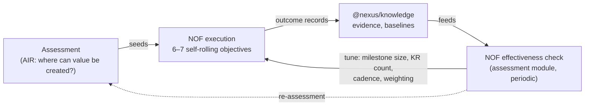

# NOF — the Nexus Objective Framework

## Purpose

Define the execution framework Nexus runs on. NOF is Karvia's OKR engine passed through the reflection gate (C-009): what survived, what was dropped, and the two deliberate upgrades — dynamic timelines and outcome measurement. This is the domain truth that the OKR-chain modules implement.

## TL;DR

- **The hierarchy**: Objective → Key Results → Milestones → Tasks. Four levels, no more. Quarterly Goals and Moves are **dropped** (C-008): they added calendar coupling and a habit layer the six pages never surfaced.
- **Dynamic by design**: an objective starts on any day and ends on any day; KRs, milestones, and tasks align to *the objective's* timeline, never to ISO weeks or quarters. Each objective is complete in itself; an organization runs **6–7 self-rolling objectives** concurrently.
- **Progress ≠ outcome**: KRs measure *progress* (how close are we). The **outcome record** at objective close measures *what actually changed* — the classic OKR blind spot NOF exists to fix.
- **Self-evolving**: NOF is a continuous-improvement framework, not a fixed methodology. The assessment module periodically assesses whether NOF is working *for this org* — rhythm is found, not imposed.

## The hierarchy

| Level | Measures | Time shape | Notes |
|---|---|---|---|
| **Objective** | Outcome (at close + Sustained reviews) | Starts/ends any day; its dates are the frame for everything below | Lifecycle: Identified → Handed off → Sustained. 6–7 concurrent per org, each self-rolling |
| **Key Result** | Progress toward the objective | Inherits the objective's window | 4–5 per objective, ~25% weight each; metric types: number / % / boolean / currency |
| **Milestone** | Progress toward a KR | **~1 week each**, ordered (M1, M2, M3…), dated relative to the objective | Replaces Karvia's WeeklyGoal; no ISO week/year fields |
| **Task** | Done-ness, in hours | Due dates within its milestone | The atomic unit; hours estimated vs logged |

Roll-up (one pure function chain, owned by the roll-up engine): task hours → milestone % → KR % → objective progress % → program %.

## Dynamic timelines — the C-008 resolution

Karvia coupled execution to the calendar: `Goal` was quarterly (with self-nesting), `WeeklyGoal` carried ISO `target_week/year`, `KeyResult` carried `quarters[]`. NOF removes all of it:

- **Dropped**: `Goal` (quarterly layer) and `Move` (habit layer). Anything a Move did (recurrence, habits) is a Task property if ever needed — post-beta.
- **Re-shaped**: `WeeklyGoal` becomes **`Milestone`** — ordered, ~week-sized, dated by offset/duration within the objective's window.
- **Re-parented**: `Task` belongs to a milestone (Karvia's Task required `goal_id`; that edge dies with Goal).
- **De-calendared**: KR loses `quarters[]`/`year`; reporting periods are computed from objective dates when a view needs them.

Why it matters for the product: a transformation program's objectives come out of an assessment on whatever day the engagement lands — forcing them into quarters was Karvia inheriting corporate OKR ritual. Self-rolling objectives are what make the weekly rhythm *the org's own*.

## Outcome measurement — NOF vs classic OKR

Classic OKR's known failure: it measures progress (KR % complete) and calls it success. NOF separates the two:

1. **During execution**: KRs/milestones/tasks measure progress. Dashboard shows progress.
2. **At objective close**: an **outcome record** is written — final values vs baseline, achievement %, outcome class (exceeded / achieved / partial / missed / not measured), narrative, success & risk factors, evidence refs. (Direct descendant of Karvia's `OKROutcome` — the one model that was already measuring outcomes without the framework noticing.)
3. **In Sustained stage**: the objective's KPI is tracked year-over-year — outcome proven durable, not just delivered.
4. **At program level**: outcome records aggregate into `Program.outcome` — the consulting engagement's receipt, captured by `@nexus/knowledge`.

Outcome measurement is itself under continuous improvement — the mechanics here are v1, expected to be refined from real engagement data (see revisit triggers).

## The self-evolving loop

NOF is not fixed; it's a rhythm each organization finds. The loop that makes that real:

The **NOF effectiveness check** is an assessment-module responsibility (designed Night 4): is the framework helping *this* org? Are milestones the right size? Are objectives closing with measured outcomes or stalling at progress? The framework that assesses the org also assesses itself — that is the self-learning AI transformation claim, made concrete.

## Reflection record (C-009 applied to NOF itself)

| Question | Answer |
|---|---|
| **Why** | Karvia's OKR chain worked but inherited calendar ritual and measured only progress |
| **What** | 4-level dynamic hierarchy + outcome records + effectiveness loop |
| **How** | Drop Goal/Move, reshape WeeklyGoal→Milestone, elevate OKROutcome, de-calendar KR |
| **When** | Now — before any OKR-chain contract is drafted (N1-P4-01) |
| **Relevant?** | Core — it IS the product's execution engine |
| **Improving?** | Yes: fixes OKR's progress-vs-outcome flaw; removes a layer the UI never showed |
| **Complexity added?** | Net negative — 4 levels instead of 6 |
| **Redundancy?** | None — replaces, doesn't duplicate |
