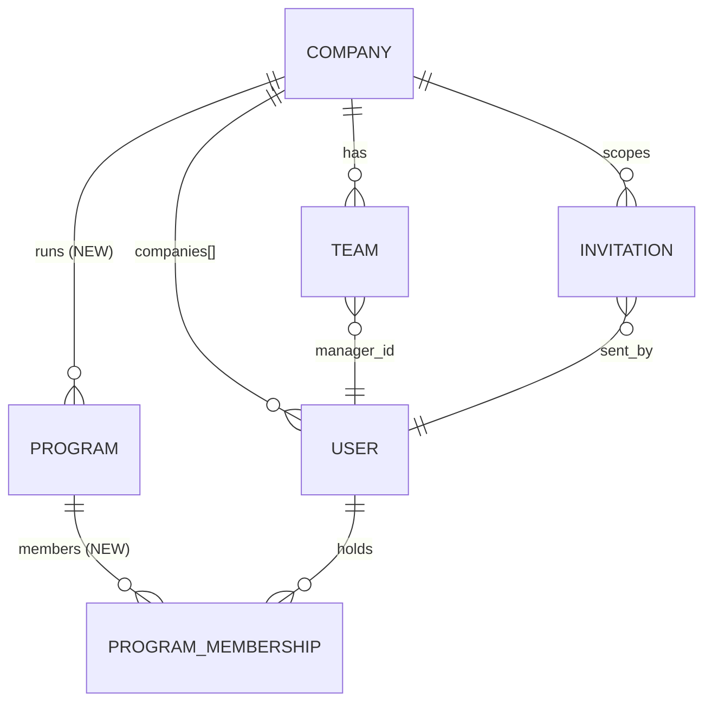
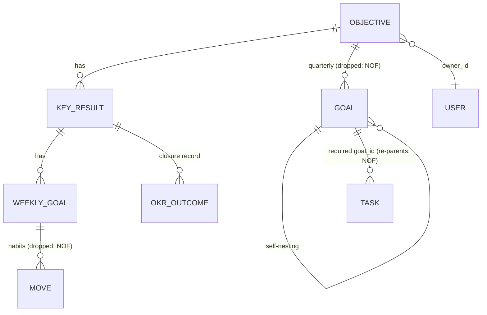
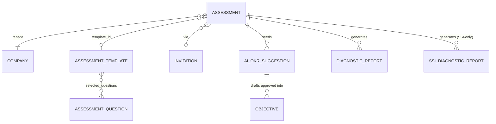

# Data Models Catalogue — Karvia schemas + Nexus dispositions

## Purpose

Catalogue Karvia's actual data layer (read from `karvia_business/server/models/`, 19 schemas) so Night 2's module models are designed from reality. Each model carries a **disposition** — what Nexus does with it. Descriptions are Karvia *as-is*; everything Nexus-flavored lives in the disposition column only.

## TL;DR

- **19 models, ~9,300 lines.** The OKR chain and CRM are clean and lift well. The assessment cluster is SSI-shaped throughout and gets redesigned behind the `AssessmentProvider` contract.
- **Every model already carries `company_id` (indexed)** — adding `program_id` (C-005) is mechanical.
- **The dual KeyResult is confirmed in code**: `Objective.js:173-184` embedded array + a `key_results_v2` virtual, with Karvia's own `CLEANUP-TARGET` comment. Nexus ships standalone-only (AP-4).
- **`User.companies[]` (role per company) is the direct ancestor of `program_memberships[]`** — the pattern exists, it just generalizes.
- **C-008 ANSWERED same day → NOF** (`1-PRODUCT/NOF.md`): Goal and Move dropped, WeeklyGoal reshaped to Milestone (~1 week, objective-relative), Task re-parents to milestone_id, KR de-calendared. Dispositions below reflect the ruling.

---

## Cluster 1 — CRM (→ `@nexus/crm`)

| Model | Lines | Key fields | Relations | Disposition |
|---|---|---|---|---|
| **Company** | 694 | name, industry(+subtype), size_category, employee_count(1–500), `stage` enum (prospect→…) + `stage_history[]` (actor-attributed transitions), custom_fields (Mixed, source-tagged) | — (tenant root) | **Lift + redesign stages**: stage enum maps to the constitutional ladder (Prospect → Measure → Align → Transform → Evolve, 01 §4 / C-014), owned by the stage machine (TECH_STRATEGY Layer 2); stage_history pattern kept (it's an audit trail done right). **Company Profile carries match-grade goals/priorities** (fit thesis) — populated by AIR's Business Context Canvas, structured (tagged), not prose. |
| **User** | 529 | email (regex-validated), password_hash (min 6), `role` enum (CONSULTANT/BUSINESS_OWNER/EXECUTIVE/MANAGER/EMPLOYEE), `companies[]` {company_id, role, is_primary, status}, `managed_businesses[]` (consultant), manager_id | → Company (multi) | **Lift + generalize**: `companies[]` + `managed_businesses[]` collapse into `program_memberships[]` {program_id, role, status} (C-005). Karvia's 5-value role enum becomes **archetype enum (CONSULTANT/BUSINESS_OWNER/MANAGER/WORKER) + extensible `role_label`** (custom labels like Architect map to an archetype; admin-addable in Configuration, zero code). **Add match-grade profile** (fit thesis): skills, intrinsic motivations, interests, working style — tagged/enum fields, never prose; partially populated by assessment instruments. |
| **Team** | 370 | name, department, function, manager_id + **denormalized manager_name**, members[] | → Company, User | **Lift + program_id**. Keep the denormalization (it's a documented perf choice) but route it through the roll-up engine's denormalize-on-write rule. |
| **Invitation** | 869 | recipient_email/role, `invitation_type` enum (individual / company_assessment / company_onboard), pre-created user_id, company_created flag, customized_question_ids[] | → Company, User, (Assessment) | **Lift simplified + program_id**: 869 lines encode three flows; Nexus keeps the flows but moves assessment-specific fields (customized_question_ids) behind the assessment block's evidence model. |

**New in Nexus**: **`Program`** (C-005) — `{company_id, name, vertical, status: active|handed_over|completed|paused, members[], assigned_consultants[], owner_user_id, assessment_id, outcome{score, narrative, evidence_refs[]}}`. Every domain doc below gains required `program_id`.

## Cluster 2 — OKR chain (→ objectives / key-results / milestones / tasks, per NOF)

| Model | Lines | Key fields | Relations | Disposition |
|---|---|---|---|---|
| **Objective** | 583 | title, short_label, `category` enum (6 MECE), owner_id, time_period_type (calendar/fiscal/custom), **embedded `key_results[]` (CLEANUP-TARGET at :173)** + `key_results_v2` virtual | → Company, User | **Lift + program_id + drop embedded KRs** (AP-4, D6). Add the lifecycle stage field (Identified → Handed off → Sustained) as the declared state machine. |
| **KeyResult** | 130 | `metric_type` enum (number/percentage/boolean/currency), target/current/baseline_value, unit, quarters[], year | → Company, Objective | **Lift + program_id, de-calendared (NOF)** — cleanest model in Karvia; `quarters[]`/`year` dropped (reporting periods compute from objective dates). |
| **Goal** (quarterly) | 607 | objective_id, optional key_result_id, **parent_goal_id/child_goal_ids[] (self-nesting)**, time_period | → Company, Objective, Goal | **Drop (C-008/NOF)** — the quarterly layer is calendar ritual NOF removes; nothing the 6 pages surface needs it. |
| **WeeklyGoal** | 167 | key_result_id (only — no objective_id), frequency enum (once→monthly), target_week/year, `completions[]` per week {status, score, notes} | → Company, KeyResult | **Reshape → `Milestone` (C-008/NOF)**: ordered (M1, M2…), ~1 week, dated relative to the objective; ISO `target_week/year` dropped; the `completions[]` check-in pattern survives as milestone check-ins. |
| **Task** | 790 | objective_id + goal_id (both required!), assigned_to, created_by, due_date, hours fields | → Company, Objective, Goal, User | **Lift + program_id + re-parent to `milestone_id` (C-008/NOF)** — the `goal_id` edge dies with Goal. |
| **Move** | 182 | weekly_goal_id, `move_type` enum (action/reaction/habit), discipline, frequency + days_of_week[] | → Company, WeeklyGoal | **Drop (C-008/NOF)** — habit layer removed; recurrence becomes a Task property post-beta if ever needed. |
| **OKROutcome** | 477 | per-KR records {final_value, achievement_percentage (0–200), outcome enum exceeded→not_measured}, summary, success/risk_factors[], recommendations[] | → KeyResult | **Lift + elevate**: this is the seed of `Program.outcome` + `@nexus/knowledge` evidence records — Karvia built the Transformation OS receipt without naming it. |

## Cluster 3 — Assessment (→ `@nexus/assessment`, redesigned behind the provider contract)

| Model | Lines | Key fields | Relations | Disposition |
|---|---|---|---|---|
| **Assessment** | 1126 | `assessment_type` enum **with 'ssi' baked in**, assessment_category, optional user_id (anonymous surveys), invitation_id, anonymous_respondent{}, **`ssi_scores{speed,strength,intelligence}` hardcoded in the shared model** | → Company, User, Template, Invitation | **Redesign** → provider-agnostic `AssessmentRun` {provider_id, program_id, status, evidence[], scores (dimension-keyed map)}. The hardcoded `ssi_scores` is AP-3's data-layer twin: provider fields don't belong in shared schemas. |
| **AssessmentTemplate** | 378 | per-dimension weight (must sum to 1.0), thresholds (needs_attention/critical), selected_questions[] by id, company_id nullable (global templates) | → Company, User | **Redesign as provider seed-data shape** — the structure is right (weights, thresholds, question refs); it becomes the impl-folder config format, not a shared collection. |
| **AssessmentQuestion** | 386 | question_id (regex: S\d+/ST\d+/IN\d+/IND-*/ROLE-*/TOOL-*), module_type (core/industry/role), industry(+subsector) enums, options[] with normalized 0–10 scores | — | **Redesign as provider seed data** — the core/industry/role modularity and 0–10 normalization carry straight into AIR's question instruments. |
| **DiagnosticReport** | 197 | report_type (individual→company), status (active/archived/superseded), eligibility{completion %}, health{score,level,color}, scores{} | → Company, User, Team | **Fold** into provider `deliverables()` output — a generated `Report` deliverable, stored by the assessment module generically. |
| **SSIDiagnosticReport** | 423 | block scores (delivery/decisions/change/response…), dimension scores with weights, priority pairs {gap, priority_level, suggested_okr_focus} | — | **Fold** — pure SSI artifact; its *shape* (block → dimension → priority → suggested focus) is the template for AIR's Opportunity Register generator. |
| **AIOKRSuggestion** | 576 | weak_areas_analysis {threshold, weak_dimensions[]}, objectives[] drafts {title, category, priority, effort_estimate, timeline.quarters} , status (draft→approved/dismissed) | → Assessment, User, Company | **Generalize** → this IS `seedObjectives()` / `ObjectiveDraft` from the provider contract, already with an approval workflow. Lift the shape into the assessment module, provider-agnostic. |
| **AIInteractionLog** | 382 | interaction_type, context_snapshot {tokens}, prompt/response {tokens_used, latency_ms, model}, outcome {status enum incl. rate_limited, items approved/rejected}, session_id | → Company, User | **Lift generalized** as the LLM call log (observability + cost ceiling enforcement per the AI parking-lot rule). Lives with ops/observability, not a domain module. |
| **Feedback** | 456 | type (pulse/feature_rating/feature_idea), pulse_score 1–5 + ISO week, feature enum, improvement_tags[] | → Company, User | **Lift + redesign as the meta-loop** (founder 2026-06-09): tenant ideas/bugs flow into Nexus's own backlog with triage status visible to the submitter ("you said → we did"). Karvia's type/tags structure is the right seed; add status + backlog-ref fields. IM-9 dogfooding with a pipe. |

## Cross-cutting observations

1. **Tenancy is uniform**: all 19 models index `company_id`; the program_id addition is one migration pattern applied 14 times (the assessment cluster gets it via redesign).
2. **Enums are healthy** but several encode provider or product specifics in shared models (`assessment_type: 'ssi'`, Feedback's feature enum) — the data-layer version of AP-3.
3. **Denormalize-on-write already exists** (Team.manager_name, DiagnosticReport.scores) — Karvia validated the roll-up engine's storage strategy informally.
4. **Validation contracts are real and bite** (regexes on question_id and email, min/max everywhere) — SESSION_PRACTICES rule 7 (read the schema before seeding fixtures) is justified by this catalogue.
5. **Sprint-comment archaeology** (`Sprint 9: changed to false`, `Sprint 22 D-C-4`, `post-22a: legacy-admin only`) shows fields whose requiredness changed under pressure — Nexus equivalents must be decided once, in the contract, not per-sprint.

## Open questions

- ~~**C-008** — the Goal/Move layer~~ — **ANSWERED 2026-06-09, same session**: the founder defined **NOF** (`1-PRODUCT/NOF.md`): drop Goal and Move, reshape WeeklyGoal → Milestone (objective-relative), re-parent Task to milestone_id, de-calendar KR. Dispositions above reflect it. N1-P4-01 fully unblocked.
