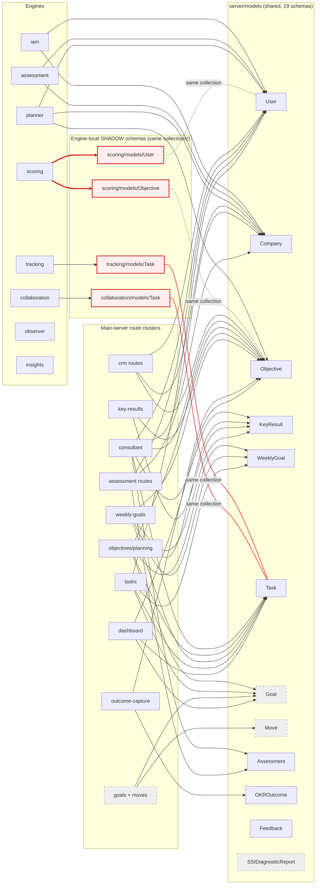

# Module Dependency Graph — who actually touches what

## Purpose

Map every Karvia engine and main-server route-cluster to the models it **actually imports** (grepped from code, not read from engine names), so N1-P4-01 can draw module contracts on real edges and Night 2 knows exactly which couplings to break. SYSTEM_ARCHITECTURE says *what the system is*; DATA_MODELS says *what the data is*; this doc says *who touches what*.

## TL;DR

- **The shared-model story is wrong in an interesting way.** Only 3 of 10 engines (iam, assessment, planner) import `server/models/`. Five engines (collaboration, insights, observer, scoring, tracking) carry their **own `models/` directories** — and the dangerous ones register the **same mongoose model names** as the shared schemas: **three independent `Task` schemas, two `User`, two `Objective`**, all bound to the same Mongo collections. Two engines (integrations, whitelabel) import no models at all.
- **The real coupling lives in the main server.** 28 route files import 14 shared models in a dense many-to-many: `consultant.js` alone touches 10 models; `planning.js` 8; `moves.js` 7. The OKR route-clusters import each other's models in **both directions** (objectives ⇄ tasks) — a cycle NOF's one-directional roll-up eliminates.
- **For Nexus**: every red edge below becomes either a published contract call, a domain event, or dies outright (Goal/Move routes die with NOF; the SSI diagnostic cluster dies with the SSI drop, C-006).

## Pre-scan — spec↔reality drifts caught

1. **SYSTEM_ARCHITECTURE overstates the shared-model pattern.** Its claim "every engine does `require('../../server/models/User')` style imports" holds for only 3 engines. The other engines' coupling is *worse*, not better: shadow schemas over the same collections (silent contract divergence), not shared imports (at least one source of truth). The engine inventory table's "Owns/Talks via Shared models" column is approximately right about collections but wrong about mechanism for 5 engines.
2. **`scoring` does not import the OKR chain it scores.** It re-declares its own `Objective`, `User`, and a `Business` model (a schema that doesn't exist in `server/models/` at all — closest relative is `Company`). Its reads go through its own divergent schema definitions.
3. **`integrations` and `whitelabel` import zero models.** They are pure config/file-handling shells. Carrying them as "engines" in any Nexus planning is noise.

(1) is recorded here rather than patching SYSTEM_ARCHITECTURE inline — that doc's claim is directionally right for its altitude; this doc is now the authoritative edge-level map and SYSTEM_ARCHITECTURE lists it as a child.

## Method

All edges below come from greps over `karvia_business/` (read-only):

- engines: `require('…models/X')` across `engines/*/`, classified by path (`../../server/models/` = shared, `./models/` = engine-local)
- shadow detection: `mongoose.model('Name', schema)` registrations compared across `engines/*/models/*.js` and `server/models/*.js`
- route-clusters: per-file `require('../models/X')` over `server/routes/*.js`
- server core: same grep over `server/index.js`, `server/services/*`, `server/middleware/*`, `server/jobs/*`

## Engines → models

Three coupling classes: **shared** (imports `server/models/`), **shadow** (own `models/` dir registering colliding model names), **none**.

| Engine | Class | Models touched | Nexus resolution |
|---|---|---|---|
| **iam** | shared | `User`, `Company` (R/W) | Becomes `@nexus/crm` internals — these models live *in* the module; auth stays with crm. **Stays in-module.** |
| **assessment** | shared | `User`, `Company` (R) + hardcoded SSI bank | Reads of crm models become **contract calls** (`crm.getUser`, `crm.getCompany`). SSI bank dies (C-006); AIR implements `AssessmentProvider`. |
| **planner** | shared | `Objective` (W), `User`, `Company` (R) | OKR generation folds into `@nexus/objectives`; crm reads become **contract calls**; OpenAI use goes behind the module's own service. |
| **scoring** | **shadow** | own `Objective`, `User`, `Business` ⚠ same collections | Shadow schemas **die**. Score/roll-up engines (BOQ family, N4) read via **published read contracts** over the signal store — never re-declared schemas. |
| **observer** | local-only | own `UserEvent`, `PerformanceInsight` (no collisions) | Lifecycle observation becomes **domain events** emitted by owning modules; observer's pattern (post-response transitions) is replaced by explicit event handlers in `@nexus/governance`. |
| **tracking** | **shadow** | own `Task` ⚠ + own `ProgressTracker` | Shadow `Task` **dies**; `@nexus/tasks` owns the one Task schema. Progress roll-up becomes the NOF roll-up chain (Task → Milestone → KR → Objective) via **contract calls** upward. |
| **collaboration** | **shadow** | own `Task` ⚠ + own `Comment`, `WorkloadAnalysis` | Shadow `Task` **dies** — comments attach by `{entity_type, entity_id}` reference, a **contract call** to resolve targets. Comment/feedback surface re-homes per PRODUCT_STRATEGY (Feedback meta-loop → `@nexus/knowledge`). |
| **insights** | local-only | own `Insight`, `Prediction`, `Recommendation` (no collisions) | **Defer** — analytics-over-everything is a read-only consumer; v1 needs none of it. When it returns (N4 BOQ engines), it reads via contracts. |
| **integrations** | none | — | **Defer.** Connector shells; nothing to map. |
| **whitelabel** | none | — | **Dies** — tenant branding is config data on Company/tenant (AP-3), not an engine. |

> ⚠ **Shadow collision** = engine-local schema registering the same mongoose model name (→ same collection) as `server/models/`. `Task` is defined **three times** (server, tracking, collaboration), `User` and `Objective` **twice** (server, scoring). Each definition has its own validation rules; whichever process touches the collection enforces *its* contract. This is the single worst coupling in Karvia — worse than the shared imports SYSTEM_ARCHITECTURE flagged, because shared imports at least have one source of truth.

## Route-clusters → models

The 28 `server/routes/*.js` files, grouped by the Nexus module that inherits them. **Bold** = models the cluster writes that belong to *another* module's territory (the contract-call candidates).

| Route cluster (files) | Models imported | Inherits to | Cross-boundary edges → resolution |
|---|---|---|---|
| auth, companies, businesses, teams, invitations, admin, config | User, Company, Team, Invitation, **Goal, Objective** | `@nexus/crm` | companies/businesses read Objective+Goal for dashboards → **contract call** `objectives.summaryFor(program)`; Goal read dies with NOF |
| consultant | User, Company, Team, Invitation, Assessment, **Objective, KeyResult, Goal, Task, Move, WeeklyGoal** | `@nexus/crm` (engagement surface) | The god-route: touches 10 models across 5 modules. Becomes the **Engagement-mode composition layer** — pure contract calls, owns no models. Goal/Move/WeeklyGoal edges die with NOF. |
| assessments, assessmentQuestions, assessmentTemplates, analytics | Assessment, AssessmentQuestion, AssessmentTemplate, **Company, Invitation, Team, User** | `@nexus/assessment` | crm reads → **contract calls**; template/question models fold into the `AssessmentProvider` impl (AIR) |
| diagnostic-reports, context-maturity, disciplines | DiagnosticReport, SSIDiagnosticReport, Company | — | **Dies with SSI drop (C-006).** SSI-shaped end to end. |
| ai-okr | AIOKRSuggestion, Company, DiagnosticReport, KeyResult, Objective, SSIDiagnosticReport | `@nexus/objectives` | AI-assisted OKR drafting survives as an objectives-module service; SSI-report inputs replaced by AIR outputs via **contract call** to assessment |
| objectives, objective-wizard, cascade | Objective, **KeyResult, Goal, Task, WeeklyGoal, Company, Assessment, User** | `@nexus/objectives` | KR edge → **contract call** (`key-results.listFor(objective)`); Task/WeeklyGoal reads → **roll-up contract** (NOF chain reads upward only); Goal dies |
| key-results | KeyResult, **Objective** | `@nexus/key-results` | Objective edge → **contract call** (validate parent on create); de-calendared per NOF |
| weekly-goals | WeeklyGoal, **Goal, KeyResult, Objective, Task** | `@nexus/milestones` | WeeklyGoal reshapes to Milestone; Goal edge dies; KR/Objective edges → **roll-up contract**; Task list → **contract call** `tasks.listFor(milestone)` |
| tasks | Task, **Goal, WeeklyGoal, User** | `@nexus/tasks` | Re-parents to `milestone_id` (NOF); Goal edge dies; User (assignee) → **contract call** `crm.getUser` |
| goals | Goal, Objective, Task | — | **Dies with NOF** (Goal layer dropped) |
| moves | Move, **Assessment, Goal, KeyResult, Objective, Task, WeeklyGoal** | — | **Dies with NOF** (Move layer dropped) |
| planning | Company, Goal, KeyResult, Move, Objective, Task, User, WeeklyGoal | `@nexus/objectives` (Planning page) | The Planning page composition layer — like consultant, becomes **pure contract calls**; Goal/Move edges die |
| dashboard | Goal, Objective, Task, User | `@nexus/governance` (read-only) | Program-level roll-up reads → **read contracts** over the NOF chain; Goal edge dies |
| outcome-capture | OKROutcome, Objective | `@nexus/knowledge` | The outcome-record seed (NOF close ritual). Objective edge → **domain event** `objective.closed` consumed by knowledge |
| feedback | Feedback | `@nexus/knowledge` | The meta-loop (PRODUCT_STRATEGY); lift+redesign per DATA_MODELS |

Server core (services/jobs/middleware) leans on the same set — `User` (23 imports), `Company` (19), `Objective` (13), `Task` (10) — and follows whichever module those models land in.

## The graph

Red nodes/edges = the shadow-schema collisions (the cycles to kill first). Grey dashed = dies with NOF (Goal, Move, their routes) or with the SSI drop (diagnostic cluster). Diagram source: [`diagrams/module-dependency.mmd`](diagrams/module-dependency.mmd).

## Cycles and collisions — Night 2 refactor targets, ranked

1. **Task ×3** (`server/models/Task.js`, `engines/tracking/models/Task.js`, `engines/collaboration/models/Task.js`) — three validation contracts over one collection. **Resolution**: `@nexus/tasks` owns the only Task schema; tracking's progress logic and collaboration's references arrive via contracts. *This is the first contract N1-P4-01 should draw.*
2. **User ×2 / Objective ×2** (server + scoring shadows) — same disease, lower traffic (scoring is dead in prod). **Resolution**: shadows die; scoring's successors (BOQ score engines, N4) read via published read contracts.
3. **objectives ⇄ tasks route cycle** — `objectives.js` imports Task/WeeklyGoal downward while `tasks.js`/`weekly-goals.js` import Objective/KeyResult upward. **Resolution**: NOF makes the chain one-directional — writes flow down via contract calls, progress flows up via the roll-up engine only. No module imports both directions.
4. **Dual KeyResult** (embedded `Objective.key_results[]` + standalone collection) — already ruled: standalone-only (AP-4, D6).
5. **God-routes** (`consultant.js` 10 models, `planning.js` 8, `moves.js` 7) — composition layers masquerading as routes. **Resolution**: consultant → Engagement-mode shell, planning → Planning page shell; both become pure contract-call compositions owning zero models. `moves.js` dies.
6. **Hardcoded SSI bank** in `engines/assessment/index.js` — already ruled (C-006, D2): dies; AIR ships as the first `AssessmentProvider`.

## Resolution legend (used above)

| Label | Meaning |
|---|---|
| **Stays in-module** | The model and its consumers land in the same Nexus module; the edge becomes an internal call. |
| **Contract call** | Synchronous read/validate across module boundaries via the consumed module's published TypeScript interface (D1, C-003/C-004). |
| **Domain event** | Async, fire-and-forget state-change notification (`objective.closed`, `client.added`); consumers subscribe. Replaces Karvia's implicit via-Mongo coordination and `res.on('finish')` lifecycle hooks. |
| **Dies — NOF** | Edge exists only to serve Goal/Move/calendar coupling; dropped per C-008/NOF. |
| **Dies — SSI** | Edge exists only to serve SSI scoring/diagnostics; dropped per C-006. |
| **Defer** | Capability not in v1; when it returns it must enter via contracts (parked, IMPROVEMENT_PLAN). |

## What N1-P4-01 takes from here

- Draw the **Task contract first** (collision #1), then the NOF roll-up read-contract (collision #3), then `crm.getUser/getCompany` (the most-imported models, 23/19 uses in server core alone).
- The contract surface per module = exactly the **bold cross-boundary edges** in the route-cluster table. Nothing else crosses a boundary in Karvia, so nothing else needs a v1 contract.
- Composition layers (consultant/Engagement shell, planning/Planning page, dashboard/governance reads) own no models — they are the proof the contracts are sufficient.
