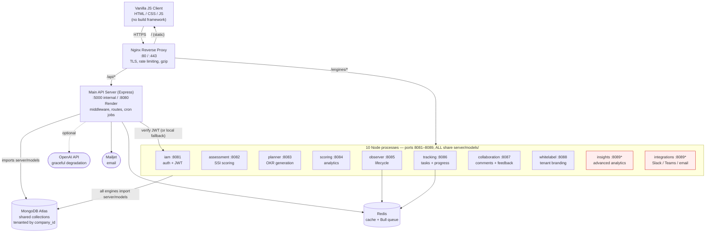
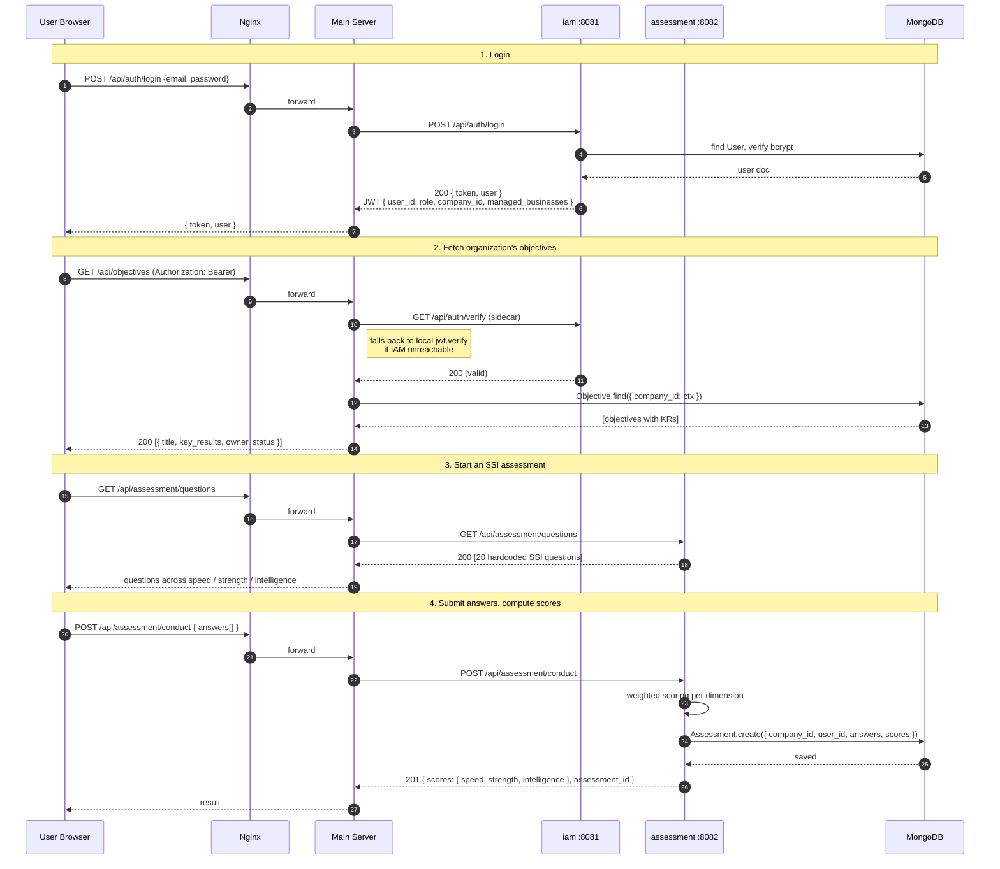

# System Architecture — Karvia as-is map

## Purpose

Map the current architecture of `karvia_business` as it exists today, so that Nexus refactoring decisions (Nights 2–5) are grounded in reality, not assumptions. The Nexus deltas at the bottom describe what changes; everything above describes what *is*.

## TL;DR

- Karvia is a **monolith with 10 optional sidecar processes** (the "engines"), all sharing a single MongoDB and a single `server/models/` directory.
- It is **not** a microservices architecture — the engines have separate ports but no DB isolation, no event bus, no contracts. They are functional groupings, not service boundaries.
- Render deploys it as a **single container per environment**. The "engines" are co-located in the same image.
- Auth flows through `engines/iam` with a **local JWT-verify fallback** in the main server. Multi-tenancy is enforced by a `company_id` field on every domain model.
- The OKR hierarchy is **Objective → KeyResult → Goal (quarterly) → WeeklyGoal + Task → Move**.
- For Nexus's lego-block goal, the **biggest obstacle is the shared-model coupling** — extracting modules requires publishing contracts and breaking the cross-engine model imports.

---

## High-level system shape



*Red nodes: `insights` and `integrations` both claim port 8089 in their `index.js` — a real configuration bug Nexus must resolve. Source: `engines/insights/index.js:36`, `engines/integrations/index.js:18`.*

## Engine inventory

| Engine | Port | Owns | Talks to others via |
|---|---|---|---|
| **iam** | 8081 | `User`, `Company`, `Invitation` | JWT only |
| **assessment** | 8082 | `Assessment`, `AssessmentTemplate`, `AssessmentQuestion` | Shared models |
| **planner** | 8083 | `Objective`, `KeyResult` (writes) | Shared models, OpenAI |
| **scoring** | 8084 | None — read-only over OKR + Task | Shared models |
| **observer** | 8085 | Lifecycle transitions on `Objective` | Shared models + Redis |
| **tracking** | 8086 | `Task`, `Move`, progress entries | Shared models + Redis |
| **collaboration** | 8087 | `Comment`, `Feedback` | Shared models, Socket.IO |
| **whitelabel** | 8088 | Tenant branding assets (file upload) | Shared models |
| **insights** | 8089* | None — read-only analytics | Shared models |
| **integrations** | 8089* | None — connector configs | Shared models, Slack/Teams |

\* Port conflict — flagged in deltas below.

**Critical pattern**: every engine does `require('../../server/models/User')` style imports. There is no published API between engines. Engines call each other only via HTTP for one thing: JWT verification. All other inter-engine "communication" is implicit, through shared MongoDB documents.

## Request lifecycle

The shape of a typical user session — login, see objectives, run an SSI assessment.



**Key observations**:

- Auth uses two paths (IAM sidecar + local fallback). Reduces availability requirements; doubles the verification surface.
- Assessment questions are **hardcoded** in `engines/assessment/index.js`, not loaded from `AssessmentTemplate`. This is the single most important file for Nexus to refactor — the pluggable assessment interface must extract these.
- No event emitter / message bus. State changes propagate by re-reading from Mongo.

## Data model hierarchy

```
Company (tenant)
└── User (role ∈ {BUSINESS_OWNER, CONSULTANT, EXECUTIVE, MANAGER, EMPLOYEE})
        └── Objective (yearly, category MECE-tagged)
                └── KeyResult (metric: number / % / boolean / currency)
                        └── Goal (quarterly)
                                ├── WeeklyGoal
                                │       └── Move
                                └── Task (assigned_to user, due_date)
```

**Multi-tenancy enforcement**: every domain doc has `company_id` (indexed). Every route filters by `req.companyId`. Cross-tenant queries are prevented by middleware, not DB-level row security.

**CONSULTANT multi-tenancy**: a CONSULTANT user has a `companies[]` array and a `managed_businesses[]` field in their JWT — used by the `/api/consultant/*` routes to access multiple client orgs. This is the closest thing in Karvia to "Nexus as Transformation OS" — multi-program-per-tenant exists in nascent form but is consultant-only.

## Auth and tenant context

- JWT issued at `engines/iam/index.js:492-584`, signed with `JWT_SECRET`.
- Payload: `{ user_id, email, role, company_id, managed_businesses, iat, exp +24h }`.
- Verified at `server/middleware/authGuards.js:29-280`, with local fallback if IAM is unreachable.
- For CONSULTANT role, `managed_businesses` is re-fetched from DB on every request (post-login changes can occur).

## Render deployment shape

Single Docker container per environment. The `engines` are co-located, started by `scripts/start-render.sh` (which spawns the main server + IAM sidecar). Other engines are not run on Render — they only exist locally and in `docker-compose`. **This means in production, 9 of the 10 engines are dead code paths.**

| Env | URL | Branch |
|---|---|---|
| dev | `karvia-business-1.onrender.com` | `development` |
| pre-prod | `karvia-business-2.onrender.com` | `pre-prod` |
| prod | `karvia-business.onrender.com` | `production` |

Health check: `GET /health` → `{ status, services, database }`. Render gates traffic on this endpoint.

Source: `_source/karvia_root/DEPLOYMENT_RUNBOOK.md:1-282`.

## Conventional vs. surprising

### Conventional
- Express + Mongoose + JWT + bcrypt + Helmet + rate-limit
- Docker Compose for local dev, Render for prod
- Nginx fronting with TLS + rate limit zones
- Multi-tenancy via `company_id`
- Cron for scheduled email (single-instance only)

### Surprising / non-obvious — and architecturally load-bearing for Nexus

1. **"Engines" are not services.** They are functional groupings that all import from the same `server/models/` directory. No DB isolation, no published API, no event bus. (`engines/*/index.js:1-30` all `require('../../server/models/...')`.)
2. **Most engines are dead in production.** Only main server + IAM run on Render. The other 8 ports are local-only. Plain reading of the codebase exaggerates the architecture's actual deployed shape.
3. **Port 8089 is double-claimed** (insights + integrations). A real bug.
4. **JWT fallback verification** — main server verifies locally if IAM is unreachable, using the same secret. Increases availability but doubles attack surface.
5. **Hardcoded SSI question bank** in `engines/assessment/index.js`, despite `AssessmentTemplate` and `AssessmentQuestion` schemas existing. The schemas are aspirational; the implementation is direct.
6. **Embedded + standalone KeyResults coexist.** Objective has `key_results[]` embedded array AND a separate `KeyResult` collection. Both queried independently. Source: `server/models/Objective.js`, `server/models/KeyResult.js`. Dual-write transition incomplete.
7. **Lifecycle transitions run post-response.** State changes (draft → active → archived) execute in `res.on('finish')` hooks. Eventually consistent from the client's perspective.
8. **No event emitter or message bus.** Cross-engine coordination is implicit via Mongo reads. Race conditions are possible.
9. **AI is optional.** `OpenAI` integration degrades gracefully — routes return fallback suggestions if the API is unavailable.
10. **Static client, no build.** Vanilla HTML/CSS/JS loaded via `<script>` tags. No webpack/vite, no tree-shaking.

---

## Nexus deltas — what we change

These are the architectural deltas from Karvia to Nexus, organized by what becomes necessary to deliver the **Transformation OS** vision (per `DECISIONS.md` 2026-06-03 — C-001).

### D1. Publish module contracts; break the shared-model import pattern

Every Nexus module owns its own models. Other modules consume them only via the module's published TypeScript interface. No cross-module `require('../../other-module/models/X')`.

**Why**: the lego-block goal is impossible while engines silently share schemas. Drives Night 2's refactor.

### D2. Pluggable Assessment interface (the central architectural move)

Extract the hardcoded SSI question bank into one of N assessment implementations. The Assessment interface is the primitive; SSI and AI Readiness are two implementations.

```
@nexus/assessment            ← interface only
   ├── impls/ssi              ← lifted from karvia engines/assessment
   └── impls/ai-readiness     ← new, Night 3
```

**Contract surface** (drafted in `ASSESSMENT_INTERFACE_SPEC.md`, Night 1 Phase 4): question bank, scoring rubric, report generation, lifecycle hooks.

### D3. Two new first-class modules

- **`@nexus/governance`** — program oversight, accountability, decision rights. Implied by the Transformation OS positioning. No equivalent in Karvia.
- **`@nexus/knowledge`** — institutional knowledge capture, outcome evidence. No equivalent in Karvia.

### D4. Multi-program-per-tenant from day one

Karvia's CONSULTANT multi-company pattern is the seed. Nexus generalizes it: an org runs multiple transformation programs concurrently, each with its own assessment + OKR tree.

**Schema delta**: introduce a `Program` model. `Objective.program_id` becomes the new tenant-of-tenant key.

### D5. Resolve the port conflict and the dead-engine deployment

Either (a) consolidate engines back into the main server process for v1 (cleanest, matches actual Render shape), or (b) genuinely deploy them as separate Render services with their own URLs. Decision deferred to Night 2.

### D6. Pick one KeyResult representation

Embedded *or* standalone, not both. Recommendation: standalone collection, drop the embedded array. Deferred to Night 2 with a dedicated migration.

### D7. TypeScript

Karvia is JavaScript. Nexus moves to TypeScript for the module contracts (interface checking is the entire point of the lego-block architecture). Deferred to Night 2; client may stay vanilla JS for v1.

### D8. Modernize the client

Karvia's vanilla JS + Tailwind-via-CDN is acceptable for v1 but limits component reuse across modules. Decision deferred — possibly Night 5 or later.

---

## Open questions

- **OK-1** — Do the 9 "dead" engines come along for Nexus, or do we consolidate into the main server? Affects Night 2 refactor scope significantly.
- **OK-2** — Move to TypeScript in Night 2, or stay JS and use JSDoc + interface docs?
- **OK-3** — `Program` as a new top-level tenant key — confirm before any data modeling work.

These will be appended to `_agent/clarifications.md` as C-003, C-004, C-005.

---

## References

Top files Karvia's architecture rests on. All paths relative to `karvia_business/` (read via `_source/` for content review).

1. `server/index.js:1-280` — main server entry, route registration, service discovery
2. `server/middleware/authGuards.js:1-390` — JWT verification + fallback
3. `server/services/discovery.js:1-276` — engine health probing
4. `engines/iam/index.js:492-584` — JWT issuance
5. `engines/assessment/index.js:1-600` — hardcoded SSI scoring
6. `engines/planner/index.js:1-700` — OKR generation
7. `engines/tracking/index.js:1-1100` — task model + progress tracking
8. `server/models/User.js`, `Company.js`, `Objective.js`, `KeyResult.js`, `Goal.js`, `Task.js`, `Assessment.js`
9. `nginx/nginx.conf:1-222` — reverse proxy rules
10. `docker-compose.yml:1-203` — service graph
11. `DEPLOYMENT_RUNBOOK.md` — Render shape
12. `package.json` — startup pattern

Diagram sources: [`diagrams/system-high-level.mmd`](diagrams/system-high-level.mmd), [`diagrams/request-lifecycle.mmd`](diagrams/request-lifecycle.mmd).
