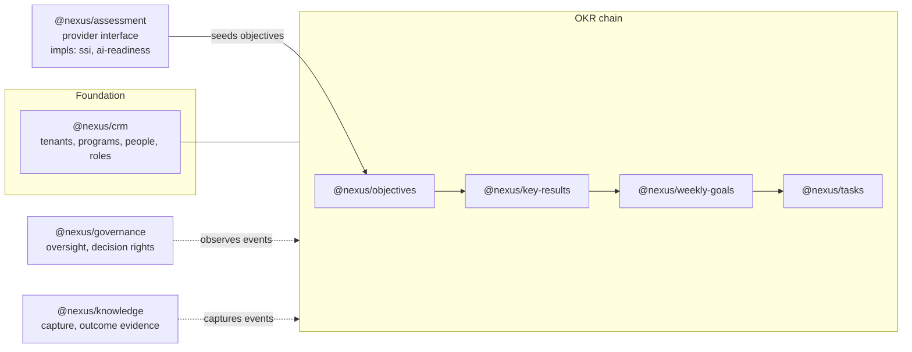

# Nexus Tech Strategy — three layers, eight blocks

**Status**: Active
**Last Updated**: 2026-06-09
**Owner**: Founder + agent (interactive session 2026-06-09)
**Tier**: T2
**Depends on**: [00_NORTH_STAR.md](../00_NORTH_STAR.md), [SYSTEM_ARCHITECTURE.md](SYSTEM_ARCHITECTURE.md), [IMPROVEMENT_PLAN.md](IMPROVEMENT_PLAN.md), `_agent/DECISIONS.md` (C-003, C-004, C-005)

---

## Purpose

This is the tech card of the pack: how Nexus is structured so that every capability is a swappable lego block. It defines the three layers, the eight module contracts, the pluggable assessment as the proof-piece, and the calculation engine that makes progress roll up truthfully. It does **not** re-describe Karvia (that's `SYSTEM_ARCHITECTURE.md`) or restate the quality bar (that's `IMPROVEMENT_PLAN.md`); it builds on both and on the three ratified decisions.

## TL;DR

- **One process, many modules** (C-003): a single TypeScript-strict Express app (C-004); module boundaries enforced by contracts and lint, not ports.
- **Three layers, one rule per layer**: UI renders page contracts; business logic owns lifecycles and roll-ups; data is private to its module.
- **Eight blocks, black-box discipline**: you ask a module through its published interface; you never import its models. Karvia's shared-`server/models/` pattern (AP-1) is the one thing Nexus must never recreate.
- **Assessment is the proof of modularity**: an `AssessmentProvider` contract; SSI and AI Readiness are just two implementations. Shipping a third in hours is the acceptance test of the whole architecture.
- **Same domain, better plumbing**: Karvia's OKR hierarchy and models carry over conceptually — re-typed, program-scoped (C-005), and with one KeyResult representation instead of two.

---

## Layer 1 — UI: page contracts as code

The six page contracts in [PRODUCT_STRATEGY.md](../1-PRODUCT/PRODUCT_STRATEGY.md) are not prose — they compile. Each page registers a typed contract the shell renders consistently:

```ts
interface PageContract {
  id: 'my-clients' | 'dashboard' | 'objectives' | 'assessments' | 'teams' | 'planning';
  purpose: string;
  primaryRole: Role;                    // whose home page this is
  primaryCta: Cta;                      // exactly one
  secondaryCta?: Cta;
  analyticsStrip: TileSpec[];           // max 4; each tile names its drill-down target
  emptyState: EmptyStateSpec;           // teaches purpose, points at primaryCta
  entryPoints: PageRef[];               // for nav/journey tests
  exitPoints: PageRef[];
}
```

Consequences:

- **Role-based landing** is data: login resolves `user.role` (within the active program) → the page whose `primaryRole` matches.
- **Journey tests are generated**: the first-value journey is a walk across `entryPoints`/`exitPoints`; E2E tests assert the walk exists and each step's primary CTA is reachable.
- **Analytics tiles are one component** fed by `TileSpec`, each backed by a module query — no per-page bespoke dashboard code, no hardcoded numbers (AP-3).
- Client stays vanilla JS for v1 (C-004); the contract types live server-side and serve the client a typed JSON shell config.

## Layer 2 — Business logic: lifecycles and roll-ups

Two engines do most of the product's thinking. Both are explicit — no `res.on('finish')` side effects (AP-7).

### The lifecycle engine

State machines, declared as data, executed synchronously inside the request (or via an observable job queue, never hidden hooks):

| Entity | States | Transition triggers |
|---|---|---|
| Objective | Identified → Handed off → Sustained | completion threshold met → handoff confirmed → sustained review cadence established |
| Client (CRM stage) | Prospect → Onboarding → Active | assessment sent → team onboarded + assessment done → first objective Identified |
| Program | active → completed / paused | outcome recorded / human action |
| Assessment | draft → sent → in-progress → scored | provider lifecycle hooks (see contract below) |

Every transition emits a typed domain event on an in-process event bus (one process per C-003 — no message broker needed, but events are first-class so tiles, notifications, and the knowledge module subscribe instead of polling Mongo (fixes "eventual consistency by accident").

### The roll-up engine

One calculation service owns the progress math — the answer to "every task completed has to show progress in the objective":

```
Task (hours done / hours estimated)
  → WeeklyGoal/Milestone % (its tasks)
    → KeyResult % (its milestones, against metric type: number | % | boolean | currency)
      → Objective % (weighted across its 4–5 KRs, default equal ≈ 25% each)
        → Program % (across objectives)
```

Rules: calculations are pure functions over typed inputs (unit-testable without Mongo); recomputed on the write path and stored denormalized with the event that caused them (read path is a lookup, not a recompute); every number a tile shows traces to one function in this service. Karvia scattered this across `calculatorService`, `scoring`, and `insights` — Nexus has exactly one roll-up module.

## Layer 3 — Data: private models, program-scoped

- Tenancy is `Company → Program → …` (C-005): every domain doc carries `company_id` + `program_id`, both indexed; users hold `program_memberships[]` (role per program).
- **One KeyResult representation** — standalone collection only; the embedded-array dual-write from Karvia is not lifted (AP-4, delta D6).
- Domain data is data (AP-3): question banks, scoring rubrics, report templates, lifecycle definitions are seeds/config, never literals in handlers.
- Each module owns its collections privately. Cross-module reads go through the owning module's interface — enforced by `no-restricted-imports` (AP-1).

## The eight blocks



*The 8 lego blocks. Solid arrows: typed interface calls. Dotted: domain-event subscriptions.*

Each module ships the same anatomy (contract-first, per hard rule 7):

```
src/modules/<name>/
├── contract.ts        ← the ONLY import other modules may touch
├── models/            ← private Mongoose schemas
├── service.ts         ← business logic
├── routes.ts          ← HTTP edge, zod-validated (IM-3)
├── events.ts          ← domain events emitted/consumed
└── tests/contract/    ← contract tests (IM-2): shapes, errors, idempotency, tenant isolation
```

**The black-box test**: "ask the objectives module for an objective — it tells you the objective, who owns it, its progress, its stage." If answering requires knowing another module's schema, the contract is wrong.

## Pluggable assessment — the proof-piece

The single most important refactor (Karvia hardcoded SSI's 20 questions inside `engines/assessment/index.js` while its template schemas sat unused). The contract:

```ts
interface AssessmentProvider {
  id: string;                              // 'ssi' | 'ai-readiness' | ...
  meta: { name: string; description: string; dimensions: Dimension[] };
  questionBank(ctx: ProgramContext): Promise<Question[]>;     // data, never literals
  score(answers: Answer[]): Score;                            // pure, 0–10 per dimension
  report(score: Score, ctx: ProgramContext): Report;          // credible result narrative
  seedObjectives(score: Score): ObjectiveDraft[];             // the Assessments→Objectives handoff
  lifecycle: { onSent?, onCompleted?, onScored? };            // domain-event hooks
}
```

What registration buys, with zero changes elsewhere: a *Create {name} assessment* option on the Assessments page, a score column on My Clients tiles, dimension tiles in analytics, and assessment-seeded objective drafts. **Acceptance test of the entire architecture**: implementing a third provider (e.g., MBTI-style) touches only `assessment/impls/<new>/` and takes hours, not days.

## Cross-cutting (by reference)

| Concern | Governed by |
|---|---|
| Quality gates, CI, coverage, secrets | `IMPROVEMENT_PLAN.md` IM-5, AP-5 |
| Auth | Lift Karvia's JWT pattern, harden; no rewrite (parking lot) |
| Config | zod-validated at boot, fail-fast (AP-6) |
| Observability | Pino + OpenTelemetry, trace IDs day 1 (IM-4) |
| Deploy | Single Render service per env; what's declared is deployed (AP-2) |
| Workspace | pnpm workspaces, TS strict (C-004) |

## Open questions

- **TQ-1** — Event bus implementation: Node `EventEmitter` with typed wrapper vs a tiny library. Decide in the Night 2 toolchain session; default to the simplest thing that types well.
- **TQ-2** — Denormalized roll-up storage shape (on-doc fields vs a progress collection). Decide alongside the data-models catalogue (N1-P2-02).
