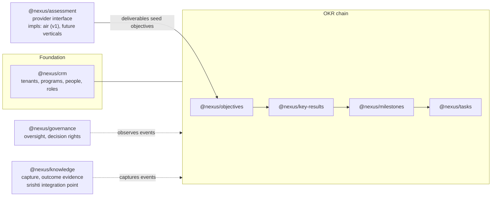

# Nexus Tech Strategy — three layers, eight blocks

## Purpose

This is the tech card of the pack: how Nexus is structured so that every capability is a swappable lego block. It defines the three layers, the eight module contracts, the generalized assessment interface (with AIR as the first implementation), the calculation engine, the handover mechanics, and the srishti boundary. It does **not** re-describe Karvia (that's `SYSTEM_ARCHITECTURE.md`) or restate the quality bar (that's `IMPROVEMENT_PLAN.md`); it builds on both and on the ratified decisions.

## TL;DR

- **One process, many modules** (C-003): a single TypeScript-strict Express app (C-004); module boundaries enforced by contracts and lint, not ports.
- **Three layers, one rule per layer**: UI renders page contracts; business logic owns lifecycles and roll-ups; data is private to its module.
- **Eight blocks, black-box discipline**: you ask a module through its published interface; you never import its models. Karvia's shared-`server/models/` pattern (AP-1) is the one thing Nexus must never recreate.
- **The assessment block is fully generic**: an `AssessmentProvider` contract covering instruments, evidence, scoring, and deliverable generation. **AIR is the first implementation; SSI is not carried over** (C-006). Shipping any future assessment in hours, touching only its impl folder, is the acceptance test of the whole architecture.
- **Handover is a first-class lifecycle event**, and **srishti is an external add-on behind a published integration contract** — never a coupled dependency.

---

## Layer 1 — UI: page contracts as code

The six page contracts in [PRODUCT_STRATEGY.md](../1-PRODUCT/PRODUCT_STRATEGY.md) are not prose — they compile. Each page registers a typed contract the shell renders consistently:

```ts
interface PageContract {
  id: 'my-clients' | 'dashboard' | 'objectives' | 'assessments' | 'teams' | 'planning';
  purpose: string;
  primaryRole: Role;                    // whose home page this is
  primaryCta: Cta;                      // exactly one
  secondaryCta?: Cta;
  analyticsStrip: TileSpec[];           // max 4; each tile names its drill-down target
  emptyState: EmptyStateSpec;           // teaches purpose, points at primaryCta
  entryPoints: PageRef[];               // for nav/journey tests
  exitPoints: PageRef[];
  modes: ('engagement' | 'builder')[];  // which operating modes show this page
}
```

Consequences:

- **Role-based landing** is data: login resolves `user.role` (within the active program) → the page whose `primaryRole` matches.
- **Journey tests are generated**: the first-value journey is a walk across `entryPoints`/`exitPoints`; E2E tests assert the walk exists and each step's primary CTA is reachable.
- **Analytics tiles are one component** fed by `TileSpec`, each backed by a module query — no per-page bespoke dashboard code, no hardcoded numbers (AP-3).
- **Extension slots**: pages that host pluggable content (Assessments above all) declare typed slots; installed blocks render into them. The page never imports an impl.
- **Design system as a constraint**: one small component set (tile, card, stage ribbon, CTA pair, empty state) shared by all pages, per the minimalistic design language (PRODUCT_STRATEGY § design; specs land in `1-PRODUCT/design/`).
- Client stays vanilla JS for v1 (C-004); the contract types live server-side and serve the client a typed JSON shell config.

## Layer 2 — Business logic: lifecycles and roll-ups

Two engines do most of the product's thinking. Both are explicit — no `res.on('finish')` side effects (AP-7).

### The lifecycle engine

State machines, declared as data, executed synchronously inside the request (or via an observable job queue, never hidden hooks):

| Entity | States | Transition triggers |
|---|---|---|
| Objective | Identified → Handed off → Sustained | completion threshold met → handoff confirmed → sustained review cadence established |
| Client (pipeline stage) | Prospect → Assessing → Engaged → Handed over | assessment started → deliverables accepted + objectives seeded → program handover |
| Program | active → handed_over → completed / paused | handover event / outcome recorded / human action |
| Assessment | draft → in_progress → scored → delivered | provider lifecycle hooks (see contract below) |

Every transition emits a typed domain event on an in-process event bus (one process per C-003 — no message broker needed), but events are first-class so tiles, notifications, and the knowledge module subscribe instead of polling Mongo.

### The roll-up engine

One calculation service owns the progress math — the answer to "every task completed has to show progress in the objective":

```
Task (hours done / hours estimated)
  → Milestone % (its tasks; ~1 week each, ordered, objective-relative dates)
    → KeyResult % (its milestones, against metric type: number | % | boolean | currency)
      → Objective % (weighted across its 4–5 KRs, default equal ≈ 25% each)
        → Program % (across objectives)
```

Per [NOF](../1-PRODUCT/NOF.md): timelines are **objective-relative** — no ISO weeks, no quarters anywhere in the chain; objectives are self-rolling (start/end any day, 6–7 concurrent per org). Progress (this chain) is distinct from **outcome** (the outcome record written at objective close — see the lifecycle engine and NOF § outcome measurement).

Rules: calculations are pure functions over typed inputs (unit-testable without Mongo); recomputed on the write path and stored denormalized with the event that caused them (read path is a lookup, not a recompute); every number a tile shows traces to one function in this service. Karvia scattered this across `calculatorService`, `scoring`, and `insights` — Nexus has exactly one roll-up module.

## Layer 3 — Data: private models, program-scoped

- Tenancy is `Company → Program → …` (C-005): every domain doc carries `company_id` + `program_id`, both indexed; users hold `program_memberships[]` (role per program).
- **One KeyResult representation** — standalone collection only; the embedded-array dual-write from Karvia is not lifted (AP-4, delta D6).
- Domain data is data (AP-3): instruments, scoring rubrics, deliverable templates, lifecycle definitions are seeds/config, never literals in handlers. (Karvia's hardcoded SSI question bank is the canonical counter-example — studied, not lifted.)
- **Match-grade capture** (fit thesis, PRODUCT_STRATEGY): User profile signals (motivations, skills, interests), Company Profile goals/priorities, and Task metadata are structured fields (tags/enums/scored dimensions), never prose blobs — the post-beta fit engine must be a query over existing data, not a migration.
- Each module owns its collections privately. Cross-module reads go through the owning module's interface — enforced by `no-restricted-imports` (AP-1).

## The eight blocks



*The 8 lego blocks. Solid arrows: typed interface calls. Dotted: domain-event subscriptions.*

Each module ships the same anatomy (contract-first, per hard rule 7):

```
src/modules/<name>/
├── contract.ts        ← the ONLY import other modules may touch
├── models/            ← private Mongoose schemas
├── service.ts         ← business logic
├── routes.ts          ← HTTP edge, zod-validated (IM-3)
├── events.ts          ← domain events emitted/consumed
└── tests/contract/    ← contract tests (IM-2): shapes, errors, idempotency, tenant isolation
```

**The black-box test**: "ask the objectives module for an objective — it tells you the objective, who owns it, its progress, its stage." If answering requires knowing another module's schema, the contract is wrong.

## Pluggable assessment — the proof-piece

The founder's standing requirement: *"tomorrow I want to change to another assessment — I should be able to just add it."* The contract is therefore broader than question-and-score; it covers how evidence is gathered, how it's scored, and what deliverables come out:

```ts
interface AssessmentProvider {
  id: string;                               // 'air' | future verticals
  meta: { name: string; description: string; dimensions: Dimension[] };

  // How evidence is gathered. An instrument can be a survey, a structured
  // interview, a workshop canvas, a floor observation, a document review —
  // each declares its own zod-validated evidence shape and UI slot renderer.
  instruments(ctx: ProgramContext): Promise<Instrument[]>;

  // Pure scoring over collected evidence: 0–10 (or 0–100) per dimension.
  score(evidence: Evidence[]): Score;

  // Deliverable generation — report, registers, roadmaps. Each deliverable is
  // a typed artifact other modules can consume.
  deliverables(score: Score, evidence: Evidence[], ctx: ProgramContext): Deliverable[];

  // The handoff that seeds the OKR chain (e.g., from an opportunity register).
  seedObjectives(deliverables: Deliverable[]): ObjectiveDraft[];

  lifecycle: { onStarted?, onEvidenceAdded?, onScored?, onDelivered? };  // domain-event hooks
}
```

What registration buys, with zero changes elsewhere: a *Create {name} assessment* option on the Assessments page, the provider's instruments rendered into the page's slots, a score column on My Clients tiles, dimension tiles in analytics, and deliverable-seeded objective drafts.

**AIR is the first implementation** (`assessment/impls/air/`): five dimensions (Leadership, Workforce, Process, Data, Execution); instruments mirroring the two-week sprint (executive workshop canvas, leadership interviews, value-stream observation, journey maps, knowledge map, finance model, workforce survey, opportunity workshop, validation, scoring workshop); deliverable generators for the AIR Score, Opportunity Register, Risk Register, 90-day plan, 12-month roadmap, and BRAMHI baseline. All of it — dimensions, instruments, rubrics, templates — is **seed data and config inside the impl folder**, nothing hardcoded in handlers (AP-3), nothing referenced outside the block.

**SSI is not shipped** (C-006). It survives only as the reference counter-example in `_source/`. A survey-style provider is trivially expressible in this contract (one survey instrument, pure score, one report deliverable) — which is exactly the point.

**Acceptance test of the entire architecture**: implementing a second provider touches only `assessment/impls/<new>/` and takes hours, not days. This drill runs in Night 3 and the result is journaled.

## Handover — engagement becomes product

Handover (the consulting playbook's step 5) is a program lifecycle transition, not a data migration. C-005's tenancy makes it cheap:

- All data already belongs to the client's `company_id`/`program_id` — nothing moves.
- The transition: program status → `handed_over`; the consultant's `program_membership` is revoked (or downgraded to time-boxed read-only); an org-side owner is confirmed; the event is captured by `@nexus/knowledge` as outcome evidence (with the BRAMHI baseline snapshot for future re-assessment).
- UI flips to **Builder mode** (page contracts' `modes` field): My Clients disappears for the org; everything else continues uninterrupted.
- Re-engagement (re-assessment a year later) is just a new assessment in the same program history — longitudinal comparison against the stored baseline.

## srishti — the intelligence add-on boundary

srishti (document management / model care, LLM-connected) is **its own product**; Nexus integrates, never embeds. The boundary:

- One integration contract, owned by `@nexus/knowledge`: link/attach srishti documents to Nexus entities (programs, objectives, assessment evidence), and subscribe srishti to Nexus domain events. Shape: a small typed API + webhook/event feed, versioned like any module contract.
- Nexus must be fully functional without srishti installed (same discipline as Karvia's iBrain toggle, done properly: declared OPTIONAL dependency with tested fallback, AP-8).
- LLM intelligence features inside Nexus follow the parking-lot rule: every AI feature has a non-AI fallback and an explicit cost ceiling.
- Detailed contract spec is deferred until srishti's own interfaces stabilize — tracked as TQ-3.

## Cross-cutting (by reference)

| Concern | Governed by |
|---|---|
| Quality gates, CI, coverage, secrets | `IMPROVEMENT_PLAN.md` IM-5, AP-5 |
| Auth | Lift Karvia's JWT pattern, harden; no rewrite (parking lot) |
| Config | zod-validated at boot, fail-fast (AP-6) |
| Observability | Pino + OpenTelemetry, trace IDs day 1 (IM-4) |
| Deploy | Single Render service per env; what's declared is deployed (AP-2) |
| Workspace | pnpm workspaces, TS strict (C-004) |

## Open questions

- **TQ-1** — Event bus implementation: Node `EventEmitter` with typed wrapper vs a tiny library. Decide in the Night 2 toolchain session; default to the simplest thing that types well.
- **TQ-2** — Denormalized roll-up storage shape (on-doc fields vs a progress collection). Decide alongside the data-models catalogue (N1-P2-02).
- **TQ-3** — srishti integration contract spec: blocked on srishti's interfaces stabilizing; until then `@nexus/knowledge` reserves the seam (attachment refs + event feed) without implementing it.
