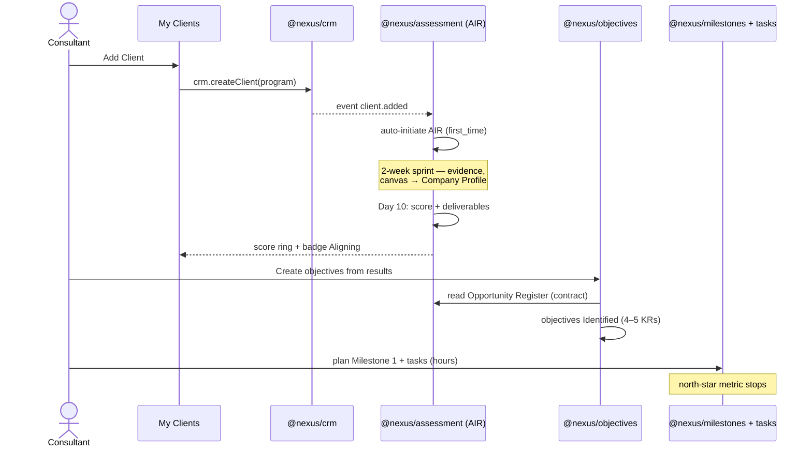
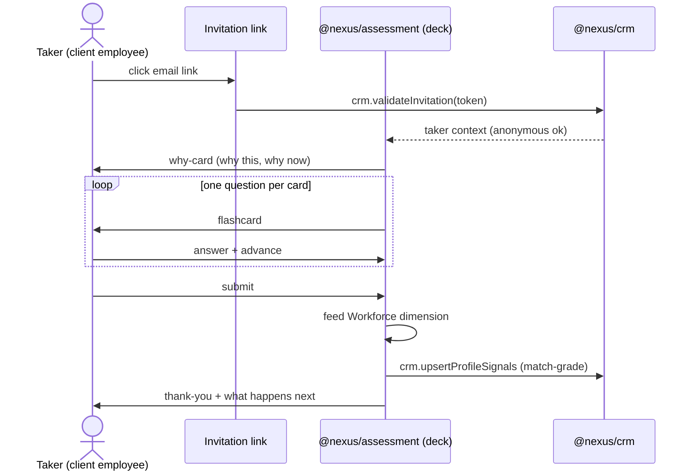
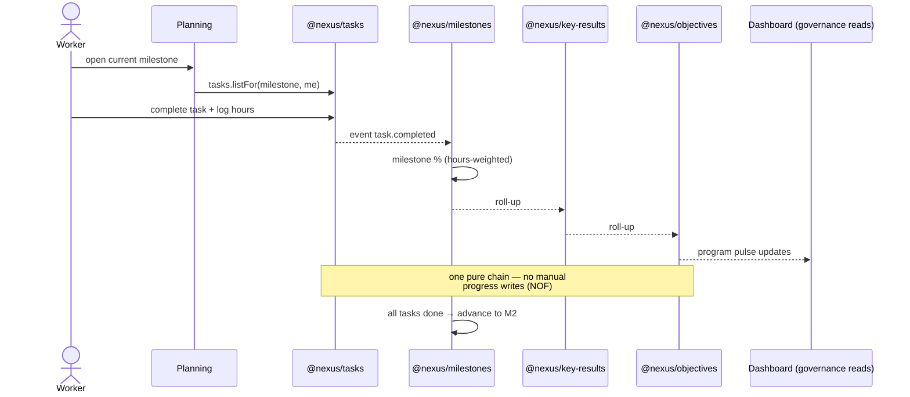
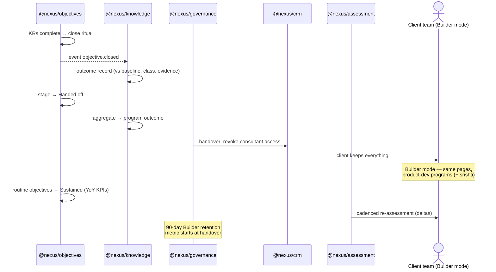

# User Journeys — five journeys, two playthroughs, the trigger map

## Purpose

Walk the product end to end through the eyes of the **four archetypes — Consultant · Business Owner · Manager · Worker** (the finalized roster, C-023; PRODUCT_STRATEGY § four archetypes) — plus the **Taker**, the tutorial persona any archetype passes through (03 §2), naming the page, the action, and the module contract behind every step. Journeys and archetypes are deliberately not 1:1 — a journey follows a *thread of value*, and several archetypes act inside each one:

| Journey | Lead player | Other archetypes in it |
|---|---|---|
| **J1** consultant first-value | Consultant | Business Owner + Manager (steps 8–9) |
| **J2** assessment taker | Taker (persona — usually a future Worker) | — |
| **J3** worker weekly loop | Worker | Manager (planning), Business Owner (push/unblock) |
| **J4** close → handover → Builder | the org (Business Owner + Manager) | Consultant (retiring) |
| **J5** org-direct | Business Owner | Manager + Worker (J3 unchanged); no Consultant, by design |

The doc therefore reads at two altitudes: **the archetype loops (A1–A4)** — what each of the four players sees and does from login, every day — and **the lifecycle journeys (J1–J5)** — how value flows end to end across stages. The loops answer "what is my day in Nexus?"; the journeys answer "how does the program move?". PRODUCT_STRATEGY defines what each page is; this doc strings the pages into the walks the E2E suite, the demo script, and the empty states must all agree on. It also holds the **trigger map** (04_RUNTIME_MODEL §4): what fires at each stage transition, and what catches it when it stalls — derived by walking the hostile playthrough.

## TL;DR

- **J1 Consultant first-value** is the north-star-metric path: first login → client's first objective *Identified* with a planned milestone. Everything in the UI exists to shorten it.
- **J2 Assessment taker** is the funnel: for most client employees the flashcard deck IS their first Nexus experience — onboarding-grade, never a survey.
- **J3 Worker weekly loop** is the engine: task hours → milestone % → KR % → objective % → program % — one pure roll-up chain (NOF), no manual progress writes.
- **J4 Close → handover → Builder** is the moat: outcome records prove value, handover flips the program, and the second metric (90-day Builder retention) starts counting.
- **J5 Org-direct** is Article 9 made walkable: the same pages minus My Clients, signup to Evolve with no consultant on any critical path.
- **The trigger map** (T0–T10) names, for every stage transition and known stall, the designed trigger, the fallback nudge chain (system → human), and the owner — every nudge logged (BRQ telemetry), every chain terminating without a consultant.
- **The archetype loops (A1–A4)** give each of the four players their own login-to-action walk — home page, page set, daily/weekly moves — so no archetype's experience exists only implicitly inside someone else's journey.
- Every step names its module contract — A-loops, J-steps, and T-rows are the acceptance criteria N1-P4-01's contracts must satisfy.

## The archetype loops — login to action, per player (A1–A4)

Each of the four archetypes (C-023), from "I log in" to "I acted": their home page, the page set they live in, and the loop they run. Page sets come from PRODUCT_STRATEGY's contracts; the home pages are the archetype bindings (§ four archetypes). The Taker precedes all of these — most players' very first Nexus experience is J2's deck, before they have an account at all.

### A1 — The Consultant (home: My Clients; sees all six pages, per client)

1. Logs in → **My Clients**: the portfolio triage — every client tile readable in <20 seconds (stage badge, score ring, at-risk flag). `crm.authenticate`; tiles read `program.stage` + roll-ups
2. Tile CTAs are stage-shaped (03 §4 row 1): Prospect → sponsor-bridge checklist (T1) · Measuring → sprint progress ring · Aligning → roadmap status · Transforming → portfolio gauges · Evolving → alumni view
3. Opens a client → works *that client's* stage in their workspace: run the sprint (J1 5–7), seed objectives with the BO + Manager (J1 8), watch the quest line (T8)
4. **Add Client** grows the portfolio (J1 1–4); the nudge engine catches stalls (T0–T3), so My Clients surfaces catches — the consultant never chases
5. Handover retires them per client (J4): the loop's win is its own shrinkage toward the alumni view — the Guide is designed to be deleted (Article 9)

### A2 — The Business Owner (home: Dashboard; pages: Dashboard · Objectives · Assessments · Teams · Planning — no My Clients)

1. Logs in → **Dashboard**: **three-things-today** answers "is the program on track, what needs me?" in 20 seconds — stage-aware, person-altitude (04 §5)
2. Acts on the at-risk rows: unblock a flagged task, **Push task completion** (J3 4), hold the review the Manager let slip (T7)
3. At Align: co-owns seeding with the Managers — *Create objectives from these results* (J1 8); owns the Company Profile
4. Weekly: outcome records as objectives close (J4 1–3) — the program's receipt accruing. `knowledge.programOutcome`
5. At Evolve the same page becomes the rhythm view: cadence adherence, **BOQ trend next to revenue** — the number that ends up in the board deck (03 §5)
6. Org-direct: the BO is also the Sponsor and walks J5 from signup

### A3 — The Manager (home: Objectives; pages: same five as the BO)

1. Logs in → **Objectives**: *their* objectives as a living board — lifecycle ribbons, roll-ups arriving without status-chasing (the Manager's relief, 03 F9)
2. At Align: turns the Opportunity Register into objectives + KRs — the AI-draft CTA takes the clerical weight (J1 8, T4). `objectives.createFrom(deliverable)`
3. In **Planning**: breaks the next KR into a ~1-week milestone with tasks + hour estimates (J1 9). `milestones.create`, `tasks.bulkCreate`
4. Daily: team-altitude NBM is *their* hint arrow — which objective deserves focus now (02 §3.2); responds to blocked tasks (J3 7)
5. Runs milestone reviews on the cadence rail (T7); milestones advance objective-relative (J3 5)
6. At an objective's close: the outcome-record ritual — final vs baseline, class, evidence (J4 1)

### A4 — The Worker (home: Planning; pages: Planning · Dashboard · Teams)

The Worker's loop **is J3** — login → current milestone's tasks, theirs first → execute, log hours → the roll-up does the rest. Two framing notes: their first session obeys the first-session contract (pre-seeded tasks, done inside ten minutes, the subtraction rule — T5, 03 §6.3), and they usually met Nexus before this loop began, as a Taker (J2) — the deck-to-Planning continuity ("in week one you told us X; here's what changed") is the loop's opening move.

## J1 — Consultant first-value (Engagement mode)

The north-star metric clock starts at step 1 and stops at step 10.

1. Consultant logs in → lands on **My Clients** (their home page). `crm.authenticate`
2. Clicks **Add Client** (the page's one dominant CTA) → creates company + primary contact. `crm.createClient(program)`
3. `client.added` fires → the assessment module **auto-initiates AIR** — no manual send (BOQ maturity ladder starts here). `assessment.initiate(provider=air, moment=first_time)`
4. Client tile appears as **Prospect**, ring empty, inline CTA **Start assessment**.
5. The AIR two-week sprint runs in **Assessments** (engagement workspace): per-day instruments capture evidence — Day 1 Business Context Canvas lands in the client's **Company Profile**; Day 7 workforce instruments feed taker **Profiles** (J2). `assessment.captureEvidence(instrument, day)`
6. Day 10 scoring workshop → AIR Score + deliverables generated (Opportunity Register, Risk Register, 90-day plan, roadmap). `assessment.score()` → `assessment.deliverables()`
7. Score ring fills; My Clients triage tiles update. When the engagement is signed — the commitment, a distinct moment that can lag the workshop (trigger map T3) — the stage machine fires on the Align entry moment (01 §4) and the tile badge advances **Measuring → Aligning**. `event program.stage_changed(measure→align)`
8. BO/Manager clicks **Create objectives from these results** (the product's most important handoff) → **Objectives**, pre-seeded from the Opportunity Register. `objectives.createFrom(deliverable)` — objectives *Identified*, 4–5 KRs each.
9. Manager opens **Planning** → breaks the first KR into Milestone 1 (~1 week) with tasks + hour estimates. `milestones.create(objective-relative)`, `tasks.bulkCreate(milestone)`
10. **Dashboard** lights up: program pulse live. **North-star metric stops: first objective *Identified* with a planned milestone.**



## J2 — Assessment taker (first-time moment — the funnel)

The taker is usually a client employee with no Nexus account. Per PRODUCT_STRATEGY § delivery experience: flashcards, never surveys.

1. Taker receives an invitation email → clicks the link. `crm.validateInvitation(token)` (no login wall for anonymous instruments)
2. The deck opens with the **why-card**: why *this* assessment, *now*, what happens with the result. Nobody takes a mystery quiz.
3. Cards advance one at a time — one question per card, flip/advance rhythm, progress felt not dreaded (PQ-4 mechanics explored in mockups). `assessment.deck(instrument, moment)`
4. Taker submits → thank-you card states what happens next. `assessment.submitResponses(token)`
5. Responses feed the AIR Workforce dimension; match-grade signals (skills, interests — tags/enums, never prose) land in the taker's **Profile** (the fit thesis starts collecting here). `assessment.score(partial)`, `crm.upsertProfileSignals`
6. On a **recurring** assessment the deck greets the taker with deltas vs their own history. `assessment.history(taker)`
7. Completion rate + taker sentiment are recorded — they are product metrics, not afterthoughts.



## J3 — Worker weekly execution (the NOF engine)

The daily loop that makes progress data real. No manual progress writes anywhere — the roll-up chain computes everything.

1. Worker logs in → lands on **Planning** (their home page): the current milestone's tasks, theirs first. `tasks.listFor(milestone, assignee)`
2. Picks a task → executes → logs hours / marks complete. `tasks.update(status, hours)`
3. Completion emits up the chain — one pure function, no stored progress fields: task hours → milestone % → KR % → objective % → program %. `event task.completed` → roll-up recompute
4. **Dashboard** reflects within the same view: week completion rate, overdue count; "Needs you today" rows convert visibility into action (BO may **Push task completion** → worker gets the nudge).
5. Milestone's tasks all done → milestone closes → next ordered milestone (M2) becomes current — dated relative to the objective, never to ISO weeks. `milestones.advance(objective)`
6. Last milestone of a KR closes → KR hits 100% progress → objective approaches close (→ J4).
7. Blocked task → worker flags it (`tasks.block(reason)`) → surfaces on Dashboard as at-risk; unblock resumes the loop.



## J4 — Objective close → handover → Builder mode (the moat)

Where progress becomes proven outcome, and the engagement becomes a product account.

1. An objective's KRs reach completion → close ritual triggers: the **outcome record** is written — final vs baseline, achievement %, outcome class (exceeded/achieved/partial/missed), narrative, evidence refs. `event objective.closed` → `knowledge.captureOutcome` (NOF's fix for OKR's progress-vs-outcome flaw)
2. Objective stage flips **Identified → Handed off**: completed and transferred to the client's team as theirs to run.
3. Outcome records aggregate into the program outcome — the engagement's receipt. `knowledge.programOutcome(program)`
4. Program objectives substantially Handed off → **program handover** (a lifecycle event, not a migration): consultant access ends, client keeps everything. Handover is the Evolve entry moment — the stage machine fires here (01 §4; trigger map T9). `governance.handover(program)` → `crm.revokeConsultantAccess` · `event program.stage_changed(transform→evolve)`
5. The account flips to **Builder mode**: My Clients hides; the same six pages now run the client's product development programs (+ srishti add-on).
6. Handed-off objectives that become routine flip to **Sustained**: tracked year-over-year as KPIs — transformation became routine, the value proof.
7. Cadenced **re-assessment** fires per the maturity ladder (BOQ): recurring decks show deltas; the BRAMHI Baseline extends. `assessment.initiate(moment=recurring)`
8. **Second metric counts from step 4**: % of handed-over clients still active in Builder mode at 90 days.



## J5 — Org-direct: the company plays without a Guide (Article 9 made walkable)

GTM motion 2 (GTM.md) and CAPABILITIES §3, walked step by step. The rule this journey proves: **no capability assumes a consultant exists** — same pages, same stage machine, same contracts; My Clients is hidden and nothing else changes. No new surfaces are invented here.

1. The Business Owner signs up (beta: manual onboarding of a design-partner org; post-beta: self-serve) → company + program created; **no consultant membership exists anywhere in the tenant**; the account is Builder-shaped from day one (My Clients hidden). Paid-only initially (C-016.6). `crm.createCompany(motion=direct)`
2. The BO is the program's Sponsor by default — the Sponsor bridge runs self-guided: the same flashcard-grade onboarding deck, then the three Prospect actions in-product — load the interview matrix on **Teams** (guided import), confirm the assessment window, name the tool-inventory contact. Prospect's exit criterion is identical: sponsor activated + matrix loaded + sprint scheduled. `assessment.initiate(provider=air, moment=first_time, mode=self_serve)`
3. Stage machine fires Prospect → Measure on the same observable entry moment (the assessment begins — 01 §4; entry is earned, not sequential: an already-instrumented org may enter higher, C-016.8). `event program.stage_changed`
4. Decks go out to takers — **J2 runs unchanged** (it never had a consultant in it). Discovery-grade self-assessment playbooks replace the consultant-run sprint; evidence capture is the same contract. `assessment.captureEvidence(instrument, day)`
5. Scoring runs from instruments + evidence; deliverables generate (Opportunity Register, roadmap). Adjustment records require cited evidence regardless of who runs the workshop (Article 4); without a qualified human calibrator, scores stand as computed — calibrate-never-invent cuts both ways. `assessment.score()` → `assessment.deliverables()`
6. The BO/Manager clicks **Create objectives from these results** — the same most-important handoff, J1 step 8 verbatim. Align's entry moment for org-direct is this commitment: leadership planning moves into the system. `objectives.createFrom(deliverable)`
7. Planning, execution, roll-up: **J3 runs unchanged**. Telemetry connects per the instrumentation quest line; gauges arm.
8. Objectives close → outcome records → Sustained KPIs: **J4 steps 1–3 and 6–7 apply; steps 4–5 (handover, access revocation) are n/a** — there is nothing to hand over because it was never anyone else's. Evolve enters when its evidence exists (cadence holding, engine measured), validated by the stage machine, not by a handover ceremony.
9. In Evolve the productized core runs alone: automated re-assessments, pulses, benchmark context, NBM cards. The Steward's Calibration Review is a **purchasable add-on, never a dependency** (03 §6.4; BUSINESS_MODEL § the Steward).

```mermaid
sequenceDiagram
    actor BO as Business Owner (no consultant)
    participant CRM as @nexus/crm
    participant AS as @nexus/assessment (AIR self-serve)
    participant OBJ as @nexus/objectives
    participant PL as Planning (J3 loop)
    participant KNW as @nexus/knowledge
    BO->>CRM: sign up — crm.createCompany(motion=direct)
    Note over CRM: My Clients hidden;<br/>no consultant membership
    BO->>AS: Sponsor bridge self-guided (matrix, window, contact)
    AS->>AS: Discovery-grade self-assessment (J2 decks unchanged)
    AS->>BO: score + deliverables (Article 4 holds)
    BO->>OBJ: Create objectives from results
    OBJ->>PL: milestones + tasks (J3 unchanged)
    PL-->>KNW: objective close → outcome records
    Note over KNW: no handover — it was<br/>always theirs; Evolve enters<br/>on evidence, not ceremony
```

## The two playthroughs (04_RUNTIME_MODEL §6)

### Best case — every trigger fires, no human stalls

The design target, never the planning assumption. Add Client (J1 1–2) → Sponsor mail, assessment taken same day (T0) → matrix loaded, sprint scheduled (J1 4–5) → decks complete inside the window (J2) → Day-10 workshop, score + deliverables (J1 6–7) → engagement signed at the readout (T3) → objectives seeded, owners assigned (J1 8) → first milestone planned — **north-star metric stops** (J1 9–10) → Workers' first sessions land inside ten minutes, a standing meeting dies in week one (03 §6.3) → telemetry quests complete on script, gauges light (T8) → reviews run on cadence unprompted — **the nudge engine sends nothing** (its success metric) → objectives close with outcome records → handover → Builder mode → re-assessment on the client's calendar → BOQ next to revenue. Zero consultant touches required end-to-end: the same path is physically walkable as J5 (Article 9).

### The hostile playthrough — friction after every step

Each stall, walked in order; the catch it names becomes a trigger-map row. The fences hold throughout: the structure speaks first, every nudge is logged telemetry, no nudge compares colleagues, no chain ends at a consultant.

1. **The Sponsor never opens the first mail** (03 F1). The mail offered take-or-delegate; silence follows. Catch → **T0**.
2. **The Sponsor responds but stalls the bridge** — matrix never loaded, dates never confirmed. Prospect's exit checklist sits at 1 of 3. Catch → **T1**.
3. **Decks go out; takers don't finish.** Participation hangs at 60% with three days left in the window. Catch → **T2**.
4. **The workshop lands, the score is delivered — and the engagement doesn't sign.** The commitment lags the readout by weeks; the program sits at Measuring with a finished roadmap. Catch → **T3**.
5. **Objectives are seeded but never staffed** — no owners, KRs undrafted; the seeding state goes stale (the Manager's squeeze, 03 F9). Catch → **T4**.
6. **Workers never start** — milestones planned, Planning empty; the cold start fails (03 F3). Catch → **T5**.
7. **Logging decays mid-Transform** (03 F11) — the team stopped logging hours in week 9; gauges would flatter everyone with old state. Catch → **T6**.
8. **Reviews slip** — the Manager lets two milestone reviews lapse; the cadence that Align delivered is dissolving. Catch → **T7**.
9. **The instrumentation quest stalls in the proxy valley** (03 F2) — CI connected, incident tracker not; BPI stuck at "insufficient signal" while fees run. Catch → **T8**.
10. **Handover never happens** — objectives are substantially done but the client keeps the Guide around; Article 9 is dying socially, not technically. Catch → **T9**.
11. **Evolve goes quiet** — re-assessment lapses, Builder usage decays toward the 90-day cliff. Catch → **T10**.

## The trigger map

The operative artifact (04 §4: `transition → designed trigger → fallback chain → owner`). Read it with the four fences in force, stated once here rather than per row:

- **Structure first** — the designed-trigger column is the mechanism; the fallback chain is the catch, never the motivator. A row whose nudges fire often is a failing design, not a working nudge.
- **Self-retiring** — every send (system or human) is a logged signal-store event (`event nudge.sent`, SCORING_MODEL §2.2); nudge-independence feeds BRQ; the engine's success metric is its own declining send rate.
- **PvE (Article 14)** — no nudge carries a colleague-vs-colleague comparison; per-person nudges are private; shared surfaces show aggregates only; bedside-manner rules (03 §6.5) govern tone.
- **Article 9** — the human tier names a *client-side* player wherever one exists; the consultant column is Engagement-mode-only and every chain terminates without them (org-direct: system → Steward-grade automation, never a dead end).

| # | Transition / stall | Designed trigger (the structure) | Fallback chain (system → human) | Owner |
|---|---|---|---|---|
| **T0** | Client added → Sponsor activates | Add Client captures a named Sponsor; auto-mail offers **take or delegate** (delegation is a designed move) — `event client.added` → `assessment.initiate` | re-mail at 48h leading with the why-card; second re-mail leads with the delegate path → consultant calls the Sponsor (Engagement) / org-direct: the BO *is* the Sponsor — next-login Dashboard three-things carries it | playbook § Sponsor bridge · My Clients contract |
| **T1** | Prospect → Measure (exit: sponsor activated + matrix loaded + sprint scheduled) | the exit checklist renders on the client tile as a 3-item quest; matrix load is a guided import on Teams | resume-import nudge to the Sponsor (private); checklist-stalled mail at day 3 → consultant unblocks (Engagement) / Sponsor's own three-things (org-direct) | playbook § Sponsor bridge · Teams contract |
| **T2** | Deck completion inside the window | the deck is the trigger: flashcard-grade, why-card first, ≤10 min (J2) | one private reminder per taker, never more; **aggregate** participation (n of m, no names ranked) renders to the Sponsor on Teams → Sponsor re-invites or swaps interviewees | assessment module · Teams contract · playbook § interview matrix |
| **T3** | Measure → Align (entry: engagement signed — the commitment) | the Day-10 readout hands over the Roadmap with its paired NBM (no verdict without a path) and the *Create objectives* CTA visible as the next move | deltas-since-readout mail at day 7 (the roadmap aging openly) → the consultant's commitment conversation — a legitimate sales touch, owned by the playbook funnel / org-direct: T3 collapses into the BO's own decision; Dashboard three-things holds "your assessment is ready to seed objectives" | playbook § funnel · stage machine (01 §4 entry moment) |
| **T4** | Align: Register → objectives staffed (owners + KRs) | seeding pre-fills objectives from the Opportunity Register; AI-draft CTA takes the clerical weight of KRs (03 F9); owner field is required at creation | unstaffed-objective row in the Manager's three-things (private) → BO sees *aggregate* seeding progress on Dashboard at day 7 → consultant working session (Engagement) / BO (org-direct) | Objectives contract · stage machine |
| **T5** | Align → Transform (entry: teams track day-to-day work) | the first-session contract: tasks arrive pre-seeded, first session ends inside 10 min with one real action; the subtraction rule makes relief visible in week one (03 §6.3) | private first-session invite re-send → stalled-milestone row to the Manager (their objective, their catch) → the Manager runs the subtraction ritual — never a consultant push to Workers | PRODUCT_STRATEGY § Planning · playbook (F3 moves) |
| **T6** | Mid-Transform: logging decays (03 F11) | freshness floors speak first: a stale gauge says **"running on old data"** instead of displaying confidently — the structure tells the truth before anyone nudges | private nudge to assignees of stale tasks; at-risk row on Dashboard (aggregate); BO **Push task completion** (J3 step 4) → Manager review | scores/BRQ instruments · Dashboard contract · roll-up engine |
| **T7** | Reviews slip (cadence failing) | milestone reviews are scheduled objects on the cadence rail — the review exists before anyone remembers it | reminder to the review owner (Manager, private) → missed-review lands in the BO's three-things → BO holds the review | governance contract · Dashboard contract |
| **T8** | Instrumentation quest stalls (03 F2 valley) | the quest line is a first-class Dashboard object: *"Gauges lit: 5 of 9 — next: connect the incident tracker"*, each gauge's arming checklist named | next-quest CTA addressed to the named tool-inventory contact (T1's third field, paying off) → consultant runs the proxy-valley script (Engagement) / quest line + setup playbooks (org-direct) | Dashboard Transform weather · playbook § proxy-valley script · scores library (arming checklists) |
| **T9** | Transform → Evolve (entry: handover) | outcome records accumulate per objective close (J4); governance surfaces handover-readiness when objectives are substantially Handed off | handover-readiness card to BO + consultant simultaneously → the Guide's retirement conversation — the playbook's scripted move, because the Guide is designed to be deleted (03 §2) / org-direct: row n/a, Evolve enters on evidence (J5 step 8) | governance contract · playbook § handover |
| **T10** | Evolve: the dance holds (re-assessment + Builder retention) | cadenced re-assessment auto-schedules on the **client's** calendar (data covenant); recurring decks greet with deltas; NBM cards keep naming the next move | re-assessment reminder to the Sponsor; usage-decay signal arms the 90-day retention metric → the Steward's Calibration Review — add-on, never a dependency (03 §6.4) | assessment module · BUSINESS_MODEL § the Steward · 4-CUSTOMER/METRICS |

Two reading notes. **Stage transitions vs intra-stage stalls**: T0/T1/T3/T5/T9 guard the constitutional entry moments (the stage machine fires only on these — TECH_STRATEGY § the stage machine); T2/T4/T6/T7/T8/T10 guard the work inside a stage that makes the next entry moment reachable. **Owners are documents**: each row's owner column names where the trigger's design lives (playbook = engagement level, page contracts = page level, per 04 §4) — this map is the index, not a fork of their content.

## Journey ↔ contract index

The steps above are acceptance criteria for N1-P4-01's contract drafts:

| Contract call / event | Used by |
|---|---|
| `crm.createClient` · `crm.validateInvitation` · `crm.upsertProfileSignals` · `crm.revokeConsultantAccess` | J1·2·4 |
| `crm.createCompany(motion=direct)` (org-direct entry; no consultant membership) | J5 |
| `event client.added` (auto-initiates entry assessment) | J1 |
| `assessment.initiate(moment, mode)` · `.captureEvidence` · `.score` · `.deliverables` · `.deck` · `.history` | J1·2·4·5 |
| `objectives.createFrom(deliverable)` · lifecycle stages | J1·4·5 |
| `milestones.create/advance` (objective-relative) · `tasks.bulkCreate/update/block` | J1·3 |
| `event task.completed` → roll-up chain (pure, no stored %) | J3 |
| `event objective.closed` → `knowledge.captureOutcome` · `knowledge.programOutcome` | J4·5 |
| `governance.handover(program)` | J4 |
| `event program.stage_changed` (the stage machine; fires only on 01 §4 entry moments) | J1·5 · T0–T9 |
| `event nudge.sent` (every send logged to the signal store; BRQ nudge-independence — SCORING_MODEL §2.2) | T0–T10 |
| governance handover-readiness surface | T9 |
