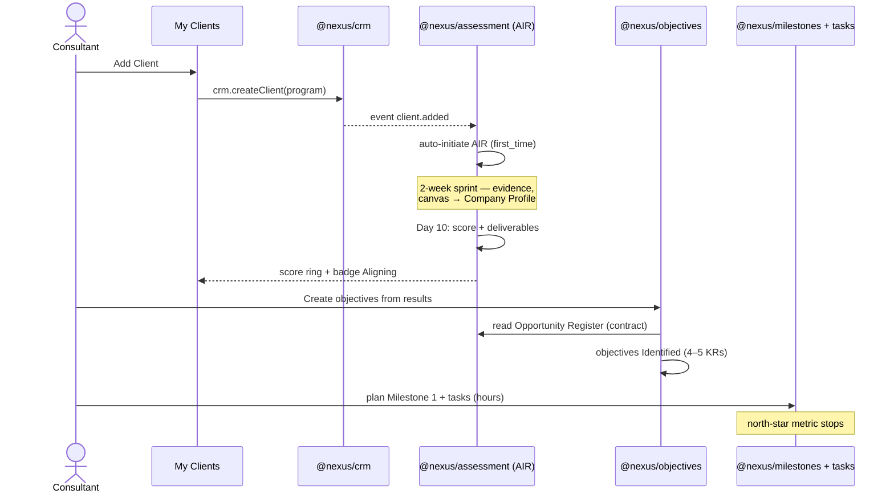
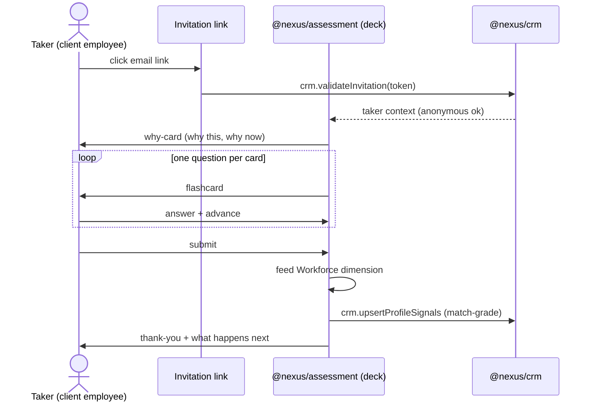
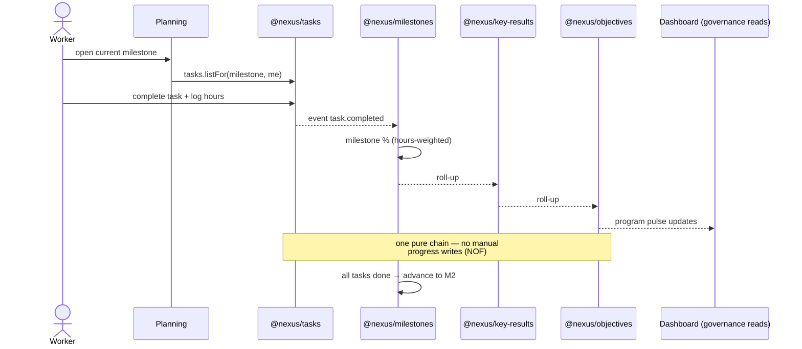
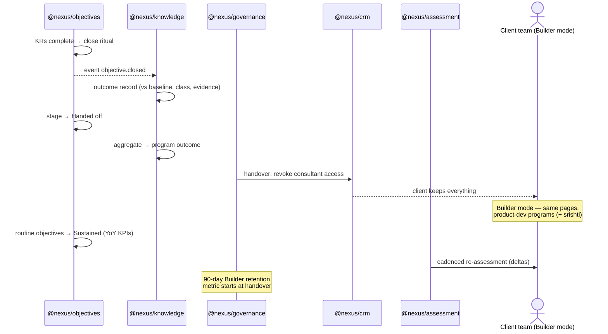

# User Journeys — four archetypes walking the product

## Purpose

Walk the four archetypes (Consultant, Business Owner/taker, Worker, the org itself at handover) through the product end to end, naming the page, the action, and the module contract behind every step. PRODUCT_STRATEGY defines what each page is; this doc strings the pages into the journeys the E2E suite, the demo script, and the empty states must all agree on.

## TL;DR

- **J1 Consultant first-value** is the north-star-metric path: first login → client's first objective *Identified* with a planned milestone. Everything in the UI exists to shorten it.
- **J2 Assessment taker** is the funnel: for most client employees the flashcard deck IS their first Nexus experience — onboarding-grade, never a survey.
- **J3 Worker weekly loop** is the engine: task hours → milestone % → KR % → objective % → program % — one pure roll-up chain (NOF), no manual progress writes.
- **J4 Close → handover → Builder** is the moat: outcome records prove value, handover flips the program, and the second metric (90-day Builder retention) starts counting.
- Every step names its module contract — J-steps are the acceptance criteria N1-P4-01's contracts must satisfy.

## J1 — Consultant first-value (Engagement mode)

The north-star metric clock starts at step 1 and stops at step 10.

1. Consultant logs in → lands on **My Clients** (their home page). `crm.authenticate`
2. Clicks **Add Client** (the page's one dominant CTA) → creates company + primary contact. `crm.createClient(program)`
3. `client.added` fires → the assessment module **auto-initiates AIR** — no manual send (BOQ maturity ladder starts here). `assessment.initiate(provider=air, moment=first_time)`
4. Client tile appears as **Prospect**, ring empty, inline CTA **Start assessment**.
5. The AIR two-week sprint runs in **Assessments** (engagement workspace): per-day instruments capture evidence — Day 1 Business Context Canvas lands in the client's **Company Profile**; Day 7 workforce instruments feed taker **Profiles** (J2). `assessment.captureEvidence(instrument, day)`
6. Day 10 scoring workshop → AIR Score + deliverables generated (Opportunity Register, Risk Register, 90-day plan, roadmap). `assessment.score()` → `assessment.deliverables()`
7. Tile badge advances **Measuring → Aligning** (the stage machine fires on the commitment entry moment, 01 §4); score ring fills; My Clients triage tiles update.
8. BO/Manager clicks **Create objectives from these results** (the product's most important handoff) → **Objectives**, pre-seeded from the Opportunity Register. `objectives.createFrom(deliverable)` — objectives *Identified*, 4–5 KRs each.
9. Manager opens **Planning** → breaks the first KR into Milestone 1 (~1 week) with tasks + hour estimates. `milestones.create(objective-relative)`, `tasks.bulkCreate(milestone)`
10. **Dashboard** lights up: program pulse live. **North-star metric stops: first objective *Identified* with a planned milestone.**

## J2 — Assessment taker (first-time moment — the funnel)

The taker is usually a client employee with no Nexus account. Per PRODUCT_STRATEGY § delivery experience: flashcards, never surveys.

1. Taker receives an invitation email → clicks the link. `crm.validateInvitation(token)` (no login wall for anonymous instruments)
2. The deck opens with the **why-card**: why *this* assessment, *now*, what happens with the result. Nobody takes a mystery quiz.
3. Cards advance one at a time — one question per card, flip/advance rhythm, progress felt not dreaded (PQ-4 mechanics explored in mockups). `assessment.deck(instrument, moment)`
4. Taker submits → thank-you card states what happens next. `assessment.submitResponses(token)`
5. Responses feed the AIR Workforce dimension; match-grade signals (skills, interests — tags/enums, never prose) land in the taker's **Profile** (the fit thesis starts collecting here). `assessment.score(partial)`, `crm.upsertProfileSignals`
6. On a **recurring** assessment the deck greets the taker with deltas vs their own history. `assessment.history(taker)`
7. Completion rate + taker sentiment are recorded — they are product metrics, not afterthoughts.

## J3 — Worker weekly execution (the NOF engine)

The daily loop that makes progress data real. No manual progress writes anywhere — the roll-up chain computes everything.

1. Worker logs in → lands on **Planning** (their home page): the current milestone's tasks, theirs first. `tasks.listFor(milestone, assignee)`
2. Picks a task → executes → logs hours / marks complete. `tasks.update(status, hours)`
3. Completion emits up the chain — one pure function, no stored progress fields: task hours → milestone % → KR % → objective % → program %. `event task.completed` → roll-up recompute
4. **Dashboard** reflects within the same view: week completion rate, overdue count; "Needs you today" rows convert visibility into action (BO may **Push task completion** → worker gets the nudge).
5. Milestone's tasks all done → milestone closes → next ordered milestone (M2) becomes current — dated relative to the objective, never to ISO weeks. `milestones.advance(objective)`
6. Last milestone of a KR closes → KR hits 100% progress → objective approaches close (→ J4).
7. Blocked task → worker flags it (`tasks.block(reason)`) → surfaces on Dashboard as at-risk; unblock resumes the loop.

## J4 — Objective close → handover → Builder mode (the moat)

Where progress becomes proven outcome, and the engagement becomes a product account.

1. An objective's KRs reach completion → close ritual triggers: the **outcome record** is written — final vs baseline, achievement %, outcome class (exceeded/achieved/partial/missed), narrative, evidence refs. `event objective.closed` → `knowledge.captureOutcome` (NOF's fix for OKR's progress-vs-outcome flaw)
2. Objective stage flips **Identified → Handed off**: completed and transferred to the client's team as theirs to run.
3. Outcome records aggregate into the program outcome — the engagement's receipt. `knowledge.programOutcome(program)`
4. Program objectives substantially Handed off → **program handover** (a lifecycle event, not a migration): consultant access ends, client keeps everything. `governance.handover(program)` → `crm.revokeConsultantAccess`
5. The account flips to **Builder mode**: My Clients hides; the same six pages now run the client's product development programs (+ srishti add-on).
6. Handed-off objectives that become routine flip to **Sustained**: tracked year-over-year as KPIs — transformation became routine, the value proof.
7. Cadenced **re-assessment** fires per the maturity ladder (BOQ): recurring decks show deltas; the BRAMHI Baseline extends. `assessment.initiate(moment=recurring)`
8. **Second metric counts from step 4**: % of handed-over clients still active in Builder mode at 90 days.

## Journey ↔ contract index

The steps above are acceptance criteria for N1-P4-01's contract drafts:

| Contract call / event | Used by |
|---|---|
| `crm.createClient` · `crm.validateInvitation` · `crm.upsertProfileSignals` · `crm.revokeConsultantAccess` | J1·2·4 |
| `event client.added` (auto-initiates entry assessment) | J1 |
| `assessment.initiate(moment)` · `.captureEvidence` · `.score` · `.deliverables` · `.deck` · `.history` | J1·2·4 |
| `objectives.createFrom(deliverable)` · lifecycle stages | J1·4 |
| `milestones.create/advance` (objective-relative) · `tasks.bulkCreate/update/block` | J1·3 |
| `event task.completed` → roll-up chain (pure, no stored %) | J3 |
| `event objective.closed` → `knowledge.captureOutcome` · `knowledge.programOutcome` | J4 |
| `governance.handover(program)` | J4 |
