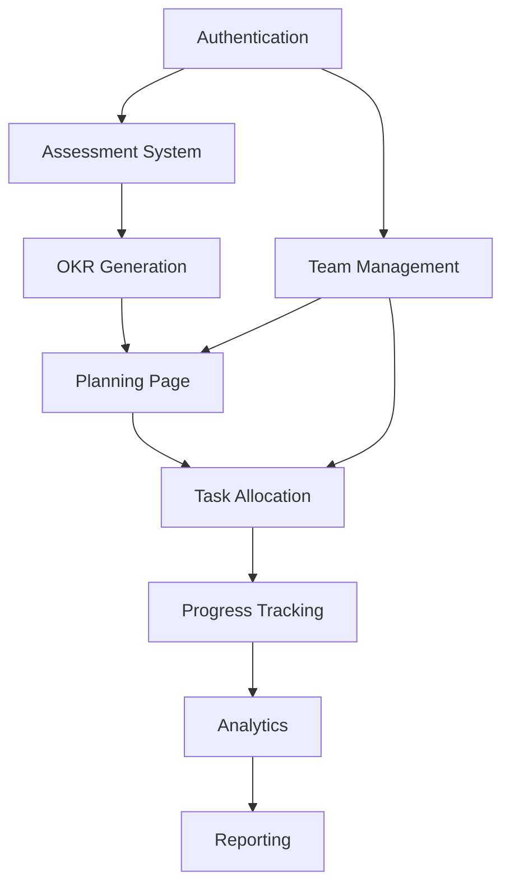

# Karvia Feature Catalog

<!-- @GENOME T2-PRD-039 | TRANSITIONING | 2026-04-05 | parent:T1-PRD-001 | auto:/strategy | linked:/coding -->

> **Document Status: TRANSITIONING**
>
> For current feature status, see [KARVIA_1.0_CAPABILITIES.md](./KARVIA_1.0_CAPABILITIES.md).
> This catalog is being consolidated into the capabilities document.
> Last substantive update: November 2025

---

**Complete Feature Inventory & Implementation Status**
Version 2.0 | November 2025

---

## 🎯 Feature Overview by User Role

### Consultant + Executive Shared Capabilities
**Both roles have identical permissions for collaboration**

```
CONSULTANT + EXECUTIVE (Full Partnership)
├── View Team Results (All business functions)
├── Generate OKRs from Assessment Results
├── Access Planning Page
│   ├── Create Objectives from OKRs
│   ├── Break down to Weekly Plans
│   ├── Create Daily Tasks
│   ├── Allocate to Managers/Employees
│   └── Track all progress
└── Full visibility across organization
```

### Manager Capabilities
```
MANAGER (Function-Specific View)
├── View Team Results (Own function only)
│   └── e.g., Sales Manager sees only Sales team
├── Receive allocated tasks from Planning
├── Track function progress
├── Update task status
└── View individual results (self + direct reports)
```

### Employee Capabilities
```
EMPLOYEE (Individual Focus)
├── View Individual Results (self only)
├── Receive allocated tasks
├── Complete assigned work
├── Update progress
└── See impact on team goals
```

---

## 📊 Feature Implementation Status

### Legend
- ✅ Complete (Backend + Frontend)
- 🔧 Backend Complete, Frontend Pending
- 📋 Planned (Not Started)
- 🚧 In Progress
- ❌ Descoped/Removed

---

## Module 1: Authentication & Access (✅ 95% Complete)

| Feature | Status | Backend | Frontend | Notes |
|---------|--------|---------|----------|-------|
| **User Registration** | ✅ | ✅ 100% | ✅ 100% | Email verification working |
| **Login/Logout** | ✅ | ✅ 100% | ✅ 100% | JWT with refresh tokens |
| **Password Reset** | ✅ | ✅ 100% | ✅ 100% | Email-based recovery |
| **Role Management** | ✅ | ✅ 100% | ✅ 100% | 6-tier hierarchy |
| **Multi-Company Support** | 🔧 | ✅ 100% | 🚧 50% | Backend ready, UI incomplete |
| **Session Management** | ✅ | ✅ 100% | ✅ 100% | 24-hour expiry |
| **2FA** | 📋 | 📋 0% | 📋 0% | Future enhancement |

### Access Matrix Implementation
```javascript
// Current Implementation
Permissions = {
  team_results_all: ['CONSULTANT', 'BUSINESS_OWNER', 'EXECUTIVE'],
  team_results_function: ['DEPARTMENT_HEAD', 'TEAM_LEAD'],
  individual_results: ['ALL_ROLES'],
  generate_okrs: ['CONSULTANT', 'BUSINESS_OWNER', 'EXECUTIVE'],
  create_plans: ['CONSULTANT', 'BUSINESS_OWNER', 'EXECUTIVE'],
  allocate_tasks: ['CONSULTANT', 'BUSINESS_OWNER', 'EXECUTIVE', 'DEPARTMENT_HEAD'],
  view_tasks: ['ALL_ROLES'],
  update_tasks: ['ASSIGNED_USER']
}
```

---

## Module 2: Assessment System (✅ 100% Complete)

| Feature | Status | Backend | Frontend | Notes |
|---------|--------|---------|----------|-------|
| **SSI Framework** | ✅ | ✅ 100% | ✅ 100% | Speed/Strength/Intelligence |
| **146 Questions Bank** | ✅ | ✅ 100% | ✅ 100% | Pre-seeded in database |
| **Assessment Templates** | ✅ | ✅ 100% | ✅ 100% | Consultant creates, Executive receives |
| **Template Distribution** | ✅ | ✅ 100% | ✅ 100% | Via invitation system |
| **Take Assessment** | ✅ | ✅ 100% | ✅ 100% | Progress saved automatically |
| **Score Calculation** | ✅ | ✅ 100% | ✅ 100% | Real-time scoring |
| **Results Dashboard** | ✅ | ✅ 100% | ✅ 100% | Visual charts and heatmaps |
| **Team Aggregation** | ✅ | ✅ 100% | ✅ 100% | Roll-up by function/team |
| **Weakness Analysis** | ✅ | ✅ 100% | ✅ 100% | Auto-identifies focus areas |
| **Historical Tracking** | ✅ | ✅ 100% | ✅ 100% | Compare over time |

### Assessment Flow
```
Consultant → Creates Template → Sends to Executive
Executive → Receives in "My Templates" → Invites Team
Team → Takes Assessment → Results Aggregated
Consultant + Executive → View Results Together → Generate OKRs
```

---

## Module 3: OKR Management (🔧 75% Complete)

| Feature | Status | Backend | Frontend | Notes |
|---------|--------|---------|----------|-------|
| **Create Objectives** | ✅ | ✅ 100% | ✅ 100% | Manual creation working |
| **AI OKR Generation** | 🔧 | ✅ 100% | 🚧 60% | GPT-4 integration complete |
| **Key Results** | ✅ | ✅ 100% | ✅ 100% | SMART criteria enforced |
| **Progress Tracking** | ✅ | ✅ 100% | ✅ 100% | Auto-calculation |
| **Health Status** | ✅ | ✅ 100% | ✅ 100% | On-track/At-risk/Behind |
| **Objective Dashboard** | ✅ | ✅ 100% | ✅ 100% | Real-time updates |
| **OKR Cascade** | 🔧 | ✅ 100% | 🚧 40% | Company→Team→Individual |
| **Link to Assessment** | 🔧 | ✅ 100% | 🚧 50% | Connect OKRs to weaknesses |
| **Quarterly Planning** | 📋 | 📋 0% | 📋 0% | Q1 2026 |

### OKR Generation Flow (NEW)
```
Team Results Page
    ↓
[Generate OKRs Button] (Consultant + Executive only)
    ↓
AI analyzes weakness areas
    ↓
Suggests 3-5 SMART objectives
    ↓
Review & Approve
    ↓
Create in system
```

---

## Module 4: Planning & Execution (🔧 60% Complete)

| Feature | Status | Backend | Frontend | Notes |
|---------|--------|---------|----------|-------|
| **Planning Page** | 🔧 | ✅ 100% | 🚧 30% | **Critical Gap** |
| **Objectives → Plans** | 🔧 | ✅ 100% | 📋 0% | Backend ready |
| **Weekly Planning** | 🔧 | ✅ 100% | 📋 0% | **Missing UI** |
| **Daily Tasks** | 🔧 | ✅ 100% | 🚧 20% | Basic UI only |
| **Task Allocation** | 🔧 | ✅ 100% | 📋 0% | **Critical Gap** |
| **Task Assignment UI** | 📋 | ✅ 100% | 📋 0% | Drag-drop planned |
| **Progress Updates** | ✅ | ✅ 100% | ✅ 100% | Simple slider UI |
| **Milestone Tracking** | 📋 | 📋 0% | 📋 0% | Future |

### Planning Page Requirements (CRITICAL)
```javascript
// Needed UI Components
PlanningPage = {
  objective_selector: 'Choose objective to plan',
  breakdown_wizard: 'Convert to weekly plans',
  task_creator: 'Add daily tasks',
  allocation_interface: 'Assign to users',
  timeline_view: 'Gantt-style visualization',
  progress_tracker: 'See completion status'
}
```

---

## Module 5: Team Management (✅ 90% Complete)

| Feature | Status | Backend | Frontend | Notes |
|---------|--------|---------|----------|-------|
| **Create Teams** | ✅ | ✅ 100% | ✅ 100% | Nested structure support |
| **Add Members** | ✅ | ✅ 100% | ✅ 100% | Role assignment |
| **Team Hierarchy** | ✅ | ✅ 100% | ✅ 100% | Department→Team→Sub-team |
| **Function Tags** | ✅ | ✅ 100% | ✅ 100% | Sales/Ops/Finance/etc |
| **Manager Assignment** | ✅ | ✅ 100% | ✅ 100% | Clear reporting lines |
| **Bulk Operations** | 📋 | 📋 0% | 📋 0% | Mass updates planned |
| **Team Analytics** | 🔧 | ✅ 100% | 🚧 50% | Dashboard incomplete |

### Team Structure
```
Company
├── Sales Department (Function: Sales)
│   ├── Inside Sales Team
│   └── Field Sales Team
├── Operations Department (Function: Operations)
│   ├── Production Team
│   └── Quality Team
└── Finance Department (Function: Finance)
    ├── Accounting Team
    └── FP&A Team
```

---

## Module 6: Analytics & Reporting (🔧 70% Complete)

| Feature | Status | Backend | Frontend | Notes |
|---------|--------|---------|----------|-------|
| **Company Dashboard** | ✅ | ✅ 100% | ✅ 100% | Executive view |
| **Team Dashboard** | 🔧 | ✅ 100% | 🚧 60% | Manager view |
| **Individual Dashboard** | 📋 | ✅ 100% | 📋 0% | **Employee Gap** |
| **Progress Charts** | ✅ | ✅ 100% | ✅ 100% | Chart.js implementation |
| **Trend Analysis** | 🔧 | ✅ 100% | 🚧 40% | Historical comparison |
| **Risk Detection** | 🔧 | ✅ 100% | 📋 0% | ML model ready |
| **Export Reports** | 📋 | 🚧 50% | 📋 0% | PDF/CSV planned |
| **Custom Reports** | 📋 | 📋 0% | 📋 0% | Future |

---

## Module 7: Communication & Collaboration (🔧 40% Complete)

| Feature | Status | Backend | Frontend | Notes |
|---------|--------|---------|----------|-------|
| **Invitations** | ✅ | ✅ 100% | ✅ 100% | Email-based |
| **Bulk Invitations** | 📋 | 📋 0% | 📋 0% | Planned for Block 6 |
| **Notifications** | 🔧 | ✅ 100% | 🚧 20% | Email only |
| **In-app Messages** | 📋 | 📋 0% | 📋 0% | Future |
| **Comments** | 📋 | 📋 0% | 📋 0% | On objectives/tasks |
| **Activity Feed** | 🔧 | ✅ 100% | 📋 0% | Backend ready |
| **Recognition System** | 📋 | 🚧 30% | 📋 0% | Badges planned |

---

## Module 8: AI & Intelligence (🔧 60% Complete)

| Feature | Status | Backend | Frontend | Notes |
|---------|--------|---------|----------|-------|
| **GPT-4 Integration** | ✅ | ✅ 100% | ✅ 100% | OpenAI API |
| **AI OKR Generation** | 🔧 | ✅ 100% | 🚧 60% | From assessment |
| **Smart Suggestions** | 🔧 | ✅ 100% | 📋 0% | Context-aware |
| **Template Fallback** | ✅ | ✅ 100% | ✅ 100% | When AI fails |
| **Predictive Analytics** | 📋 | 🚧 40% | 📋 0% | Risk prediction |
| **iBrain Toggle** | ✅ | ✅ 100% | ✅ 100% | Premium feature |
| **Behavioral Nudging** | 📋 | 📋 0% | 📋 0% | iBrain feature |
| **AI Coaching** | 📋 | 📋 0% | 📋 0% | iBrain feature |

---

## 🚨 Critical Gaps (P0 - Must Fix)

### 1. Planning Page UI (Blocks Launch)
```
Current State: Backend 100%, Frontend 0%
Needed:
- Objective breakdown interface
- Weekly plan creator
- Task allocation UI
- Timeline visualization
Impact: Can't convert OKRs to executable work
```

### 2. Employee Dashboard (Blocks Adoption)
```
Current State: Backend 100%, Frontend 0%
Needed:
- My tasks view
- Progress update interface
- Impact visualization
- Daily workflow
Impact: Employees can't use the system
```

### 3. Goal Management UI (Core Functionality)
```
Current State: Backend 100%, Frontend 30%
Missing Pages:
- quarterly-goals.html
- goal-details.html
- weekly-goals.html
Impact: Can't manage middle layer of cascade
```

---

## 📅 Feature Release Timeline

### Phase 1: MVP Completion (Weeks 5-6) - NOW
- ✅ Complete Planning Page UI
- ✅ Finish Goal Management UI
- ✅ Create Employee Dashboard
- ✅ Fix OKR Generation UI
- ✅ Mobile responsiveness

### Phase 2: Beta Features (Weeks 7-8)
- 📋 Bulk operations
- 📋 Advanced analytics
- 📋 Export functionality
- 📋 Performance optimization

### Phase 3: Launch Ready (Weeks 9-12)
- 📋 Integration testing
- 📋 Security hardening
- 📋 Documentation
- 📋 Onboarding flow
- 📋 Marketing website

### Phase 4: Post-Launch (Q1 2026)
- 📋 Public API
- 📋 Slack integration
- 📋 Mobile app
- 📋 Advanced AI features
- 📋 White-label option

---

## 🔄 Feature Dependencies Map



---

## 📊 Feature Completion Metrics

### Overall Progress
```
Total Features: 89
Complete: 42 (47%)
Backend Only: 23 (26%)
In Progress: 8 (9%)
Not Started: 16 (18%)
```

### By Module
| Module | Backend | Frontend | Overall |
|--------|---------|----------|---------|
| Authentication | 95% | 90% | 93% |
| Assessment | 100% | 100% | 100% |
| OKR Management | 100% | 50% | 75% |
| Planning | 100% | 20% | 60% |
| Team Management | 100% | 80% | 90% |
| Analytics | 100% | 40% | 70% |
| Communication | 70% | 20% | 45% |
| AI Features | 80% | 30% | 55% |

### Critical Path to Launch
1. Planning Page UI (2 days)
2. Employee Dashboard (2 days)
3. Goal Management UI (1 day)
4. Mobile Responsive (3 days)
5. Integration Testing (3 days)
6. Bug Fixes (3 days)

**Total: 14 days to production-ready**

---

## 🎯 Feature Prioritization (MoSCoW)

### Must Have (Launch Blockers)
- Planning Page UI
- Employee Dashboard
- Goal Management UI
- Mobile Responsive
- Basic Reporting

### Should Have (Important)
- Bulk Invitations
- Export to PDF/CSV
- Advanced Analytics
- Slack Notifications

### Could Have (Nice to Have)
- AI Coaching
- Custom Reports
- White Label
- API Access

### Won't Have (Future)
- Mobile App
- Blockchain Badges
- AR Dashboard
- Voice Commands

---

**Document Status**: Living document, updated with each sprint
**Next Update**: After Week 6 completion
**Owner**: Product Team