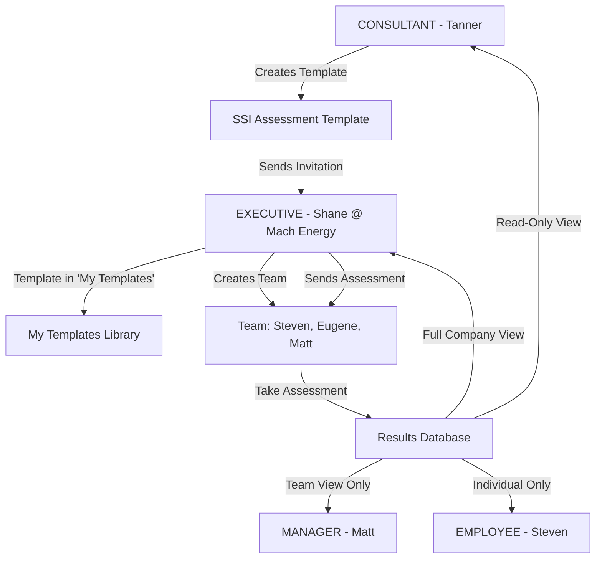

# KARVIA Engine Architecture

<!-- @GENOME T2-ARC-002 | ACTIVE | 2026-03-30 | parent:T1-ARC-001 | auto:/coding,/strategy | linked:/design -->

> Technical architecture of the KARVIA OKR engine layer. For the full ecosystem view (YSELA → KARVIA → iBrain), see [ECOSYSTEM_ARCHITECTURE.md](../../ECOSYSTEM_ARCHITECTURE.md).

**Version**: 3.0 | March 2026
**Status**: ACTIVE (Beta Phase)

---

## Ecosystem Context

This document describes **KARVIA** - the OKR engine layer:

```
┌────────────────────────────────────────┐
│  YSELA (Product Layer)                 │  ← User-facing brand
│  • BBB, GRIT, PBL frameworks           │
│  • Coach persona, prompts              │
└────────────────┬───────────────────────┘
                 │ wraps
                 ▼
┌────────────────────────────────────────┐
│  KARVIA (Engine Layer) ◄── THIS DOC    │  ← Reusable backbone
│  • OKR data models                     │
│  • APIs, authentication                │
│  • Microservice engines                │
└────────────────┬───────────────────────┘
                 │ connects to
                 ▼
┌────────────────────────────────────────┐
│  iBrain (Intelligence Layer)           │  ← Future ML
│  • Behavioral predictions              │
│  • NOT required for Beta               │
└────────────────────────────────────────┘
```

**Key Files**:
- Ecosystem overview: [ECOSYSTEM_ARCHITECTURE.md](../../ECOSYSTEM_ARCHITECTURE.md)
- iBrain integration: [iBRAIN_Integration/](../../iBRAIN_Integration/)
- YSELA philosophy: [YSELA_PHILOSOPHY.md](roadmap/BETA_RELEASE_PROJECT/YSELA_PHILOSOPHY.md)

---

## 🎯 Architecture Philosophy

### Core Principles
1. **Modular Independence**: Each block works standalone
2. **Progressive Enhancement**: Start simple, add complexity
3. **Fail Gracefully**: Features degrade, don't break
4. **SMB-First**: Optimize for 50-500 users, not 50,000
5. **API-First**: Every feature has API endpoints

### Design Decisions
- **Monolith + Microservices**: Core monolith with optional engines
- **Database**: MongoDB for flexibility, PostgreSQL ready
- **Frontend**: Vanilla JS for simplicity, React migration path
- **Authentication**: JWT with refresh tokens
- **Deployment**: Single container (Render), Kubernetes ready

---

## 🔄 Updated Consultant-Company Flow

### The New Assessment Distribution Model



### Key Changes from Original Design

| Aspect | Original Flow | New Flow |
|--------|--------------|----------|
| **Template Creation** | Consultant creates in their account | Consultant creates in Assessment Hub |
| **Distribution** | Direct to employees | Via Executive's template library |
| **Company Setup** | Consultant creates company | Executive owns company setup |
| **Team Creation** | Consultant manages | Executive creates and manages |
| **Result Access** | Consultant has full control | Consultant has read-only view |
| **Data Ownership** | Ambiguous | Clear: Company owns data |

### Permission Matrix for New Flow

```javascript
// Assessment Template Permissions
CONSULTANT: {
  create_template: true,
  send_to_executives: true,
  view_all_results: true,  // Read-only for client companies
  edit_results: false,
  manage_teams: false
}

EXECUTIVE: {
  receive_templates: true,
  create_teams: true,
  invite_employees: true,
  view_company_results: true,  // Full access to their company
  share_with_consultant: true
}

MANAGER: {
  take_assessment: true,
  view_team_results: true,  // Only their team, not full company
  view_company_results: false
}

EMPLOYEE: {
  take_assessment: true,
  view_own_results: true,  // Only individual results
  view_team_results: false
}
```

---

## 🏛️ System Architecture

### High-Level Architecture

```
┌─────────────────────────────────────────────────────────────┐
│                     Frontend Layer                           │
│  ┌──────────┐ ┌──────────┐ ┌──────────┐ ┌──────────┐      │
│  │   Web    │ │  Mobile  │ │   API    │ │  Slack   │      │
│  │ (HTML/JS)│ │   (PWA)  │ │ (Public) │ │   Bot    │      │
│  └──────────┘ └──────────┘ └──────────┘ └──────────┘      │
└─────────────────────────────────────────────────────────────┘
                              │
┌─────────────────────────────────────────────────────────────┐
│                     API Gateway                              │
│         (Rate Limiting, Auth, Routing, Caching)             │
└─────────────────────────────────────────────────────────────┘
                              │
┌─────────────────────────────────────────────────────────────┐
│                  Core Application Server                     │
│  ┌──────────────────────────────────────────────────┐      │
│  │            Business Logic Layer                   │      │
│  │  ┌──────────┐ ┌──────────┐ ┌──────────┐        │      │
│  │  │Assessment│ │   OKR    │ │Analytics │        │      │
│  │  │  Service │ │ Service  │ │ Service  │        │      │
│  │  └──────────┘ └──────────┘ └──────────┘        │      │
│  └──────────────────────────────────────────────────┘      │
└─────────────────────────────────────────────────────────────┘
                              │
┌─────────────────────────────────────────────────────────────┐
│                   Microservice Engines                       │
│  ┌──────────┐ ┌──────────┐ ┌──────────┐ ┌──────────┐      │
│  │   IAM    │ │Assessment│ │ Planner  │ │ Scoring  │      │
│  │  :8081   │ │  :8082   │ │  :8083   │ │  :8084   │      │
│  └──────────┘ └──────────┘ └──────────┘ └──────────┘      │
│  ┌──────────┐ ┌──────────┐ ┌──────────┐                   │
│  │ Observer │ │ Tracking │ │ Insights │                   │
│  │  :8085   │ │  :8086   │ │  :8087   │                   │
│  └──────────┘ └──────────┘ └──────────┘                   │
└─────────────────────────────────────────────────────────────┘
                              │
┌─────────────────────────────────────────────────────────────┐
│                      Data Layer                              │
│  ┌──────────────┐ ┌──────────────┐ ┌──────────────┐       │
│  │   MongoDB    │ │  PostgreSQL  │ │    Redis     │       │
│  │  (Primary)   │ │   (Future)   │ │   (Cache)    │       │
│  └──────────────┘ └──────────────┘ └──────────────┘       │
└─────────────────────────────────────────────────────────────┘
                              │
┌─────────────────────────────────────────────────────────────┐
│                   External Services                          │
│  ┌──────────┐ ┌──────────┐ ┌──────────┐ ┌──────────┐      │
│  │  OpenAI  │ │ Mailjet  │ │  Stripe  │ │  iBrain  │      │
│  │   GPT-4  │ │  Email   │ │ Billing  │ │    AI    │      │
│  └──────────┘ └──────────┘ └──────────┘ └──────────┘      │
└─────────────────────────────────────────────────────────────┘
```

---

## 🧩 Modular Block Architecture

### Block Dependencies & Relationships

```
Block 1: Core Execution (Standalone)
    │
    ├── Block 2: Team Management (Optional)
    │   └── Enables: Multi-user, Roles, Permissions
    │
    ├── Block 3: Assessment Framework (Optional)
    │   └── Enables: SSI Scoring, Maturity Analysis
    │       └── Block 4: AI Generation (Requires Block 3)
    │           └── Enables: Smart OKRs from Assessment
    │
    ├── Block 5: Advanced Analytics (Optional)
    │   └── Enables: Predictive Insights, Risk Detection
    │
    ├── Block 6: Bulk Operations (Optional)
    │   └── Enables: Mass Updates, Import/Export
    │
    └── Block 7: iBrain Integration (Premium)
        └── Requires: Blocks 3, 4, 5
        └── Enables: Behavioral Nudging, AI Coaching
```

### Feature Flags Configuration

```javascript
// config/feature-flags.js
module.exports = {
  blocks: {
    core_execution: {
      enabled: true,  // Always on
      features: ['manual_okrs', 'progress_tracking', 'basic_reports']
    },
    team_management: {
      enabled: true,
      features: ['multi_user', 'role_permissions', 'team_structure']
    },
    assessment_framework: {
      enabled: true,
      features: ['ssi_scoring', 'assessment_templates', 'weakness_analysis']
    },
    ai_generation: {
      enabled: true,
      requires: ['assessment_framework'],
      features: ['gpt4_okrs', 'smart_suggestions', 'auto_cascade']
    },
    advanced_analytics: {
      enabled: false,  // Coming in Phase 2
      features: ['predictive_insights', 'risk_detection', 'ml_forecasting']
    },
    bulk_operations: {
      enabled: false,  // Coming in Phase 3
      features: ['bulk_invite', 'mass_update', 'data_import_export']
    },
    ibrain_integration: {
      enabled: false,  // Premium add-on
      requires: ['assessment_framework', 'ai_generation', 'advanced_analytics'],
      features: ['behavioral_nudging', 'sentiment_analysis', 'ai_coaching']
    }
  }
};
```

---

## 💾 Data Architecture

### Database Schema Design

```javascript
// Core Collections Structure
Collections = {
  // 1. Identity & Access
  users: {
    indexes: ['email', 'company_id', 'role'],
    relationships: ['companies', 'teams', 'objectives']
  },

  // 2. Organization
  companies: {
    indexes: ['subscription_tier', 'created_at'],
    relationships: ['users', 'teams', 'objectives', 'assessments']
  },

  teams: {
    indexes: ['company_id', 'manager_id'],
    relationships: ['users', 'goals']
  },

  // 3. Assessment System
  assessment_templates: {
    indexes: ['consultant_id', 'is_global', 'category'],
    relationships: ['assessment_questions', 'invitations']
  },

  assessments: {
    indexes: ['company_id', 'user_id', 'status', 'created_at'],
    relationships: ['assessment_responses', 'objectives']
  },

  // 4. OKR System
  objectives: {
    indexes: ['company_id', 'owner_id', 'status', 'quarter'],
    relationships: ['key_results', 'assessments']
  },

  key_results: {
    indexes: ['objective_id', 'owner_id', 'progress'],
    relationships: ['goals']
  },

  goals: {
    indexes: ['key_result_id', 'team_id', 'frequency'],
    relationships: ['tasks']
  },

  tasks: {
    indexes: ['goal_id', 'assignee_id', 'status', 'due_date'],
    relationships: ['users']
  },

  // 5. Collaboration
  invitations: {
    indexes: ['template_id', 'recipient_email', 'status', 'expires_at'],
    relationships: ['assessment_templates', 'companies']
  },

  activities: {
    indexes: ['company_id', 'user_id', 'type', 'created_at'],
    relationships: ['users', 'objectives', 'tasks']
  }
};
```

### Data Flow Architecture

```
User Action → API Endpoint → Middleware Stack → Service Layer → Data Layer

Example: Create OKR from Assessment
────────────────────────────────
1. POST /api/objectives/generate-from-assessment
2. Middleware: authGuard → roleGuard → validateRequest
3. Service: assessmentService.getResults()
4. Service: aiOKRService.generateObjectives()
5. Service: objectiveService.create()
6. Database: Insert objective → key_results → auto-calculate progress
7. Response: Return created objective with KRs
8. Frontend: Update UI with new objective
```

---

## 🔐 Security Architecture

### Authentication Flow

```
Login Request → Validate Credentials → Generate JWT (24h) + Refresh Token (7d)
     ↓
Store in Client → Send with Requests → Validate Token → Extract User Info
     ↓
Token Expired → Use Refresh Token → Generate New JWT → Continue
     ↓
Refresh Expired → Force Re-login
```

### Authorization Model

```javascript
// Role-Based Access Control (RBAC)
Permissions = {
  // Consultant - External advisor (highest)
  CONSULTANT: {
    manage_multiple_companies: true,
    create_assessment_templates: true,
    view_all_client_results: true,  // Read-only
    override_permissions: false
  },

  // Business Owner - Company admin
  BUSINESS_OWNER: {
    manage_company_settings: true,
    manage_all_users: true,
    view_everything: true,
    delete_company_data: true
  },

  // Executive - Department leader
  EXECUTIVE: {
    manage_department: true,
    create_objectives: true,
    view_company_objectives: true,
    manage_department_users: true
  },

  // Manager - Team leader
  MANAGER: {
    manage_team: true,
    create_goals: true,
    view_team_objectives: true,
    assign_tasks: true
  },

  // Employee - Individual contributor
  EMPLOYEE: {
    view_assigned_tasks: true,
    update_task_progress: true,
    view_team_objectives: true,
    take_assessments: true
  }
};
```

---

## 🚀 Deployment Architecture

### Environment Strategy

```yaml
Development:
  - Multiple microservices (ports 8080-8089)
  - Hot reload enabled
  - Verbose logging
  - Mock external services

Staging:
  - Single container deployment
  - Production-like config
  - Integration with external services
  - Performance profiling

Production:
  - Standalone mode (no microservices)
  - Horizontal scaling ready
  - APM monitoring
  - Error tracking (Sentry)
  - CDN for static assets
```

### Scaling Strategy

```
Phase 1 (0-1000 users):
  Single server (2 CPU, 4GB RAM)
  MongoDB Atlas M10
  Direct file uploads

Phase 2 (1000-10000 users):
  Load balanced servers (3 instances)
  MongoDB Atlas M30
  Redis cache layer
  S3 for file storage

Phase 3 (10000+ users):
  Kubernetes cluster
  MongoDB sharded cluster
  Multi-region deployment
  ElasticSearch for search
  Message queue (RabbitMQ)
```

---

## 🔌 Integration Architecture

### API Design Principles

```javascript
// RESTful API Structure
GET    /api/objectives          // List all objectives
POST   /api/objectives          // Create objective
GET    /api/objectives/:id      // Get specific objective
PUT    /api/objectives/:id      // Update objective
DELETE /api/objectives/:id      // Delete objective

// Nested Resources
GET    /api/objectives/:id/key-results
POST   /api/objectives/:id/key-results
GET    /api/teams/:id/goals
POST   /api/teams/:id/goals

// Actions
POST   /api/objectives/:id/generate-ai
POST   /api/assessments/:id/calculate-scores
POST   /api/invitations/bulk-send
```

### External Integrations

```javascript
// Integration Points
Integrations = {
  openai: {
    purpose: 'AI OKR Generation',
    endpoints: ['completions'],
    fallback: 'Template-based generation'
  },

  mailjet: {
    purpose: 'Email notifications',
    endpoints: ['send', 'templates'],
    fallback: 'Queue for retry'
  },

  stripe: {
    purpose: 'Subscription billing',
    endpoints: ['customers', 'subscriptions', 'invoices'],
    fallback: 'Manual billing'
  },

  slack: {
    purpose: 'Team notifications',
    endpoints: ['webhook', 'oauth'],
    fallback: 'Email notification'
  },

  ibrain: {
    purpose: 'Advanced AI features',
    endpoints: ['analyze', 'predict', 'coach'],
    fallback: 'Basic analytics only'
  }
};
```

---

## 🎨 Frontend Architecture

### Component Structure

```
client/
├── pages/                  # HTML pages
│   ├── auth/              # Login, signup, reset
│   ├── dashboard/         # Main dashboards
│   ├── objectives/        # OKR management
│   ├── assessments/       # Assessment flows
│   └── teams/            # Team management
├── js/                    # JavaScript modules
│   ├── api/              # API client libraries
│   ├── components/       # Reusable components
│   ├── utils/            # Helper functions
│   └── config/           # Configuration
├── css/                   # Stylesheets
│   ├── bootstrap/        # Bootstrap customization
│   ├── components/       # Component styles
│   └── themes/          # Theme variations
└── assets/               # Static assets
    ├── images/
    ├── fonts/
    └── icons/
```

### State Management

```javascript
// Current: LocalStorage + Session
State = {
  user: localStorage.getItem('user'),
  token: localStorage.getItem('token'),
  company: sessionStorage.getItem('company'),
  objectives: sessionStorage.getItem('objectives')
};

// Future: Redux/Zustand Pattern
Store = {
  auth: { user, token, isAuthenticated },
  company: { details, teams, users },
  objectives: { list, selected, filters },
  ui: { loading, errors, notifications }
};
```

---

## 🧪 Testing Architecture

### Testing Strategy

```
Unit Tests (Jest)
├── Services (80% coverage target)
├── Models (100% coverage target)
├── Utils (100% coverage target)
└── API Routes (70% coverage target)

Integration Tests (Supertest)
├── Auth flows
├── Assessment → OKR flow
├── Permission scenarios
└── Data cascade operations

E2E Tests (Cypress)
├── Critical user journeys
├── Consultant flow
├── Executive flow
└── Employee flow

Performance Tests (K6)
├── API load testing
├── Database query optimization
└── Frontend rendering speed
```

---

## 📊 Monitoring & Observability

### Metrics Collection

```javascript
// Application Metrics
Metrics = {
  business: {
    active_users: 'Daily/Weekly/Monthly active users',
    objectives_created: 'New objectives per week',
    completion_rate: 'Percentage of objectives completed',
    assessment_scores: 'Average SSI scores by company'
  },

  technical: {
    api_latency: 'P50, P95, P99 response times',
    error_rate: '4xx and 5xx errors per endpoint',
    database_performance: 'Query execution times',
    cache_hit_rate: 'Redis cache effectiveness'
  },

  infrastructure: {
    cpu_usage: 'Server CPU utilization',
    memory_usage: 'RAM consumption',
    disk_io: 'Database read/write operations',
    network_traffic: 'Bandwidth usage'
  }
};
```

---

## 🔮 Future Architecture Evolution

### Phase 1 → Phase 2 Migration

```
Current (Vanilla JS) → Next (React)
────────────────────────────────────
1. Create React components alongside existing
2. Gradually migrate pages to React
3. Implement state management (Redux/Zustand)
4. Add TypeScript for type safety
5. Implement server-side rendering (Next.js)
```

### Microservices Evolution

```
Current (Optional Engines) → Future (Full Microservices)
────────────────────────────────────────────────────────
1. Extract services into separate repositories
2. Implement service mesh (Istio)
3. Add message queue (RabbitMQ/Kafka)
4. Implement CQRS pattern
5. Add event sourcing for audit trail
```

---

## 📚 Technical Decisions Record

| Decision | Choice | Rationale | Alternatives Considered |
|----------|--------|-----------|------------------------|
| **Database** | MongoDB | Flexible schema for rapid iteration | PostgreSQL (future migration planned) |
| **Frontend** | Vanilla JS | Simplicity, no build step needed | React (planned migration) |
| **Auth** | JWT | Stateless, scalable | Sessions (too stateful) |
| **Deployment** | Render | Simple, cost-effective for MVP | AWS (overkill for MVP) |
| **AI Provider** | OpenAI | Best quality for OKR generation | Claude, Gemini (may add later) |
| **Email** | Mailjet | Good deliverability, simple API | SendGrid, SES |
| **Architecture** | Modular Monolith | Balance of simplicity and flexibility | Pure microservices (too complex) |

---

## Related Documents

| Document | Purpose |
|----------|---------|
| [ECOSYSTEM_ARCHITECTURE.md](../../ECOSYSTEM_ARCHITECTURE.md) | Three-layer ecosystem (YSELA → KARVIA → iBrain) |
| [iBRAIN_Integration/](../../iBRAIN_Integration/) | Future ML integration specs |
| [YSELA_PHILOSOPHY.md](roadmap/BETA_RELEASE_PROJECT/YSELA_PHILOSOPHY.md) | Product philosophy and frameworks |
| [CLAUDE.md](../../CLAUDE.md) | Development guide and patterns |

---

**Document Status**: Living document, updated with each architectural decision
**Last Updated**: March 2026 (Ecosystem restructure)
**Next Review**: Post-Beta (May 2026)