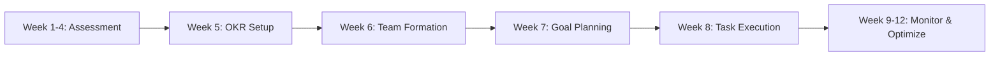

# User Journeys - Consolidated Master Document

<!-- @GENOME T2-PRD-038 | ACTIVE | 2026-03-30 | parent:T1-PRD-001 | auto:/design | linked:/coding -->

**Complete User Journey Map for All Personas**
Version 2.0 | November 2025

---

## 🎯 Executive Summary

This document consolidates all user journeys for Karvia Business, showing how each persona interacts with the system from assessment through execution. The journeys follow the updated Consultant + Executive shared workflow model.

**Active Personas**:
1. **Consultant** - External advisor orchestrating multiple clients
2. **Business Owner/Executive** - Company leader setting strategic direction
3. **Department Head/Manager** - Team leader executing strategy
4. **Team Lead** - Supervisor coordinating daily work
5. **Employee** - Individual contributor executing tasks

---

## 🔄 Master Workflow - The Golden Path

### Complete 12-Week Journey



### Phase-by-Phase Breakdown

#### **Phase 1: Strategic Assessment (Weeks 1-4)**
```
Consultant Creates Template
    ↓
Consultant Sends to Executive
    ↓
Executive Receives in "My Templates"
    ↓
Executive Invites Team
    ↓
All Employees Take Assessment
    ↓
System Calculates SSI Scores
    ↓
Results Aggregated by Team/Company
```

#### **Phase 2: OKR Generation (Week 5)**
```
Consultant + Executive View Results Together
    ↓
Both Can Generate AI OKRs (Shared Capability)
    ↓
Review AI Suggestions Based on Weaknesses
    ↓
Executive Approves Final OKRs
    ↓
System Creates Objective Records
```

#### **Phase 3: Planning & Cascade (Weeks 6-7)**
```
Executive Creates Annual Objectives (Max 4)
    ↓
Breaks Down to Quarterly Key Results
    ↓
Manager Creates Team Goals from KRs
    ↓
Manager Allocates Weekly Goals
    ↓
Manager Creates Daily Tasks
    ↓
Tasks Assigned to Employees
```

#### **Phase 4: Execution & Tracking (Week 8+)**
```
Employee Views Daily Tasks
    ↓
Sees "Why Chain" (Task → Goal → KR → Objective)
    ↓
Updates Progress
    ↓
System Auto-Calculates Roll-up
    ↓
Manager Monitors Team Dashboard
    ↓
Executive Views Company Progress
    ↓
Consultant Compares Across Clients
```

---

## 👥 Persona-Specific Journeys

### 1️⃣ CONSULTANT Journey (External Advisor)

**Primary Role**: Multi-client orchestration and strategic guidance

#### Key Capabilities
- **Assessment Management**
  - Create custom templates (dynamic questions)
  - Send to multiple client executives
  - Track completion across portfolio
  - View aggregated results

- **Strategic Partnership** (Shared with Executive)
  - View all team results
  - Generate AI OKRs from assessments
  - Access planning page
  - Break objectives into plans
  - Allocate tasks to teams

- **Portfolio Management**
  - Compare performance across clients
  - Identify best practices
  - Generate cross-client insights
  - Track implementation success

#### Workflow
```
Day 1: Onboard New Client
├── Create assessment template
├── Send to client executive
└── Schedule review meeting

Week 1: Assessment Phase
├── Monitor completion rates
├── Send reminders
└── Prepare analysis

Week 2: Strategic Planning
├── Review results with executive (shared screen)
├── Generate AI OKRs together
├── Help break down objectives
└── Set up planning structure

Monthly: Ongoing Advisory
├── Review progress dashboards
├── Compare to other clients
├── Suggest optimizations
└── Report to client leadership
```

#### Access Permissions
✅ View all assigned client data
✅ Generate OKRs for clients
✅ Access planning tools
✅ View cross-client analytics
❌ Cannot execute tasks
❌ Cannot modify client team structure

---

### 2️⃣ BUSINESS OWNER/EXECUTIVE Journey (Company Leader)

**Primary Role**: Strategic direction and organizational alignment

#### Key Capabilities (Shared with Consultant)
- **Full Visibility**
  - All team assessment results
  - Company-wide objectives
  - Department performance
  - Individual progress

- **Strategic Planning** (Shared with Consultant)
  - Generate AI OKRs
  - Create annual objectives
  - Break down to quarterly goals
  - Approve manager plans

- **Resource Allocation**
  - Create teams
  - Assign managers
  - Allocate resources
  - Set priorities

#### Workflow
```
Week 1: Assessment Launch
├── Receive template from consultant
├── Add to "My Templates"
├── Create teams
├── Send invitations
└── Communicate importance

Week 2-4: Monitor Participation
├── Track completion rates
├── Send reminders
├── Review early results
└── Identify gaps

Week 5: OKR Creation
├── Review results with consultant
├── Generate AI suggestions
├── Approve final OKRs
├── Communicate to organization
└── Assign to departments

Ongoing: Strategic Oversight
├── Monday: Review weekly progress
├── Monthly: Department reviews
├── Quarterly: Strategy adjustment
└── Annually: Full assessment cycle
```

#### Access Permissions
✅ Full company visibility
✅ Create/modify objectives
✅ Approve all plans
✅ Access all analytics
✅ Generate OKRs
❌ Cannot access other companies

---

### 3️⃣ DEPARTMENT HEAD/MANAGER Journey (Team Leader)

**Primary Role**: Translate strategy to execution

#### Key Capabilities
- **Team Management**
  - Create and organize teams
  - Add/remove members
  - Assign roles
  - Set team goals

- **Goal Translation** (Function-Specific)
  - View assigned objectives
  - Create quarterly goals
  - Break into weekly targets
  - Create actionable tasks

- **Progress Monitoring**
  - Team dashboard (own function only)
  - Individual performance
  - At-risk indicators
  - Intervention tools

#### Workflow
```
Week 5: Receive Objectives
├── View assigned OKRs
├── Understand targets
└── Plan approach

Week 6: Team Setup
├── Organize team structure
├── Assign team members
├── Set roles
└── Communicate goals

Week 7: Planning Phase
├── Create quarterly goals
├── Break into weekly targets
├── Create task list
├── Assign to team members
└── Set deadlines

Week 8+: Execution Management
├── Daily: Monitor task progress
├── Weekly: Team check-ins
├── Identify blockers
├── Intervene when at-risk
└── Report up to executive
```

#### Function-Specific Views
- **Sales Manager**: Sees only sales team and sales objectives
- **Operations Manager**: Sees only operations team and ops objectives
- **Finance Manager**: Sees only finance team and finance objectives

#### Access Permissions
✅ View own function/team data
✅ Create goals and tasks for team
✅ Monitor team progress
❌ Cannot see other departments
❌ Cannot create company objectives
❌ Cannot generate OKRs

---

### 4️⃣ TEAM LEAD Journey (Supervisor)

**Primary Role**: Coordinate daily execution

#### Key Capabilities
- All Employee capabilities, plus:
  - View team member tasks (read-only)
  - Suggest task reassignments
  - Coordinate team activities
  - Provide peer feedback

#### Workflow
```
Daily Routine
├── Morning: Review team tasks
├── Identify dependencies
├── Coordinate with team
├── Complete own tasks
├── Update progress
└── Evening: Report to manager
```

#### Access Permissions
✅ Everything employees can do
✅ View team task list (read-only)
✅ Suggest changes to manager
❌ Cannot assign tasks
❌ Cannot modify goals

---

### 5️⃣ EMPLOYEE Journey (Individual Contributor)

**Primary Role**: Execute assigned work with context

#### Key Capabilities
- **Task Execution**
  - View assigned tasks
  - Update progress
  - Complete work
  - Add notes

- **Context Understanding**
  - See "Why Chain" connection
  - Understand impact
  - View related objective
  - Track contribution

#### The "Why Chain" - Critical for Motivation
```
My Task: "Complete customer survey analysis"
    ↓ Why?
Weekly Goal: "Analyze 5 customer segments" (3/5 done)
    ↓ Why?
Quarterly Goal: "Improve customer satisfaction 20%" (12% achieved)
    ↓ Why?
Key Result: "NPS score from 30 to 50" (currently 38)
    ↓ Why?
Objective: "Become customer-obsessed organization"
    ↓ Why?
Assessment Finding: "Customer Intelligence gap: -2.1 below industry"
```

#### Daily Workflow
```
Morning (8:00 AM)
├── Check daily tasks
├── Review priorities
├── See "Why Chain" context
└── Plan day

During Day
├── Work on tasks
├── Update progress (slider)
├── Add notes if blocked
└── Mark complete

Evening (5:00 PM)
├── Review progress
├── Update remaining tasks
├── See impact on goals
└── Receive recognition
```

#### Access Permissions
✅ View own tasks and goals
✅ Update own progress
✅ View own assessment
✅ See related objectives
❌ Cannot see others' tasks
❌ Cannot create tasks
❌ Cannot modify goals

---

## 🔐 Permission Matrix

### Complete Access Control Grid

| Action | Consultant | Executive | Manager | Team Lead | Employee |
|--------|------------|-----------|---------|-----------|----------|
| **Assessment** |||||
| Create templates | ✅ | ❌ | ❌ | ❌ | ❌ |
| Send invitations | ✅ | ✅ | ✅ | ❌ | ❌ |
| Take assessment | ✅ | ✅ | ✅ | ✅ | ✅ |
| View company results | ✅ | ✅ | ❌ | ❌ | ❌ |
| View team results | ✅ | ✅ | ✅* | ❌ | ❌ |
| **OKR Management** |||||
| Generate AI OKRs | ✅ | ✅ | ❌ | ❌ | ❌ |
| Create objectives | ❌ | ✅ | ❌ | ❌ | ❌ |
| Approve OKRs | ❌ | ✅ | ❌ | ❌ | ❌ |
| View all objectives | ✅ | ✅ | ✅* | ✅* | ✅* |
| **Planning** |||||
| Access planning page | ✅ | ✅ | ❌ | ❌ | ❌ |
| Create plans | ✅ | ✅ | ✅* | ❌ | ❌ |
| Allocate tasks | ✅ | ✅ | ✅* | ❌ | ❌ |
| **Execution** |||||
| Create tasks | ❌ | ✅ | ✅ | ❌ | ❌ |
| Assign tasks | ❌ | ✅ | ✅ | ❌ | ❌ |
| Complete tasks | ❌ | ❌ | ❌ | ✅ | ✅ |
| View progress | ✅ | ✅ | ✅* | ✅* | ✅* |

*Limited to own scope (team/function/assigned)

---

## 🔄 Data Flow Architecture

### Assessment to Execution Pipeline

```javascript
// Complete Lineage Chain
{
  // 1. Assessment Result
  assessment: {
    id: "assess_123",
    company_id: "comp_456",
    scores: {
      speed: 7.5,
      strength: 5.5,  // Weakness identified
      intelligence: 8.1
    }
  },

  // 2. AI-Generated OKR
  objective: {
    id: "obj_789",
    title: "Strengthen operational resilience",
    source_assessment: "assess_123",
    ai_rationale: "Addresses Strength score gap of -2.0"
  },

  // 3. Key Result
  key_result: {
    id: "kr_234",
    objective_id: "obj_789",
    title: "Reduce operational costs by 30%",
    target: 30,
    current: 0
  },

  // 4. Quarterly Goal
  goal: {
    id: "goal_567",
    key_result_id: "kr_234",
    title: "Optimize Q1 operations",
    quarter: "Q1-2026",
    manager_id: "mgr_890"
  },

  // 5. Weekly Target
  weekly_goal: {
    id: "week_123",
    goal_id: "goal_567",
    title: "Review 5 processes this week",
    week: "W1-Q1-2026"
  },

  // 6. Daily Task
  task: {
    id: "task_456",
    weekly_goal_id: "week_123",
    title: "Audit shipping process",
    assignee_id: "emp_789",
    lineage: {
      assessment: "assess_123",
      objective: "obj_789",
      key_result: "kr_234",
      goal: "goal_567",
      weekly: "week_123"
    }
  }
}
```

### Progress Roll-up (Automatic)

```javascript
// When employee updates task
updateTaskProgress(taskId, 100)
  ↓
// Triggers cascade
updateWeeklyGoal()   // 1/5 tasks = 20%
  ↓
updateQuarterlyGoal() // 1/13 weeks = 7.7%
  ↓
updateKeyResult()     // 7.7% of 30% = 2.3%
  ↓
updateObjective()     // 1/3 KRs at 2.3% = 0.8%
  ↓
updateDashboards()    // Real-time via WebSocket
```

---

## 📊 iBrain Integration Points

### Where AI Enhances Each Journey

| Persona | iBrain Features | Impact |
|---------|----------------|--------|
| **Consultant** | Portfolio insights, Pattern detection | 3x faster analysis |
| **Executive** | Predictive analytics, Risk alerts | 2 weeks early warning |
| **Manager** | Team optimization, Workload balance | 30% efficiency gain |
| **Employee** | Smart suggestions, Learning paths | 25% skill growth |

### Toggle Implementation
```javascript
if (company.ibrain_enabled) {
  // Premium features active
  showAIInsights();
  enablePredictiveAlerts();
  activateSmartSuggestions();
  provideBehavioralNudging();
} else {
  // Standard features only
  useManualWorkflows();
  showBasicAnalytics();
}
```

---

## 🎯 Critical Success Factors

### For Each Persona

**Consultant Success**:
- Can manage 10+ clients from one view
- Generates valuable insights across portfolio
- Demonstrates clear ROI to clients

**Executive Success**:
- Sees real-time organizational health
- Makes data-driven decisions
- Achieves strategic objectives

**Manager Success**:
- Translates strategy to execution efficiently
- Keeps team aligned and motivated
- Identifies and resolves blockers quickly

**Employee Success**:
- Understands how work impacts company
- Feels recognized for contributions
- Grows skills through clear feedback

---

## 📋 Implementation Priority

### Must-Have Features (MVP)
1. Assessment system with SSI scoring
2. AI OKR generation from assessment
3. Consultant + Executive shared workflow
4. Manager goal breakdown and task creation
5. Employee "Why Chain" visibility
6. Progress tracking and roll-up

### Should-Have Features (Beta)
1. Cross-client analytics for consultants
2. Predictive risk alerts
3. Team workload balancing
4. Recognition system
5. Mobile app

### Nice-to-Have Features (Future)
1. Advanced AI coaching
2. Skill development paths
3. Peer feedback system
4. Marketplace for templates

---

**Document Status**: This consolidated document replaces individual journey files
**Deprecation Note**: ADMIN_JOURNEY functionality merged into BUSINESS_OWNER role
**Next Review**: Post-launch user feedback incorporation