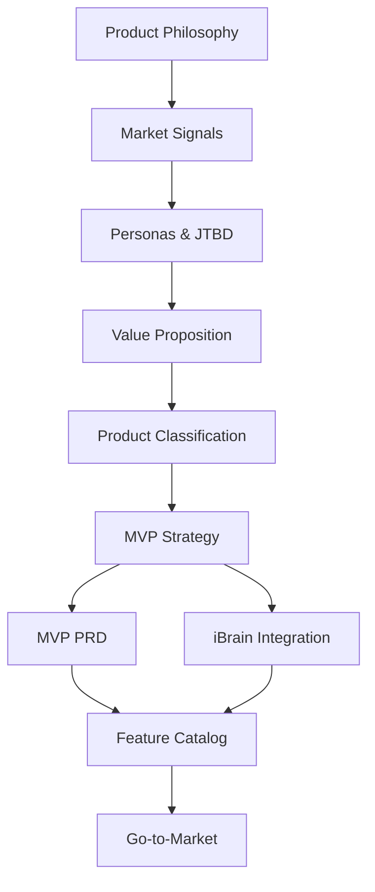

# 📋 Product Strategy Documentation - MECE Structure

**Complete Product Strategy Library**
Version 3.0 | November 2025

---

## 🎯 MECE Organization Framework

All product strategy documents are organized using the **MECE principle** (Mutually Exclusive, Collectively Exhaustive) to ensure:
- No overlaps between categories
- Complete coverage of all strategic aspects
- Clear navigation and decision-making

---

## 📊 Strategy Categories (MECE Structure)

### 1️⃣ FOUNDATION - Why We Exist
*Core purpose, philosophy, and principles that guide all decisions*

| Document | Purpose | Key Content |
|----------|---------|-------------|
| **[product_philosophy.md](./product_philosophy.md)** | Core beliefs & principles | Assessment-first philosophy, SMB focus, outcome-driven |
| **[product_overview.md](./product_overview.md)** | Executive summary | What Karvia is, problem/solution fit |

---

### 2️⃣ MARKET - Where We Compete
*Market analysis, customer insights, competitive landscape*

| Document | Purpose | Key Content |
|----------|---------|-------------|
| **[market_signals.md](./market_signals.md)** | Market research & validation | $18B TAM, 74% alignment chaos, competitor analysis |
| **[personas_and_jtbd.md](./personas_and_jtbd.md)** | Customer understanding | 5 SMB personas, empathy maps, jobs-to-be-done |

---

### 3️⃣ POSITIONING - How We Win
*Value proposition, differentiation, competitive advantages*

| Document | Purpose | Key Content |
|----------|---------|-------------|
| **[value_proposition.md](./value_proposition.md)** | Unique value & differentiation | 5 outcome pillars, 4,400% ROI model |
| **[product_classification.md](./product_classification.md)** | Product tiers & capabilities | Free/Pro/Enterprise tiers, capability matrix |

---

### 4️⃣ SOLUTION - What We Build
*Product architecture, features, technical strategy*

| Document | Purpose | Key Content |
|----------|---------|-------------|
| **[MVP_STRATEGY_V5.md](./MVP_STRATEGY_V5.md)** | MVP implementation strategy | 7 modular blocks, feature flags, 12-week timeline |
| **[MVP_PRD_V3.md](./MVP_PRD_V3.md)** | Detailed requirements | User stories, acceptance criteria, technical specs |
| **[ibrain_integration_model.md](./ibrain_integration_model.md)** | AI strategy | Optional iBrain add-on, toggle architecture |

---

### 5️⃣ EXECUTION - How We Deliver
*Go-to-market, launch strategy, growth plans*

| Document | Location | Purpose | Key Content |
|----------|----------|---------|-------------|
| **[GO_TO_MARKET.md](../GO_TO_MARKET.md)** | Parent folder | Launch & growth strategy | Consultant-led distribution, $12/user pricing |
| **[FEATURE_CATALOG.md](../FEATURE_CATALOG.md)** | Parent folder | Feature tracking | 89 features, 70% complete, critical gaps |
| **[PRODUCT_VISION.md](../PRODUCT_VISION.md)** | Parent folder | 3-year roadmap | Phases, success metrics, expansion |

---

## 🗂️ Document Relationships



---

## 📚 Related Documentation (Outside Strategy Folder)

### System Level
- **[../SYSTEM_OVERVIEW.md](../SYSTEM_OVERVIEW.md)** - 3-page system context
- **[../PRODUCT_ARCHITECTURE.md](../PRODUCT_ARCHITECTURE.md)** - Technical architecture
- **[../../00_MASTER_STRATEGY.md](../../00_MASTER_STRATEGY.md)** - Company-wide strategy

### User Research
- **[../user-journeys/](../user-journeys/)** - Role-specific journey maps
- **[../user-stories/](../user-stories/)** - 114 user stories

### Development
- **[../CLAUDE_CONTEXT.md](../CLAUDE_CONTEXT.md)** - AI/dev onboarding
- **[../../Karvia_OKR_Product_Planning/](../../../Karvia_OKR_Product_Planning/)** - Operational tracking

---

## 🎯 Quick Navigation by Need

### "I need to understand..."

| Question | Read These Documents |
|----------|---------------------|
| **What we're building** | product_philosophy → product_overview → MVP_STRATEGY_V5 |
| **Who our customers are** | market_signals → personas_and_jtbd |
| **How we're different** | value_proposition → product_classification |
| **What features to build** | MVP_PRD_V3 → FEATURE_CATALOG |
| **How to sell it** | value_proposition → GO_TO_MARKET |
| **Technical decisions** | MVP_STRATEGY_V5 → ibrain_integration_model → PRODUCT_ARCHITECTURE |
| **Timeline & roadmap** | MVP_STRATEGY_V5 → PRODUCT_VISION |

---

## 📊 Strategy Metrics

### Document Coverage
```
Foundation:  2 documents ✅
Market:      2 documents ✅
Positioning: 2 documents ✅
Solution:    3 documents ✅
Execution:   3 documents ✅
─────────────────────────
Total:      12 core strategy documents
```

### Strategy Completeness
| Aspect | Status | Documents |
|--------|--------|-----------|
| **Vision** | ✅ Complete | product_philosophy, PRODUCT_VISION |
| **Market** | ✅ Complete | market_signals, personas_and_jtbd |
| **Product** | ✅ Complete | MVP_STRATEGY_V5, MVP_PRD_V3 |
| **Technical** | ✅ Complete | ibrain_integration_model, PRODUCT_ARCHITECTURE |
| **Go-to-Market** | ✅ Complete | GO_TO_MARKET, value_proposition |
| **Operations** | ✅ Complete | FEATURE_CATALOG, roadmap in PRODUCT_VISION |

---

## 🔄 Maintenance Guidelines

### Update Frequency
- **Market documents**: Quarterly (market changes fast)
- **Product documents**: Sprint-aligned (every 2 weeks)
- **Philosophy documents**: Annually (core principles stable)
- **Technical documents**: As architecture evolves

### Version Control
- Major updates increment version (e.g., V5 → V6)
- Track changes in document header
- Archive old versions to `_archive/` subfolder

### Decision Log
Major strategic decisions should be documented in:
1. The relevant strategy document
2. Git commit message
3. Decision log section (if exists)

---

## 💡 Strategy Principles

All strategy documents follow these principles:

1. **Customer-Obsessed**: Every strategy starts with customer needs
2. **Data-Driven**: Decisions backed by market research
3. **Outcome-Focused**: Features serve outcomes, not vice versa
4. **Modular**: Strategies can evolve independently
5. **Actionable**: Every document drives specific actions

---

## 🚀 Using These Documents

### For Strategic Planning
1. Start with **product_philosophy.md** for principles
2. Review **market_signals.md** for context
3. Check **MVP_STRATEGY_V5.md** for current plan
4. Reference **GO_TO_MARKET.md** for execution

### For Feature Decisions
1. Check alignment with **value_proposition.md**
2. Verify in **MVP_PRD_V3.md** requirements
3. Track in **FEATURE_CATALOG.md**
4. Validate against **personas_and_jtbd.md**

### For Technical Decisions
1. Review **MVP_STRATEGY_V5.md** for architecture
2. Check **ibrain_integration_model.md** for AI
3. Reference **PRODUCT_ARCHITECTURE.md** for details

---

## 📞 Ownership & Contact

**Strategy Owner**: Product Team
**Review Cycle**: Monthly
**Questions**: product-strategy@karvia.io

---

## ✅ Completeness Check

This MECE structure ensures:
- ✅ **Mutually Exclusive**: Each document has a unique purpose
- ✅ **Collectively Exhaustive**: All strategic aspects covered
- ✅ **No Redundancy**: Information appears once
- ✅ **Clear Navigation**: Easy to find what you need
- ✅ **Actionable**: Every document drives decisions

---

**Last Consolidation**: November 2025
**Next Review**: December 2025