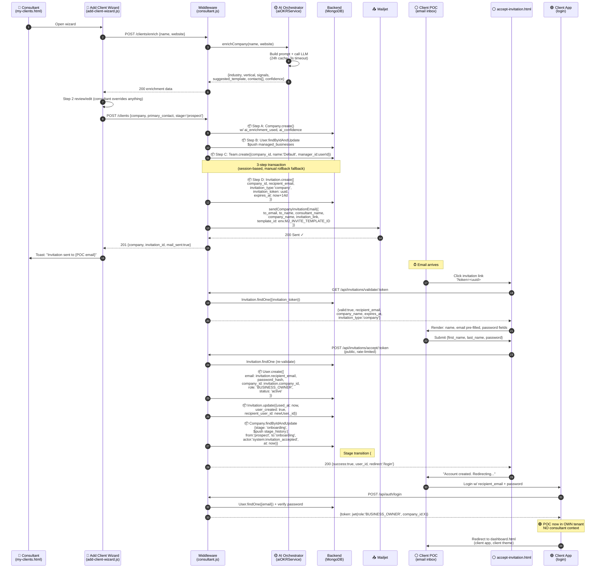
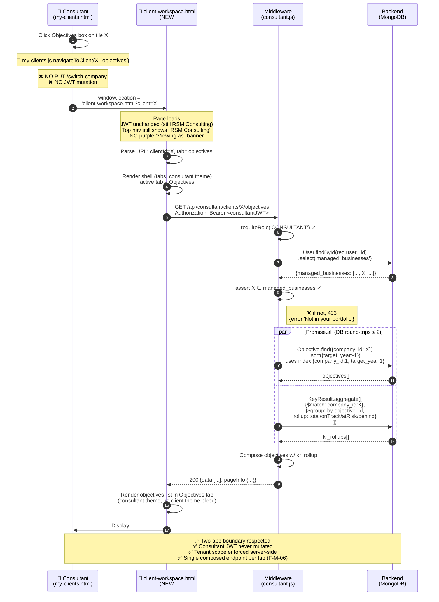
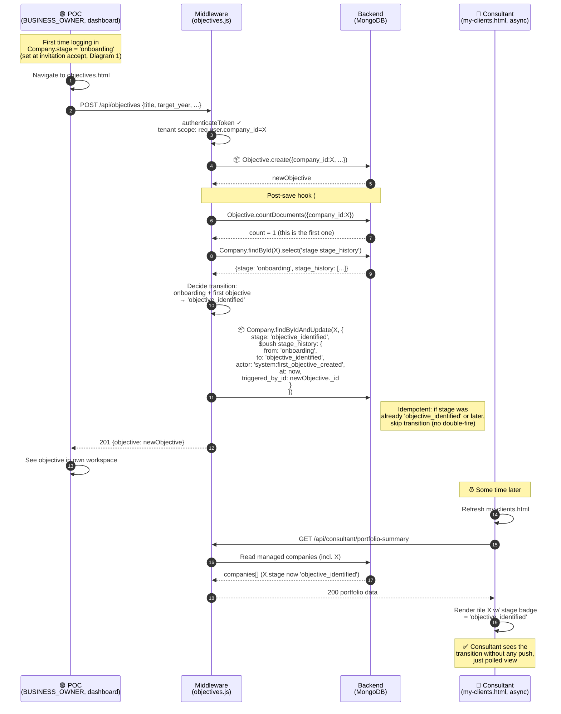

# Sprint 22a — Data Flow Diagrams

<!-- @GENOME T3-SPR-022a-FLOW | DRAFT | 2026-04-30 | parent:T3-SPR-022a-AUDIT | auto:- | linked:/audit-architecture,/coding -->

**Status**: DRAFT pending sign-off
**Companion**: [API_CONTRACT.md](API_CONTRACT.md), [ARCH_AUDIT_REPORT.md](ARCH_AUDIT_REPORT.md)

Three sequence diagrams. Each diagram is canonical for the flow it describes; any deviation during implementation is a documented amendment.

**Notation**:
- 🔵 = Consultant App (RSM Consulting JWT)
- 🟢 = Client App (BUSINESS_OWNER tenant JWT)
- ⚪ = Public (no JWT yet)
- 🟡 = AI Orchestrator
- 📦 = Database write
- 📤 = External (Mailjet)

---

## Diagram 1 — Add Client → Invitation → POC Account Creation

**Trigger**: Consultant clicks "Add Client" on `my-clients.html`, completes 2-step wizard.

**Key invariants**:
- ✅ Consultant never sees POC's password or holds POC's JWT
- ✅ POC's JWT is `company_id = clientCompany`, not `RSM Consulting`
- ✅ Stage transition `prospect → onboarding` fires at invitation **acceptance**, not at invitation send
- ✅ The 3-step Company/managed_businesses/Team transaction (steps 7-9) is the existing #181 pattern; #184d adds steps 10-11 (Invitation + Mailjet)
- ✅ POC accept route is **public** (no JWT) — correct, POC has no account yet

**Files touched (#184d)**:
- [server/routes/consultant.js](../../../../server/routes/consultant.js) — `POST /clients` extends current flow with steps 10-11
- [server/routes/invitations.js:105](../../../../server/routes/invitations.js#L105) — `POST /accept/:token` extends with stage transition (handoff to #184e for the actual transition logic)
- [server/services/mailjetService.js:196](../../../../server/services/mailjetService.js#L196) — `sendCompanyInvitationEmail` already exists (NEEDS-VERIFY F-M-07: confirm template ID env var)
- [client/pages/scripts/add-client-wizard.js](../../../../client/pages/scripts/add-client-wizard.js) — wizard already wired (Sprint 22 #181); only success copy changes
- [client/pages/invitation-accept.html](../../../../client/pages/invitation-accept.html) (or NEW `accept-invitation.html`) — POC entry point

---

## Diagram 2 — Consultant Views Client Objectives (post Sprint 22a)

**Trigger**: Consultant clicks the Objectives box on a client tile in `my-clients.html`.

**Key invariants**:
- ✅ `?client=X` is a **hint**; the server is the source of truth via `managed_businesses` membership
- ✅ Top nav DOM doesn't change (no theme flip, no `renderContextBanner`)
- ✅ Tab switch within `client-workspace.html` updates URL hash + makes ONE call to the corresponding `/api/consultant/clients/X/<tab>` endpoint
- ✅ Back-button works (URL hash drives state)
- ✅ Bookmarking `client-workspace.html?client=X#tab=objectives` reloads cleanly (server re-asserts membership)

**What this kills**:
- ❌ `KarviaCommon.ensureActiveCompany(X)` (F-C-01) — never invoked from consultant pages
- ❌ `PUT /api/auth/switch-company` from consultant frontend (F-C-03) — `navigateToClient` no longer calls it
- ❌ Purple "Viewing as: Client Company" banner (F-C-02) — `renderContextBanner` early-returns for CONSULTANT
- ❌ "Back to My Company" button (F-H-05) — no banner = no button

---

## Diagram 3 — Stage Auto-Transition on POC First Login + First Objective

**Trigger**: POC creates first objective in their workspace.

**Stage transition rules (#184e)**:

| Trigger | From → To | Actor | Idempotent? |
|---|---|---|---|
| Company doc created via `POST /api/consultant/clients` | (none) → `prospect` | `consultant:<userId>` | Yes (default value, schema-level) |
| `POST /api/invitations/accept/:token` (first POC user created for company) | `prospect` → `onboarding` | `system:invitation_accepted` | Yes (idempotent guard: `if stage === 'prospect'`) |
| First Objective.create for `company_id` | `onboarding` → `objective_identified` | `system:first_objective_created` | Yes (count-based guard) |
| First Assessment completes | (no stage flip) | `system:first_assessment_completed` | Yes (history entry only, no flip) |
| Manual edit via `Edit` modal | any → any allowed by enum | `consultant:<userId>` | N/A — explicit user action |

**Implementation note (#184e)**:
- Hook lives in route handler, not Mongoose post-save middleware. Reason: post-save hooks fire on *every* save (including bulk imports), making "is this the first?" detection brittle. Explicit calls in route handlers (`objectives.js POST`, `invitations.js POST /accept`) are cheaper and more auditable.
- New schema: `Company.stage_history: [{from, to, actor, at, triggered_by_id}]` — append-only.
- Backfill policy: **NONE**. Existing companies stay at current stage; history starts at the next transition.

**Key invariants**:
- ✅ Stage transitions are server-side; consultant cannot push them
- ✅ History entries include `triggered_by_id` so the audit trail is causal
- ✅ Idempotency guards prevent double-firing on retries
- ✅ Consultant sees updates via polled `portfolio-summary`, no WebSocket required

---

## Cross-cutting: What never happens after Sprint 22a

| Anti-pattern | Why it can't happen |
|---|---|
| Consultant frontend calls `PUT /api/auth/switch-company` | Grep-asserted absent in #184c integration test |
| Consultant JWT contains a client tenant's `company_id` | `switch-company` is unreachable from consultant frontend; route stays alive only for legacy admin |
| Frontend renders raw Mongoose docs | All renders go through endpoints with explicit projections |
| Consultant writes to client tenant's data | `/api/consultant/clients/:id/*` endpoints are read-only by spec |
| Stage transitions fire retroactively on legacy data | Backfill policy = none; first transition starts the history |
| AI prompts reference the wrong tenant's context | Provider cache key includes `company_id`; cross-tenant key collision impossible |
| Two consultants stomp on a shared client's `managed_businesses` | `$pull`/`$push` are atomic per-consultant operations |

---

## Sign-off

After this and `API_CONTRACT.md` are signed off, #184a starts. The integration tests for #184a, #184b, #184c, #184d, #184e map directly to the invariants above:

- **Diagram 2 invariants** → #184a tests (membership guard, single-endpoint-per-tab) + #184c tests (no `switch-company` call from consultant pages)
- **Diagram 1 invariants** → #184d tests (Mailjet sent, public accept route, separate JWTs)
- **Diagram 3 invariants** → #184e tests (idempotent transitions, history entries, backfill = none)

**Status**: DRAFT — awaiting sign-off
