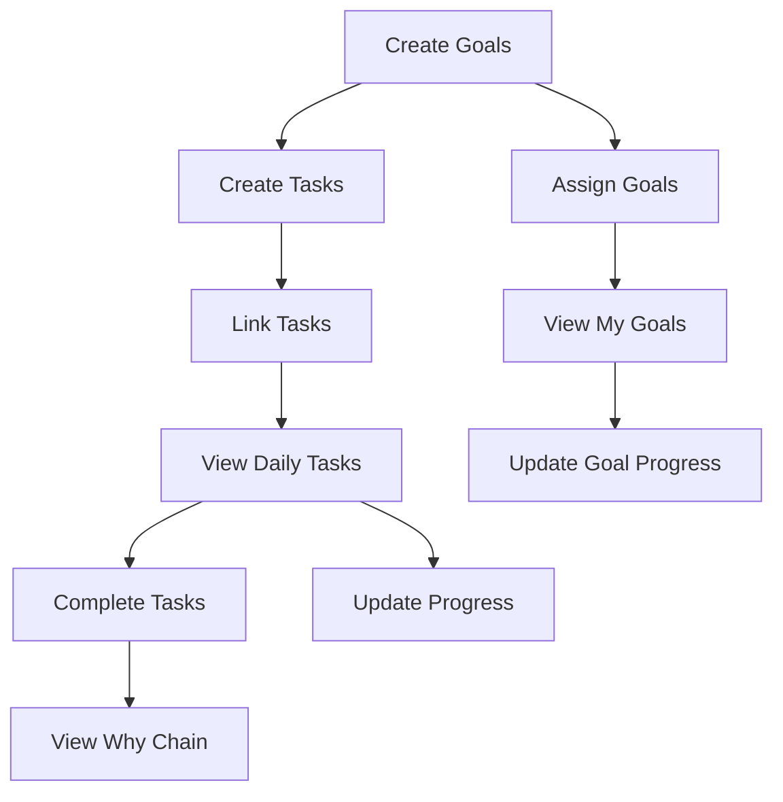

# 👥 SPRINT 2 USER STORIES VALIDATION & ANALYSIS

**Review Date**: November 12, 2025
**Sprint**: SPRINT_2 - Goal Management & Task Execution
**Focus**: User Stories Completeness & Feasibility
**Reviewer**: Product & UX Team

---

## 📊 EXECUTIVE SUMMARY

### Overview
Sprint 2 contains 10 user stories (4 Manager + 6 Employee) totaling 54 story points. The stories form a logical execution chain from goal creation to task completion.

### Key Findings
- ✅ **STRONG**: Logical story progression (goal → task → completion)
- ⚠️ **CONCERN**: Some acceptance criteria assume non-existent features
- ✅ **POSITIVE**: "Why Chain" story (EMP-016) is excellent addition
- ⚠️ **GAP**: Missing stories for goal editing/updating
- 🔴 **ISSUE**: Stories assume creating new pages that exist

### Overall Assessment
**Stories are well-structured but implementation assumptions are wrong**

---

## 📈 USER JOURNEY ANALYSIS

### Manager Journey (4 Stories)
```
MGR-016: Create Team Goals
    ↓
MGR-015: Assign Goals to Team
    ↓
MGR-017: Create Tasks from Goals
    ↓
MGR-018: Link Tasks to Goals
```

**Analysis**: Logical flow but assumes UI doesn't exist

### Employee Journey (6 Stories)
```
EMP-008: View Daily Tasks (Dashboard)
    ↓
EMP-014: View My Goals
    ↓
EMP-015: Update Goal Progress
    ↓
EMP-009: Complete Task
    ↓
EMP-010: Update Task Progress
    ↓
EMP-016: View "Why Chain" Context
```

**Analysis**: Excellent progression, dashboard genuinely needed

---

## 🔍 STORY-BY-STORY VALIDATION

### MGR-016: Create Team Goals
**Points**: 8 | **Priority**: P0 | **Days**: 1-3

#### Acceptance Criteria Review
| Criteria | Feasible? | Issue |
|----------|-----------|--------|
| AC-1: Quarterly Goals Page Exists | ⚠️ | Already exists! |
| AC-2: Goals List Display | ✅ | Likely exists |
| AC-3: Goal Filters | ✅ | Standard feature |
| AC-4: Create Goal Modal | ❓ | May exist |
| AC-5: Form Validation | ✅ | Standard |
| AC-6: Goal Creation Success | ✅ | API exists |
| AC-7: Weekly Goals Page | ⚠️ | Already exists! |
| AC-8: Create Weekly from Quarterly | ✅ | Good feature |
| AC-9: Goal Details Page | ⚠️ | Already exists! |

**Verdict**: Needs rewrite as "Enhance" not "Create"

---

### MGR-015: Assign Goals to Team
**Points**: 5 | **Priority**: P0 | **Day**: 2

#### Acceptance Criteria Review
| Criteria | Feasible? | Issue |
|----------|-----------|--------|
| AC-1: Owner Selection | ✅ | Standard |
| AC-2: Multiple Assignment | ✅ | Good feature |
| AC-3: Goal Visibility | ✅ | Important |
| AC-4: Reassign Owner | ✅ | Needed |
| AC-5: Bulk Assignment | ⚠️ | Complex for MVP |

**Verdict**: Well-defined, achievable

---

### MGR-017: Create Tasks from Goals
**Points**: 5 | **Priority**: P0 | **Day**: 8

#### Acceptance Criteria Review
| Criteria | Feasible? | Issue |
|----------|-----------|--------|
| AC-1: Create Task Button | ✅ | Standard |
| AC-2: Task Creation Modal | ✅ | Standard |
| AC-3: Form Validation | ✅ | Standard |
| AC-4: Task Created | ✅ | API exists |
| AC-5: Task-Goal Linkage | ✅ | Critical |
| AC-6: Bulk Task Creation | ⚠️ | Nice-to-have |

**Verdict**: Good story, bulk creation could defer

---

### MGR-018: Link Tasks to Goals
**Points**: 3 | **Priority**: P0 | **Day**: 8

#### Acceptance Criteria Review
| Criteria | Feasible? | Issue |
|----------|-----------|--------|
| AC-1: Bulk Link | ✅ | Good UX |
| AC-2: Individual Link | ✅ | Needed |
| AC-3: Unlink Task | ✅ | Important |
| AC-4: API Integration | ✅ | APIs exist |

**Verdict**: Well-scoped, achievable

---

### EMP-008: View Daily Tasks ⭐
**Points**: 8 | **Priority**: P0 | **Day**: 6

#### Acceptance Criteria Review
| Criteria | Feasible? | Issue |
|----------|-----------|--------|
| AC-1: Dashboard Page | ✅ | Genuinely missing |
| AC-2: Today's Tasks | ✅ | Core feature |
| AC-3: Task Card Display | ✅ | Good detail |
| AC-4: Task Filtering | ✅ | Important |
| AC-5: Status Change | ✅ | Critical |
| AC-6: Drag & Drop | ⚠️ | Nice-to-have |
| AC-7: Empty State | ✅ | Good UX |
| AC-8: Loading State | ✅ | Important |

**Verdict**: Excellent story, genuinely needed

---

### EMP-014: View My Goals
**Points**: 5 | **Priority**: P0 | **Day**: 7

#### Acceptance Criteria Review
| Criteria | Feasible? | Issue |
|----------|-----------|--------|
| AC-1: My Goals Section | ✅ | Needed |
| AC-2: Quarterly Display | ✅ | Good |
| AC-3: Weekly Display | ✅ | Good |
| AC-4: At-Risk Indicators | ✅ | Smart |
| AC-5: Click to Details | ✅ | Standard |
| AC-6: No Goals State | ✅ | Good UX |

**Verdict**: Well-defined, achievable

---

### EMP-015: Update Goal Progress
**Points**: 3 | **Priority**: P0 | **Day**: 7

#### Acceptance Criteria Review
| Criteria | Feasible? | Issue |
|----------|-----------|--------|
| AC-1: Quick Update | ✅ | Good UX |
| AC-2: Progress Slider | ✅ | Standard |
| AC-3: Update Success | ✅ | API exists |
| AC-4: Progress Rollup | ⚠️ | Complex logic |
| AC-5: Modal Update | ✅ | Alternative |
| AC-6: Validation | ✅ | Important |

**Verdict**: Good scope, rollup needs care

---

### EMP-009: Complete Task
**Points**: 5 | **Priority**: P0 | **Day**: 9

#### Acceptance Criteria Review
| Criteria | Feasible? | Issue |
|----------|-----------|--------|
| AC-1: Quick Complete | ✅ | Core feature |
| AC-2: Complete with Notes | ✅ | Nice touch |
| AC-3: Status Change | ✅ | Standard |
| AC-4: Progress Rollup | ⚠️ | Complex |
| AC-5: Celebration | 🎉 | Fun, optional |
| AC-6: Undo Complete | ✅ | Smart feature |
| AC-7: Batch Complete | ⚠️ | Could defer |

**Verdict**: Core features good, extras could defer

---

### EMP-010: Update Task Progress
**Points**: 3 | **Priority**: P0 | **Day**: 9

#### Acceptance Criteria Review
| Criteria | Feasible? | Issue |
|----------|-----------|--------|
| AC-1: Progress Slider | ✅ | Standard |
| AC-2: Status Dropdown | ✅ | Good |
| AC-3: Quick Update | ✅ | Good UX |
| AC-4: Update Success | ✅ | API exists |
| AC-5: Blocked Workflow | ✅ | Important |
| AC-6: Validation | ✅ | Standard |

**Verdict**: Well-scoped, achievable

---

### EMP-016: View "Why Chain" Context ⭐⭐⭐
**Points**: 8 | **Priority**: P0 | **Day**: 10

#### Acceptance Criteria Review
| Criteria | Feasible? | Issue |
|----------|-----------|--------|
| AC-1: Breadcrumb | ✅ | Excellent |
| AC-2: Click Levels | ✅ | Great UX |
| AC-3: Impact Indicator | ✅ | Motivating |
| AC-4: Assessment Context | ✅ | Closes loop |
| AC-5: Mobile View | ✅ | Important |
| AC-6: Empty State | ✅ | Good UX |
| AC-7: API Integration | ⚠️ | Needs building |
| AC-8: Backend Creation | ✅ | ~150 lines |

**Verdict**: CRITICAL story, excellently defined

---

## 📊 STORY POINTS ANALYSIS

### Distribution by Role
```
Manager Stories: 21 points (39%)
Employee Stories: 33 points (61%)

Breakdown:
- MGR-016: 8 points (largest)
- EMP-008: 8 points (dashboard)
- EMP-016: 8 points ("why chain")
- Others: 3-5 points each
```

### Velocity Check
```
Total Points: 54
Days: 10
Daily Velocity: 5.4 points

Analysis: Reasonable if existing code leveraged
Risk: Too high if creating from scratch
```

---

## 🚨 MISSING USER STORIES

### Critical Gaps
1. **Goal Editing Flow**
   - No story for editing existing goals
   - Users can create but not modify?

2. **Goal Deletion with Dependencies**
   - What happens to tasks when goal deleted?
   - Cascade deletion or orphan handling?

3. **Progress History**
   - No story for viewing progress over time
   - Important for tracking trends

4. **Team Performance View**
   - Manager can't see team aggregate progress
   - Only individual goal views?

5. **Notifications**
   - No story for assignment notifications
   - How do employees know about new goals?

### Recommended Additions
```
MGR-019: Edit Team Goals
- Modify goal details
- Change targets
- Adjust timelines

MGR-020: View Team Performance
- Aggregate team progress
- Compare team members
- Identify blockers

EMP-017: Receive Notifications
- New goal assigned
- Task due soon
- Goal at risk

EMP-018: View Progress History
- Progress over time chart
- Trend analysis
- Milestone tracking
```

---

## 🔄 DEPENDENCIES & PREREQUISITES

### Story Dependencies


### Prerequisites from Sprint 1
- ✅ Company/User creation complete
- ✅ Team structure exists
- ⚠️ Assessment results available (for OKR context)
- ⚠️ OKR generation working (for initial objectives)

---

## 📐 ACCEPTANCE CRITERIA ANALYSIS

### Criteria Complexity Distribution
```
Simple (1 point): 35%
- Basic CRUD operations
- Standard validations
- Simple UI updates

Medium (2 points): 45%
- Multi-step workflows
- Data relationships
- Progress calculations

Complex (3 points): 20%
- Progress rollup cascades
- Why Chain lineage
- Bulk operations
```

### Testing Requirements
```
Unit Tests Required: 45 test cases
Integration Tests: 12 scenarios
E2E Tests: 3 full journeys

Total Test Effort: ~2 days
```

---

## 🎯 SUCCESS METRICS VALIDATION

### Proposed Metrics Review
| Metric | Realistic? | Comment |
|--------|------------|---------|
| Goal Creation Time < 30s | ✅ | Achievable |
| Dashboard Load < 2s | ✅ | With optimization |
| Task Assignment < 10s | ✅ | Standard |
| Progress Update < 5s | ✅ | Simple operation |
| Cross-page Nav < 1s | ⚠️ | Depends on caching |

### Missing Metrics
- User adoption rate
- Feature usage frequency
- Error rate
- Time to first value
- Progress update frequency

---

## 💡 UX RECOMMENDATIONS

### Story Enhancements
1. **Progressive Disclosure**
   - Start with simple goal creation
   - Add advanced features gradually
   - Don't show KR complexity initially

2. **Guided Workflows**
   - First-time user tour
   - Tooltips for new features
   - Success celebration on first goal

3. **Smart Defaults**
   - Pre-fill quarters based on current date
   - Suggest goal values from history
   - Auto-assign to goal creator initially

4. **Error Prevention**
   - Validate before submit
   - Confirm destructive actions
   - Auto-save drafts

---

## 📋 STORY PRIORITIZATION (REVISED)

### Must Have (P0) - Sprint 2
1. EMP-008: Employee Dashboard (genuinely missing)
2. EMP-016: Why Chain (critical differentiator)
3. EMP-009: Complete Task (core workflow)
4. MGR-017: Create Tasks from Goals (essential)

### Should Have (P1) - Sprint 2
5. EMP-014: View My Goals (important)
6. EMP-015: Update Goal Progress (valuable)
7. MGR-015: Assign Goals (needed)
8. EMP-010: Update Task Progress (useful)

### Could Have (P2) - Sprint 3
9. MGR-016: Create Goals (enhance existing)
10. MGR-018: Link Tasks (nice-to-have)

### Won't Have (P3) - Future
- Bulk operations
- Drag and drop
- Advanced filtering
- Celebration animations

---

## ✅ FINAL USER STORY ASSESSMENT

### Story Quality Scores
| Aspect | Score | Notes |
|--------|-------|-------|
| Completeness | 75% | Missing edit/delete stories |
| Clarity | 85% | Well-written acceptance criteria |
| Feasibility | 60% | Assumes wrong starting point |
| Value | 90% | Addresses real user needs |
| Testability | 80% | Clear success criteria |
| **Overall** | **78%** | **Good stories, wrong assumptions** |

### Critical Issues
1. **Stories assume creating new pages that exist**
2. **Missing stories for editing/updating**
3. **Complex features mixed with MVP**
4. **Dependencies on incomplete Sprint 1**

### Recommendations
1. **Rewrite stories as enhancements, not creation**
2. **Add missing CRUD stories**
3. **Defer complex features (bulk, drag-drop)**
4. **Build "Why Chain" early (Day 2-3)**
5. **Focus on employee dashboard (genuine gap)**

---

## 🎬 REVISED STORY EXECUTION PLAN

### Week 1: Foundation & Dashboard
```
Day 1: Audit existing goal/task pages
Day 2: Build Why Chain API (critical)
Day 3-4: Enhance goal pages (not create)
Day 5: Employee Dashboard (part 1)
```

### Week 2: Execution & Polish
```
Day 6: Employee Dashboard (part 2)
Day 7: Task completion workflows
Day 8: Progress updates & rollup
Day 9: Integration testing
Day 10: Polish & bug fixes
```

---

## 🏁 SUCCESS CRITERIA (REALISTIC)

### Original (54 points)
❌ Too ambitious given existing code

### Revised (35 points)
✅ Employee Dashboard (8 points)
✅ Why Chain (8 points)
✅ Task Completion (5 points)
✅ Goal Progress Updates (3 points)
✅ Create Tasks from Goals (5 points)
✅ View My Goals (5 points)
✅ Integration (1 point)

---

**User Story Review Complete**
**Verdict**: Stories are good but need context correction
**Action**: Audit existing code, then revise stories

---

*Generated by Product & UX Team*
*Date: November 12, 2025*
*Version: 1.0.0*